# 程序设计基本概念

计算机不过是一种具有**内部存储能力**、由**程序自动控制**的电子设备。

**"程序"(program)：**连续执行的一条条能被计算机识别和执行的**有序指令**的集合。

**"程序设计语言"**：人与机器"对话"的一类媒介和工具，由语句(statement)组成。

**"语句"：**组成程序的**基本单位**。一个";"表示一个语句，单行一个";"叫空语句。每条语句都可以认为是一条指令

**机器语言：**(machine language)计算机直接使用的**二进制**形式的程序语言或机器代码。

**汇编语言：**(assembler language)一种面向机器的用**符号**表示的低级程序语言。相当于机器指令的助记符号，与机器语言相近。

**高级语言：**(high-level language)是易为人们所理解的**完全符号化**的程序设计语言。

**源程序**：用户用高级语言编写的程序。**C语言源程序文件名字后缀一般必须为"`.C`"**。

**目标程序：**由二进制代码组成的程序。**形式:0、1** C语言**后缀为"`.obj`"**。

**编译程序：**具有翻译功能的软件。由编译程序**转换**为**机器代码**。

**解释程序：**具有翻译功能的软件。由解释程序**转换**直接为**机器代码**。一条一条解释为二进制，必须从头到尾执行一遍。

**可执行程序**:二进制文件，可以运行的文件。

**连接器**：用于连接相关的目标文件以生成可执行文件。

**编译**: 有了C源文件，通过编译器将其编译成`.obj`文件(目标文件)。

**连接(linker)**：将目标模块和其他一些必要的功能模块装配在一起，生成可执行文件，**执行文件后缀为"`.exe`"**

**bit(位)**：计算机中最小的存储单位。`1byte = 8bit`

**byte(字节)**：计算机中基本存储单元。`1byte = 8bit`

**表达式**：由数字、算符、数字分组符号（括号）、自由变量和约束变量等以能求得数值的有意义排列方法所得的**组合**。约束变量在表达式中已被指定数值，而自由变量则可以在表达式之外另行指定数值。

****

# 程序设计

**简单的程序设计一般包含以下几个部分**：

- (1)**确定数据结构**。根据任务书提出的要求、指定的输人数据和输出结果，确定存放数据的数据结构。

- (2)**确定算法**。针对存放数据的数据结构来确定解决问题、完成任务的步骤。

- (3)**编码**。根据确定的数据结构和算法,使用选定的计算机语言编写程序代码,输人到计算机并保存在磁盘上,简称编程。

- (4)**在计算机上调试程序**。消除由于疏忽而引起的语法错误或逻辑错误;用各种可能的输人数据对程序进行测试，使之对各种合理的数据都能得到正确的结果,对不合理的数据能进行适当的处理。

- (5)**整理并写出文档资料。**

# 算法

​	**算法**是指为解决某个特定问题而采取的确定且有限的步骤。一个算法应当具有以下特征：

- (1)**有穷性**。一个算法包含的操作步骤应该是有限的。也就是说,在执行若干个操作步票之后,算法将结束，而且每一步都在合理的时间内完成。

- (2)**确定性**。算法中每一条指令必须有确切的含义,不能有二义性,对于相同的输人必能得出相同的执行结果。

- (3)**可行性**。算法中指定的操作,都可以通过已经验证过可以实现的基本运算执行有限次后实现。

- (4)**有零个或多个输人**。在计算机上实现的算法是用来处理数据对象的,在大多数情况下这些数据对象需要通过输人来得到。

- (5)**有一个或多个输出**。算法的目的是为了求“解”,这些“解”只有通过输出才能得到。

  算法可以用各种描述方法来进行描述,最常用的是**伪代码**和**流程图**。

# 伪代码

​	伪代码是一种近似于高级语言但又不受语法约束的一种语言描述方式,这在英语国家中使用起来更为方便。

# 流程图

​	流程图是算法的一种**图像化**表示方式。能直观、清晰，更有利于人们设计与理解算法。

​	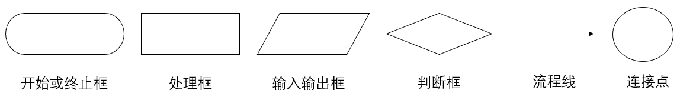

​	由这些基本图形中的框和流程线组成的流程图来表示算法形象直观,简单方便。但是,这种流程图对于流程线的走向没有任何限制,可以任意转向,在描述复杂的算法时所占篇幅较多，费时费力且不易阅读。

​	随着结构化程序设计方法的出现,**1973年**美国学者`I.Nassi`和`B.Shneiderman`提出了一种新的流程图形式,这种流程图完全去掉了流程线,算法的每一步都用一个矩形框来描述,把一个个矩形框按执行的次序连接起来就是一个完整的算法描述。这种流程图用两位学者名字的第一个英文字母命名,称为**N-S流程图**。

# 结构化程序

​	结构化程序由三种基本结构组成。结构化的程序设计语言：层次清晰，便于按**模块化方式组织程序**，易于**调试和维护**。

- **顺序结构**

  如赋值语句、输入、输出语句都可构成顺序结构。当执行这些语句构成的程序时，将按照这些语句的先后顺序**逐条执行**，**没有分支**，**没有转移**。

  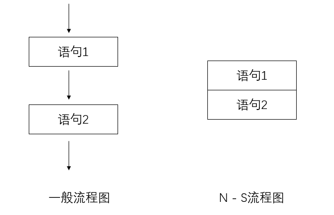

- **选择结构**

  如if语句、switch语句都可以构成选择结构。当执行到这些语句时，将根据不同的条件去执行不同分支中的语句

  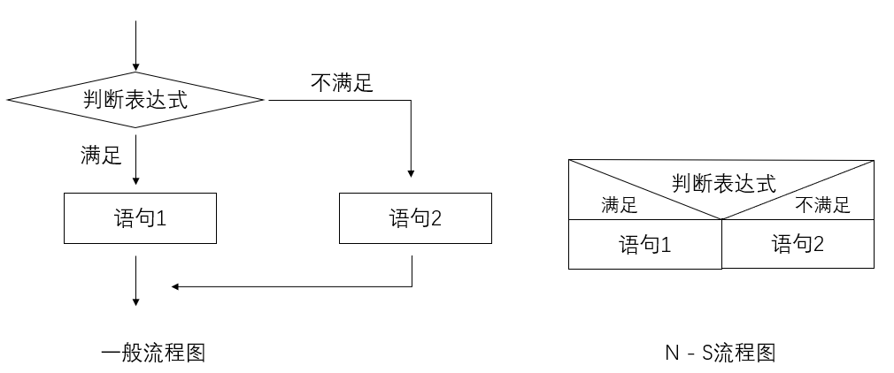

- **循环结构**

  如for循环、while循环、do-while循环。将根据各自的条件，使同一组语句重复执行多次或一次也不执行。

  - 当型循环的特点是：当指定的条件满足(成立)时，就执行循环体，否则就不执行。

  
  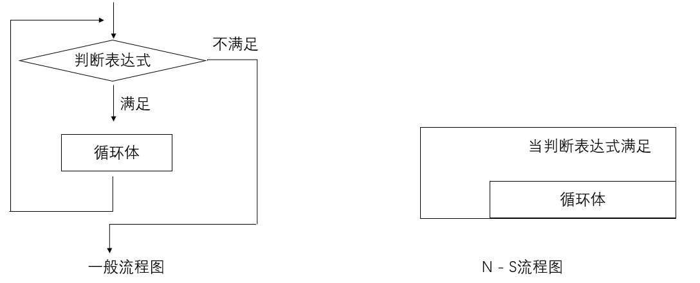
  
  - 直到型循环的特点是：执行循环体直到指定的条件满足(成立)时就不再执行循环体。
  
  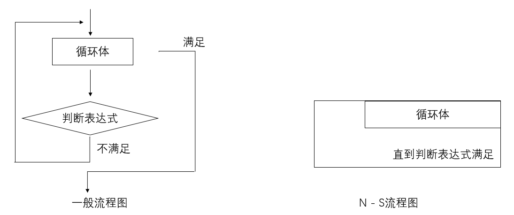

已经证明，由三种基本结构组成的算法可以解决任何复杂的问题。由三种基本结构所构成的算法称为**结构化算法**；由三种基本结构所构成的程序称作**结构化程序**。

例：先后输人若干个整数,要求打印出其中最大的数,当输人的数小于0时结束。用N-S流程图表示算法。

解题的思路是:先输人一个数,在没有其他数参加比较之前,它显然是当前最大的数，把它放到变量max中。让max始终存放当前已比较过的数中的最大值。然后输入第二个数,并与max比较,如果第二个数大于max，则用第二个数取代max中原来的值。如此先后输人和比较,每次比较后都将值大者放在max中,直到输入人的数小于0时结束。最后max中的值就是所有输入数中的最大值。

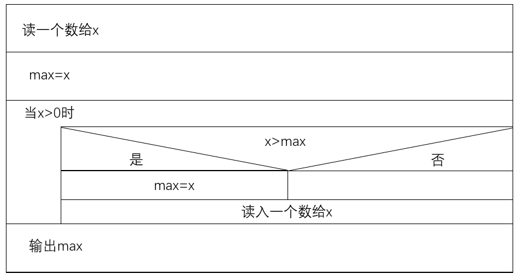

# 模块化结构

​	当计算机在处理较复杂的任务时,所编写的程序经常由上万条语句组成,需要由许多人来共同完成。这时常常把这个复杂的任务分解为若千个子任务,每个子任务，又分成很多个小子任务，每个小子任务只完成一项简单的功能。在程序设计时,用一个个小模块来实现这些功能,每个程序设计人员分别完成一个或多个小模块。我们称这样的**程序设计方法为“模块化”的方法,由一个个功能模块构成的程序结构为模块化结构。**

​	由于把一个大程序分解成若干相对独立的子程序,每个子程序的代码一般不超过一页纸,因此对程序设计人员来说,编写程序代码变得不再困难。这时只需对程序之间的数据传递做出统一规范,同一软件可由一组人员同时进行编写,分别进行调试，这就大大提高了程序编制的效率。

​	软件编制人员在进行程序设计的时候,首先应当集中考虑主程序中的算法,写出主程序后再动手逐步完成子程序的调用。对于这些子程序也可用调试主程序的同样方法逐步完成其下一层子程序的调用。这就是**自顶向下、逐步细化、模块化**的程序设计方法。

​	C语言是一种结构化程序设计语言。它提供了**三种基本结构**的语句;**提供了定义“函数”的功能**,在c语言中没有子程序的概念，它提供的**函数**可以完成子程序的所有功能;c语言允许对函故单独进行编译,从而可以实现模块化。另外，c语言还提供了丰富的数据类型。这些都为结构化程序设计提供了有力的工具。

# C语言简介

​	C语言是结构化程序设计语言的代表作

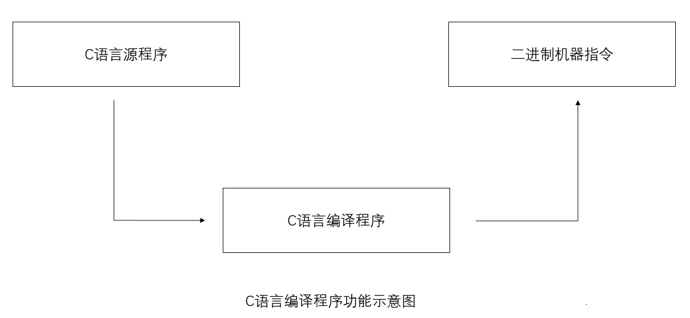

  # C语言的诞生

  - 70年代，由美国贝尔实验室的`Thompson` (肯·汤普森) 和`D.M.Ritchie` (丹尼斯·里奇)合作开发的**UNIX**操作系统和C语言诞生了，C语言**最初用于开发系统级程序**，UNIX操作系统和C语言像一对孪生姐妹，她们以自己崭新的面貌一开始就引起了人们的广泛注意。后来又经过不断改进和实践的考验，这对姐妹已迅速成长和成熟，展示出了强大的生命力，被公认为最优秀的**操作系统**和**计算机语言**之一。近30年来，C语言帮助了UNIX的成功，UNIX的发展又推动了C语言的普及和发展。C语言应用非常广泛，我们熟知的Windows操作系统基本上是用C语言编写的。
  - 1972年哦1月 C语言诞生。
  - 1977年出现了不依赖于具体机器的C语言编译文本"可移植C语言编译程序"，使C语言移植到其他机器的工作大大简化。
  - 1978年11月贝尔实验室正式发布C语言。
  - 1983年，美国国家标准化协会(ANSI)根据C语言各种版本对C的发展和扩充，制定了新的标准ANSI C，比标准C 有了很大的发展。
  - 1987年，ANSI 公布了新标准--87 ANSI C。
  - 1988年，K&R 按照ANSI C修改了他们的《The C Programming Language》。
  - 1989年12月，ANSI完成标准的制定(ANSI C 或C89)
  - 1990年，国际标准化组织接受了87 ANSI C 为ISO C的标准(`ISO9899-1990`)。(ISO C或C90)
  - 1994年，ISO又修订了C语言标准。
  - 1999年，ISO发布了最近的C语言规范，被称为`C99`。
  - 2011年12月8日，国际标准化组织(ISO)和国际电工委员会(IEC)发布的`C11`标准是C语言的第三个官方标准，也是C语言的最新标准，该语言更好的支持了汉字函数名和汉字标识符，一定程度上实现了汉字编程。

  目前流行的C语言编译系统大多是以ANSI　C为基础进行开发的从而使C发展成一种独立于UNIX、独立于具体计算机类型的计算机语言。之后，C语言先后移植到大、中、小、微型计算机上，已独立于UNIX和PDP，风靡世界，成为当今世界上最为流行的、广大程序设计者最为喜爱的计算机语言之一。

  **说明**：不同版本 的C编译系统所实现的语言功能和语法规则略有差别，因此要了解所用的C语言智能编译系统的特点。

  # C语言的特点

  1. **代码级别的跨平台**。
  2. C语言是一种**结构化语言。**层次清晰，便于按**模块化方式组织程序**，易于**调试和维护**。
  3. C语言语句**简洁、紧凑、使用方便、灵活。**
  
       - 只有37个关键字，分为四个大类：
         
           - 数据结构关键字12个。
           - 控制语句关键字12个。
           - 存储类型关键字4个。
           - 其他关键字9字。
       
       - 9种控制语句
       
       - 数据构造能力强
       
       - 运算符丰富，共有34种运算符，可以实现其他高级语言难以实现的一些运算
       
       - 程序书写格式自由
  4. C语言程序**易于移植。**用C语言编写的程序可以从一种环境不加或稍加改动就能搬到另一种环境中运行。

  5. C语言由**强大的处理能力**。既可以用于系统软件的开发，也适合应用软件的开发。
  6. C语言是一种中级语言，**生成的目标代码质量高，运行效率高**。

  ​它既**具有高级语言的通用性及易写易读的特点，又具有汇编语言(低级语言)的"位处理"、"地址操作"等能力**。C语言允许直接访问物理地址，能进行位操作，能实现汇编语言的大部分功能，可以直接对硬件进行操作。

  # C语言运行过程

​	**编辑**C源程序后经过 C编译程序**编译**之后生成一个后缀`.OBJ`的二进制文件(被称为**目标文件**，在计算机底层执行)，然后由称为**"连接程序"(Link)**的软件，把此`.OBJ`文件与C语言提供的各种库函数**连接**起来**生成**一个后缀为`.EXE`的**可执行文件**。(在计算机底层执行) 在操作系统环境下，只需**点击或输入**此文件的名字(而不必输入后缀`.EXE`)，该可执行文件就可以**运行**。

  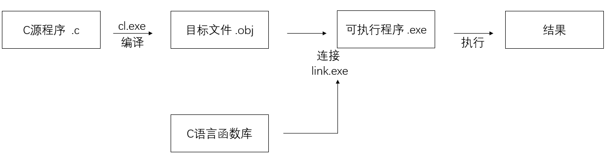

# C语言内存布局

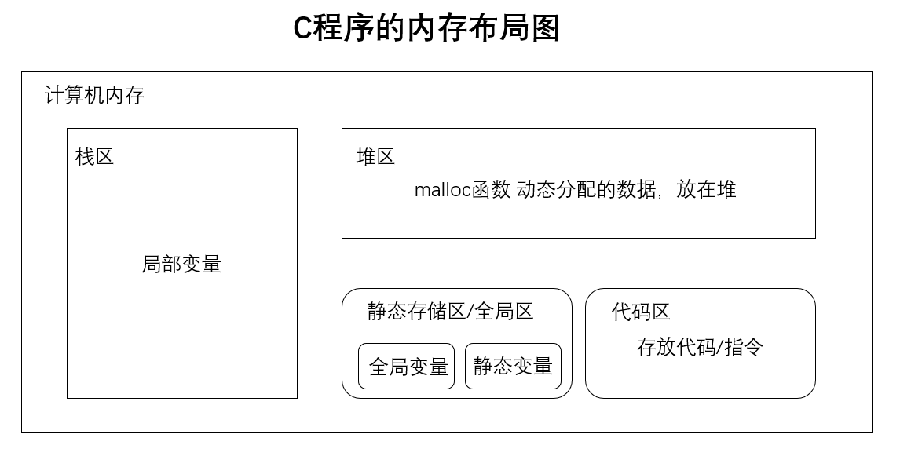

**注意**：

1. 栈：**先进后出**原则。

  # C语言构成和格式

**基本结构**：

```c
#include <stdio.h>
void main(){
    int a;
    printf("Hello World");
}
```

## 预处理命令

​	以#开始的语句称为**预处理器命令**。

​	在编译之前对源文件进行简单加工的过程，称为**预处理**(即预先处理、提前处理)。

 **头文件**：含有函数的声明和预处理语句，用于帮助访问外部定义的函数。头文件的扩展名"`.h`"

 **引入头文件** --> [Here](函数/头文件)

**说明**：

1. `#include`语句不是必须的 但是 如果由该语句 就必须将它放到程序的**开始处**，行尾不可以加";"。
2. 一个`#include`命令只能包含一个头文件，多个头文件需要多个`#include`命令。
3. 使用尖括号`< >`和双引号`" "`的区别在于头文件的搜索路径不同：
   - 使用尖括号`< >`，编译器会到系统路径下查找头文件；
   - 使用双引号`" "`，编译器首先在当前目录下查找头文件，如果没有找到，再到系统路径下查找。
4. 预处理是C语言的一个重要功能，由**预处理程序**完成。当对一个源文件进行编译时，**系统将自动调用预处理程序对源程序中的预处理部分作处理**，处理完毕自动进入对源程序的编译。
5. c语言提供了多种预处理功能，如宏定义、文件包含、条件编译等，合理地使用它们会使编写的程序便于阅读、修改、移植和调试，也有利于模块化程序设计。

​	宏定义 --> [here](#宏定义)

​	C语言常见预处理指令 --> [Here](#C语言常见预处理指令)

**注意**：

1. 预处理指令是以`#`号开头的代码行，#号必须是该行除了任何空白字符外的第一个字符。`#`后是指令关键字，在关键字和`#`号之间允许存在任意个数的空白字符，整行语句构成了一条预处理指令，该指令将在编译器进行编译之前对源代码做某些转换。
2. 预处理功能是C语言特有的功能，它是在对源程序正式编译前由**预处理程序**完成的，用**预处理命令**来调用这些功能。
3. 宏定义可以带有参数，宏调用时是以实参代换形参，而不是“值传送”。
4. 为了避免宏代换时发生错误，宏定义中的字符串应加括号，字符串中出现的形式参数两边也应加括号。
5. 文件包含是预处理的一个重要功能，它可用来把多个源文件连接成一个源文件进行编译，结果将生成一个目标文件。
6. 条件编译允许只编译源程序中满足条件的**程序段**，使生成的目标程序较短，从而减少了内存的开销并提高了程序的效率。
7. 使用预处理功能便于程序的**修改、阅读、移植和调试**，也便于实现模块化程序设计。

**例**：暂停5秒以后再输出内容"hello"，并且要求跨平台，在Windows和Linux下都能运行

1) Windows 平台下的暂停函数的原型是`void Sleep(DWORD dwMilliseconds)`.参数的单位是“毫秒”，位于`<windows.h>`头文件。
2) Linux 平台下暂停函数的原型是`unsigned int sleep (unsigned int seconds)`,参数的单位是“秒”，位于`<unistd.h>`头文件。
3) `#if`、`#elif`、`#endif` 就是**预处理命令**，它们都是在编译之前由**预处理程序**来执行的。

```c
#include <stdio.h>
#if _WIN64  //如果是Windows平台，执行#include <stdio.h>
#include <windows.h>
#elif __linux__  //如果是linux平台，执行#include <unistd.h>
#include <unistd.h>
#endif
int main(){
    //不同平台下调用不同的函数 生成的源码不一样
#if _WIN64  //识别windows平台
    Sleep(50000);//毫秒
#elif _linux_
    sleep(5);//秒
#endif
    puts("hello");//输出
    return 0;
}
/*windows下
#include <windows.h>
int main(){
 Sleep(50000);//毫秒
 puts("hello");//输出
 return 0
}
 * */
```

## 主函数

**main是主函数**。

**说明**：

1. C程序**有且只有一个**主函数。
2. C都是由**主函数**开始执行 从**主函数**结束执行。
3. main()函数是C程序的起点 main()函数可以返回一个值 也可以不返回值 如果某个函数没有返回值，那么在它的前面有一个关键字void。

## 函数体

​	在函数的起始行后面用一对花括号"{ }" 括起来的部分为**函数体**。

**说明**：

1. 在函数定义的后面有一个左大括号 即"{"它表示函数的**开始**，后面是函数的**主体**。
2. 大括号也可以将语句块括起来,在函数定义的**结尾**处有一个右大括号 即"}"。
3. 函数体内通常有定义(说明)部分和执行语句部分。
   - "int a" 为程序的**定义部分**。
   - "printf("Hello World");"为程序的**执行部分**。

执行部分的语句称为可执行语句，**必须放在定义部分之后**，语句的数量不限，程序中有这些语句向计算机系统发出操作指令。

4. 函数主体中的每个语句都以**分号**结束。C程序中的一个语句可以跨越多行，并且用分号**通知编译器该语句已结束**。

## 注释

1. 必须成对出现。
2. "/" 和 "*" 之间不能有空格。
3. 注释可以出现在程序的任何地方。
4. 注释部分对程序运行不起作用。
5. 在注释之间不可以再嵌套/* */。

- **多行注释**

  ```c
  /*
  Hello World
  */
  ```

- **单行注释**

  ```c
  //
  ```

# 规范代码风格

- ## 	正确的注释和注释风格

  如果注释的一个函数，可以使用**块注释**。

  如果注释函数中的某一个语句，使用**单行注释**。

- ## 	正确的缩进和空白

  使用一次tab操作，实现缩进，默认整体向右边移动。

  运算符两边习惯性各加一个空格。例：`2 + 4 * 5 `

# 	块的风格

## 行尾风格

```c
int max(int a,int b){
	if(a > b){
		return a;
	}else{
		return b;
	}
}
```

## 次行风格

```c
int max(int a,int b)
{    
	if(a > b)
	{        
		return a;    
	}
	else
	{        
		return b;    
	}
}
```

  # 标识符

​	在C语言中，有许多符号的命名，如变量名、函数名、数组名等，都必须遵守一定的规则，按此规则命名的符号称为**标识符**。

**命名规则**：

1. 只能由字母、数字和_(下划线)**组成**。
2. 必须以字母或_(下划线)**开头**。
3. 不能包含空白字符(**换行符、空格和制表符称为空白字符**)。
4. C语言中的关键字、保留字不能用作标识符名。
5. 区分大小写。

**注意：**

- 大写字母和小写字母是不同的两个字符，程序中不得出现仅靠大小写区分的相似的标识符。

- 标识符长度：C语言编译系统是有规定的，即标识符的前若干个字符有效，超过的字符不被识别。

- 所有宏定义、枚举类型、常量(只读变量)全用大写字母命名，用下划线分割单词。如：

  ```c
  #define FILE_PATH "/usr/tmp"
  ```

- 定义变量要初始化。定义变量时编译器并不一定清空了这块内存，它的值可能是无效数据，运行程序，会异常退出。

- 变量名、方法名：多单词组成时，第一个单词首字母小写，第二个单词开始每个单词首字母大写：`xxxYyyZzz` (驼峰法，小驼峰)[大驼峰 `XxxYyyZzz`]

  ```c
  int tankShotGame  = 1;
  ```

**标识符可以分为三类：**

## 关键字

​	C语言已经预先规定了一批标识符，它们在程序中都代表着固定的含义，不能另作他用，这些标识符称为**关键字**。

​	**C语言关键字 -->  [Here](#C语言关键字)**

## 预定义标识符

​	C语言中**预先定义并具有特定含义**的标识符称为预定义标识符，如C语言提供的库函数的名字(如 `printf`)和预编译处理命令(如`define`)等。C语言允许把这类标识符重新定义另作他用,但这将使这些标识符失去预先定义的原意。鉴于目前各种计算机系统的C语言都一致把这类标识符作为固定的库函数名或预编译处理中的专门命令使用,因此为了避免误解,建议用户不要把这些预定义标识符另作他用。

## 用户标识符

​	由用户根据**需要**定义的标识符称为用户标识符，又称自定义标识符。用户标识符一般用来给变量、函数、数组等命名。程序中使用的用户标识符除要遵守标识符命名规则外,还应注意做到"**见名知义**”,即选择具有一定含义的英文单词或汉语拼音作为标识符,如number1 , red 、yellow , green , work等,以增加程序的可读性。
​	如果用户标识符与关键字相同,则在对程序进行编译时系统将给出出错信息;如果用户标识符与预定义标识符相同,系统并不报错,只是该预定义标识符将失去原定含义,代之以用户确认的含义,这样有可能会引发一些运行时错误。

# 常量

​	在程序运行过程中，**其值不能被改变的量**叫变量，又叫做**字面值**。C语言中，有整型常量、实型常量、字符常量、字符串常量等类型。

常量的命名规则：**都用大写，中间用_**

**常量的特点**：

- 在程序中保持不变，定义后不能进行修改。
- 在程序内部频繁使用。
- 需要用比较简单的方式替代某些值。


​	整型常量和实型常量又称为**数值型数据**，它们有正值和负值的区分。

## 	整型常量

​	只用数字表示，不带小数点，例如12、-1等。

1. **十进制**表示：用一串连续的数字表示十进制数。例:345 31684 0  -23456。
       **只有十进制可以是负数。**
2. **八进制**表示：以数字0开头的一个连续数字序列，序列中只能有0-7这八个数字。
   例:045、`06745l`是合法的八进制数而019、423、-078是非法的八进制数。
3. **十六进制**表示：以`0X`或`0x`开头的连续数字和字母序列，序列中只能有0-9、A-F和 a-f这些数字和字母,字母a、b、c、d、e、f分别对应数字10、11、12、13、14、15，大小写均可。
4. **无符号整数**表示：以后缀为 `U`为无符号整数(unsigned)，后缀可以是大写也可以小写。
5. **长整数**表示：以后缀为 `L`为长整数(long)，后缀可以是大写也可以小写。

**注**：八进制和十六进制只能是整数。

```c
#include <stdio.h>
main(){
    printf("十六进制0x80的十进制值为:%d\n",0x80);
    printf("八进制0200的十进制值为:%d\n",0200);
    printf("十进制128的十进制值为:%d\n",128);
    printf("十进制128的十六进制值为:%x\n",128);
    printf("十进制128的八进制值为:%o\n",128);
}
```

## 	实型常量

​	必须用带小数点的数表示，例如3.14159、0.0等。

​	**指数形式**：以幂的形式表示，以字母e或者E后跟一个以10为底的幂数。

例：`2.3e5`、`500e-2`、`.5E3`、`4.5e0`  而   `e4`、`.5e3.6`、`.e5`、`e`都不合法。

​		2.3*10<sup>5</sup>

## 	字符型常量

​	用英文单引号括起来，只保存一个字符'a'、'b' 、'*' ，还有转义字符 '\n' 、'\t'。

​	**说明**：区分大小写、空格符也是字符常量、只能包含一个字符、必须用单引号，双引号也是字符串常量，可以和整型互换。

`'A'`和`'l'`还有转义字符`'\t'`等

## 	字符串常量

​	用英文的双引号引起来 可以保存多个字符："`NICE`"

## 	符号常量

​	在C语言程序中,可以用一个符号名来代表一个常量，称为**符号常量**。这个符号名必须在程序中进行特别的“指定”,并符合标识符的命名规则。如：`PI`

## define宏定义定义常量

```c
#include <stdio.h>
//宏定义
#define MY_AGE 1000

void main() {
    printf("%d",MY_AGE);
}
```

## const关键字定义常量

```c
#include <stdio.h>

const int MY_AGE = 1000;

void main() {
    printf("%d",MY_AGE);
}
```

**区别**：  

1. `const`定义的常数带类型，`define`不带类型。

2. `const`是在编译、运行的时候起作用，而`define`是在编译的预处理阶段起作用。

3. `define`只是简单的替换，没有类型检查。简单的字符串替换会导致边界效应。

   ```c
   #include <stdio.h>
   
   #define A 1
   #define B A+3
   //#define B (A+3)
   #define C A/B*3
   void main(){
       //C = A/A+3*3 = 1/1+3*3=1+9=10
       printf("%d",C);
       //C = A/(A+3)*3 = 0
   }
   ```

4. `const`常量可以进行调试的，`define`是不能进行调试的，主要是预编译阶段就已经替换掉了，调试的时候就没它了。
   
5. `const`不能重定义，不可以定义两个一样的，而`define`通过`undef`取消某个符号的定义再重新定义。
   
     ```c
     #include <stdio.h>
     
     const double PI = 1.2;
     //const double PI = 3.14;
     #define PI 3.14
     #undef PI
     #define PI 3.15
     void main(){
         //C = A/A+3*3 = 1/1+3*3=1+9=10
         printf("%f",PI);
     }
     ```
     
6. `define`可以配合`#ifdef`、`#ifndef`、`_#endif`来使用，可以让代码更加灵活，比如我们可以通过`#define`来启动或者关闭调试信息。
   
    ```c
    #include <stdio.h>
    
    #define DEBUG
    void main(){
    #ifdef DEBUG
        printf("调试信息");
    #endif
    #ifndef DEBUG
        printf("调试信息失败");
    #endif
    }
    ```

# 变量

​	在程序的运行过程中，值可以改变的量称为**变量**。**变量是程序的基本组成单位**。

**变量使用基本步骤**：

   1. 声明变量：

      ```c
      int num;
      ```

   2. 赋值：

      ```c
      num = 62;
      ```

   3. 使用：

      ```c
      printf("%d",num);
      ```

**说明：**

 1. 每个变量有一个名字作为标识，它是属于用户标识符。

 2. 变量必须先定义后使用**(定义后还得赋值才能用)**。

    ```c
    //定义变量后，给变量赋值
    int a;int b,c;
    a=1;  b=2;c=3;
    //定义时初始化变量
    int a=1;int b=2,c=3;
    ```

**注意事项**:

1. 变量表示内存中的一个存储区域(不同的数据类型，占用的空间大小不一样)。
2. 该区域有自己的名称和类型。
3. 变量必须先声明，后使用。
4. 该区域的数据可以在**同一类型范围**内不断变化。
5. 变量在同一作用域内不能重名。
6. 变量的三要素(数据类型、变量名、值)缺一不可。

## 变量作用域

​	**变量作用域(Scope)**，就是指变量的**有效范围**。

**注意**：

1. C语言规定，只能从小的作用域向大的作用域中去寻找变量，而不能反过来，使用更小的作用域中的变量。
2. 在同一个作用域，变量名**不能重复**，在不同的作用域，变量名可以重复，使用时编译器采用**就近原则**。
3. 由`{ }`包围的代码块也拥有独立的作用域。

## 局部变量

​	**局部变量(Local Variable)**保存在**栈**中，函数被调用时才动态地为变量分配存储单元，它的**作用域**仅限于**函数内部**。

**说明**：

1. 局部变量，系统不会对其**初始化**，必须对局部变量初始化才能使用，否则，程序运行后可能会**异常退出**。

2. 正确地初始化变量是一个良好的编程习惯，否则有时候程序可能会产生意想不到的结果，因为未初始化的变量会导致一些在内存位置中已经可用的垃圾值。

3. 函数的参数，形式参数，被当作该函数的局部变量，如果与全局变量同名会**优先使用局部变量**。(编译器使用就近原则)。

4. 函数内部声明/定义的局部变量，作用域仅限于**函数内部**。

5. 在一个代码块，比如`for/if`中的**局部变量**，那么这个变量的作用域就在该代码块中。

   ```c
   #include <stdio.h>
   
   void main(){
       int i;
       for (i=0;i< 10;i++) {
           int k = 90;//k的作用域在for代码块中
           printf("%d",k);
       }
       //printf("%d",k);//这里不能使用for中定义的k变量
   }
   ```

## 全局变量

​	在所有函数**外部定义的变量**叫**全局变量**，**作用域在整个程序中有效**。

​	**全局变量(Global Variable)**保存在内存的全局储存区中，占用静态的存储单元，它的**作用域默认是整个程序**，也就是所有的代码文件，包括源文件(.c文件)和头文件(.h文件)。

**说明**：

1. 全局变量未初始化，系统会自动对其初始化(正确地初始化变量是一个良好的编程习惯，否则有时候程序可能会产生意想不到的结果，因为未初始化的变量会导致一些在内存位置中已经可用的垃圾值)。

   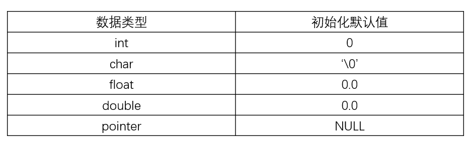

**例**：

```c
myFun.h
double money = 1.1;//定义了全局变量
hello.c
#include <stdio.h>
#include "myFun.h"
void test(){
    printf("%.2f\n",money);
}
void main(){
    printf("%.2f\n",money);
    test();
    if(1){
        printf("%.2f\n",money);
    }
}
```

```c
#include <stdio.h>

int n = 20;//函数外部定义的变量，就是全局变量
void sayHello(){
    char name[] = "tom";
    printf("hello %s\n",name);//name就是局部变量，作用域在sayHello函数中
}
//函数形参，会被视为f10的局部变量
//当局部变量和全局变量同名时，以局部变量为准(就近原则)
void f10(){
    int n = 10;
    printf("n=%d",n);
}
void main(){
    sayHello();
    //不能使用到sayHello的name变量
    //printf("name = %s",name);//提示：没有定义name
    f10(10);
}
```

# 数据类型

​	每一种数据都定义了明确的数据类型，在内存中分配了不同大小的内存空间(字节来表示)。

​	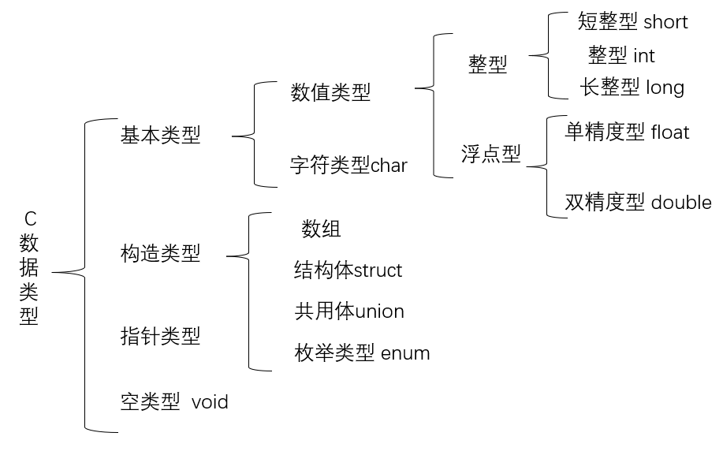

## 基本数据类型

### 整型数据

​	分为基本型、短整型、长整型、无符号四种。**整数可以精确存放**。

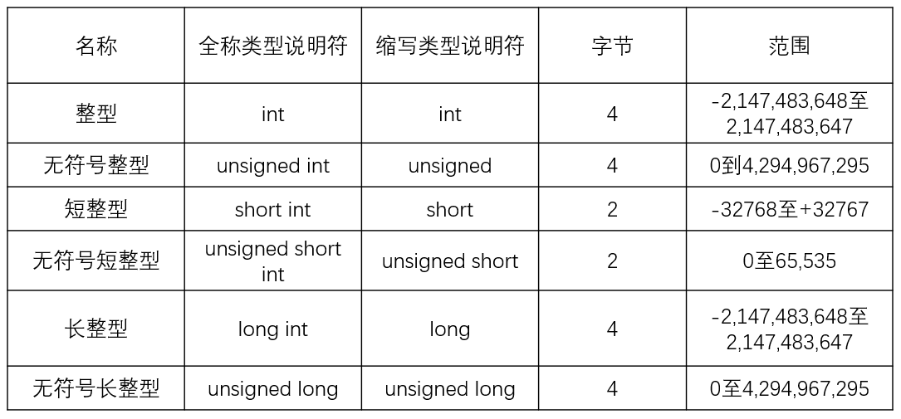

​	在不同系统上，数据类型的长度不一样 int 2字节或4字节。

​	**占位符**： -->  [Here](#C语言占位符)

​	**写二进制数据**：以`0b`开头为2进制，`0b11101101`

​	**八进制数据**：以`0`开头为8进制，`045`，`021`

​	**十六进制数据**以`0x`开头为16进制，`0x21458adf`

​	**进制**： --> [Here](#进制)

​	**int补充知识**： -->  [Here](#int补充知识)

### 实型数据

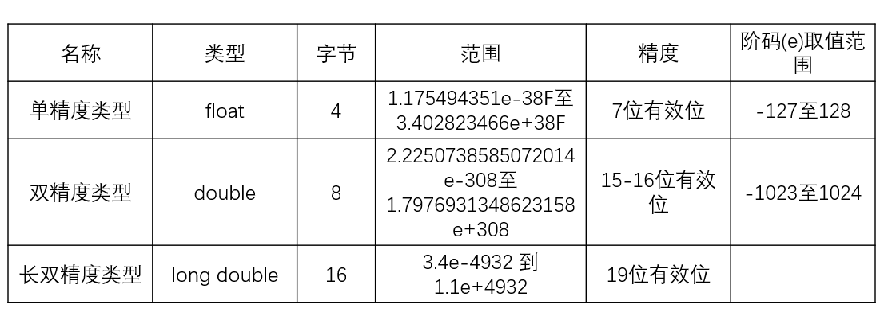

​	在内存中，实数一律以**指数形式**存放。**浮点数是近似值，存在误差**。

​	**浮点数** = **符号位** + **指数位** + **尾数位**。

​	**单精度**：数字后面加 "f"或"F" `2.3f`   不加"f" 是从double到float截断。

​	**双精度**：2.3，默认为双精度。

​	**占位符**： -->  [Here](#C语言占位符)

### 字符型数据

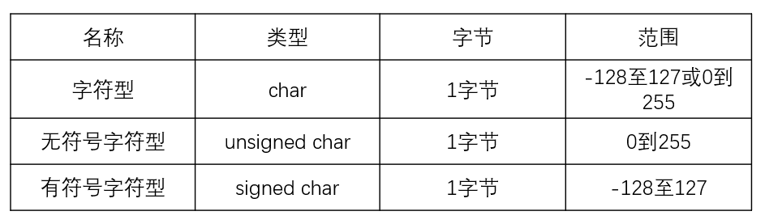

​	字符类型可以表示**单个字符**，允许使用单个字符、转义字符、ASCII、Unicode。

​	字符类型 存储到计算机中，需要将字符对应的**码值**(整数)找出来。

​	**存储**：字符'a' ---> 码值(97) ---> 二进制(1100001) ---> 存储 

​	**读取**：二进制(1100001) ---> 码值(97) ---> 字符'a' ---> 读取(显示)

​	字符和码值的**对应关系**是通过字符编码决定的。

​	**占位符**： -->  [Here](#C语言占位符)

​	**ASCII码**： -->  [Here](#ASCII码)

- **查看长度** :

  ```c
  printf("length of char: %d\n",sizeof(char));
  ```

- 如果直接%d `a`输出编码 `97`即ASCII码 -->  [Here](#ASCII码)

  ```c
  char ch = 'a';
  printf("%d\n",ch);
  ```

  ```c
  char ch = 'A';
  printf("%d\n",ch+32);
  ```

### 字符串数据

​	**没有字符串类型**，使用**字符数组**来表示**字符串**。

```c
char name[20] = "你好";
```

```c
char name[] = "你好";
```

**输出形式**：

1. 可以直接跟字符串：

   ```c
   printf("%s\n", "abcd\0");
   ```

2. 可以直接跟字符串的首地址：

   ```c
   printf("%s\n",字符串的首地址);
   ```

**注意**：

1.  字符串占用内存是连续的，一个字符挨着一个字符，一旦碰到`\0`则表示字符串的结束。

2. 字符串简单**内存示意**：

   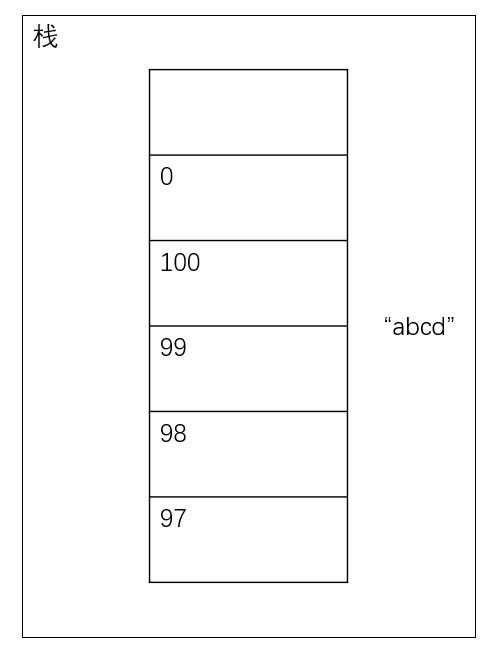

​	**占位符**： -->  [Here](#C语言占位符)

  ### 布尔型数据

1. C语言标准(C89)没有定义布尔类型，所以c语言判断真假时**以0为假，非0为真**。

2. 但这种做法不直观，所以我们可以借助c语言的宏定义。

3. C语言标准(C99)提供了_Bool型，_Bool仍是整数类型，但与一般整型不同的是，Bool变量只能赋值0或1，非0的值都会被储存位1。

   C99还提供了一个头文件`<stdbool.h>`定义了`bool`代表`_Bool`，true代表1，false代表0。只要导入 stdbool.h，就能方便的操作布尔类型了，比如bool flag = false;

   ```c
   #include <stdbool.h>
   main(){
   	bool flag = false;
       printf("\n%d",c);
   }
   ```

   **可用于**：

   - 条件控制语句;
   - 循环控制语句;

​	**占位符**： -->  [Here](#C语言占位符)

  ### 自定义类型

​	使用`typedef` 自定义类型，相当于取个别名。

```c
#include <stdio.h>
#include <stdint.h>
typedef int64_t hjc_int;
typedef char hjc_char;
void main() {
    hjc_int a = 5;
	hjc_char b = 'a';
    printf("%d",a);

}
```

  ## 数据类型的转换

### 基本数据类型的转换

 C语言允许表达式中混合有不同类型的常量和变量。

  1. **系统自动转换**：容易出现意外结果

​      当参与运算的数据的**类型不同**时，编译系统会自动先将它们转换成**同一类型**，然后再进行运算。

  - 转换的基本规则是“**按数据长度增加的方向进行转换**”，以保证精度不降低。
    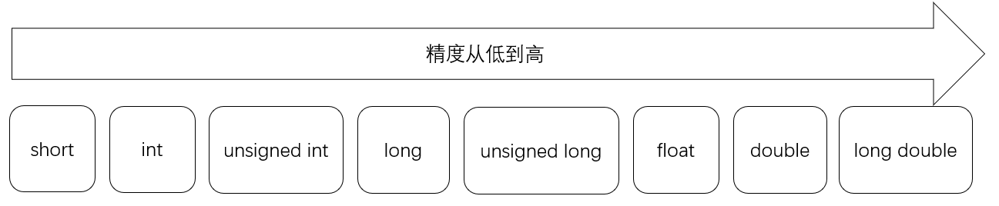

  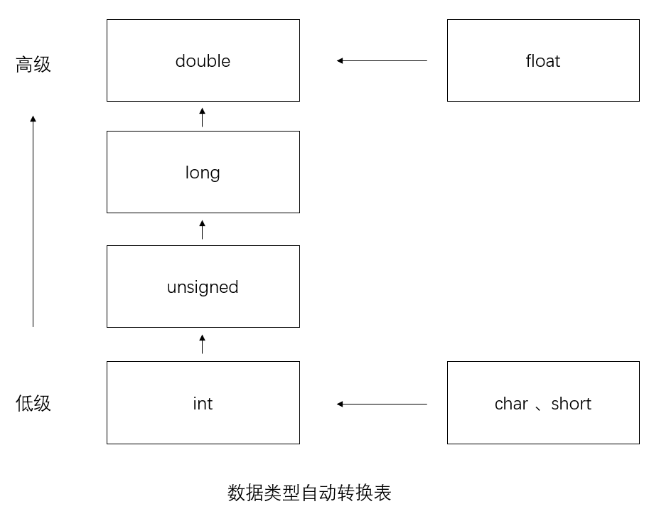

​	 比如 `int` 型数据和 `long` 型数据进行相加或相减运算时，系统会先将 `int` 型数据转换成 `long` 型，然后再进行运算。这样的话运算结果的精度就不会降低。`long` 是“大水桶”，`int` 是“小水桶”。`int` 能存放的，`long` 肯定能存放；而 `long` 能存放的，`int` 不一定能存放。

  - 所有的浮点运算都是以**双精度**进行的。

​     在运算时，程序中所有的 `float` 型数据全部都会先转换成 `double` 型。即使只有一个 `float` 型数据，也会先转换成 `double` 型，然后再进行运算。因为 CPU 在运算的时候有“字节对齐”的要求，这样运算的速度是最快的。

  - `char` 型和 `short` 型数据参与运算时，必须先转换成 `int` 型。涉及 CPU 的运行原理。

  - 有符号整型和无符号整型混合运算时，有符号型要转换成无符号型，运算的结果是无符号的。

  - 在赋值运算中，赋值号两边量的数据类型不同时，**赋值号右边量的类型将转换为左边量的类型**，如果右边变量的数据类型长度比左边长时，将丢失一部分数据。**会降低精度**，丢失的部分按**四舍五入向前舍入**。

  2. **强制转换**

​     将精度高的数据类型转换为精度小的数据类型，使用时要加上强制转换符()，但可能造成精度降低或溢出，格外注意。强制类型转换操作**并不改变**操作数本身。

**强制转换表达式**：(数据类型符)表达式; 或 (数据类型符)变量;

   ```c
  double a = 1.5;
  int b = (int)a;
   ```

**注意：**

​	强制类型转换只对最近的数有效，如果希望更多的表达式转换，使用`()`。

```c
int num = (int)(3.5 * 10 + 6 * 5.1);
```

### 基本数据类型和字符串类型的转换

- 基本数据类型转成字符串类型

  **sprintf函数打印到字符串中。包含在stdio.h的头文件中**。

  ```c
  #include <stdio.h>
  
  void main(){
      char str1[20];//字符数组，即字符串String
      char str2[20];
      char str3[20];
      int a = 20984,b=48090;
      double d = 14.309948;
      sprintf(str1,"%d %d",a,b);
      sprintf(str2,"%.2f",d);
      sprintf(str3,"%8.2f",d);//整数前6位，整数后两位
      printf("str1= %s str2= %s str3= %s",str1,str2,str3);
  }
  ```

**说明**：

1. `sprintf`是一个系统函数，可以将结果存放到字符串中。
2. 格式化的结果，会存放到`str`中。

- 字符串类型转成基本数据类型

  通过`<stdlib.h>`的函数调用`atoi` `atof`即可。

  ```c
  #include <stdio.h>
  #include <stdlib.h>
  
  void main(){
      //字符数组
      char str[10] = "123456";
      char str2[10] = "12.67423";
      char str3[2] = "a";
      char str4[4] = "111";
      int num1 = atoi(str);
      short s1 = atoi(str4);
      double d = atof(str2);
      char c = str3[0];
      printf("num1 = %d d = %f c = %c s1 = %d",num1,d,c,s1);
  }
  ```

**说明**：

1. `atoi(str)`将`str`转成整数。
2. `atof(str2)`将`str2`转成小数。
3. `str3[0]`获取`str3`字符串(数组)的第一个元素。

**注意**：

1. 在将`char`数组类型转成基本数据类型时，要确保能够转成有效的数据，比如把"`123`"转成一个整数，不能把"`hello`"转成整数。
2. 如果格式不正确，会默认转成`0`或者`0.0`。

## 构造数据类型

### 枚举类型

​	**枚举**是C语言的一种**构造数据类型**，可以让数据更简洁，更易读，对于**只有几个有限的特定数据**，可以使用枚举。

​	枚举对应英文(enumeration，简写enum)

​	枚举是一组常量的集合，包含一组**有限的**`特定的`数据

**格式**：

```c
enum 枚举名 {枚举元素1，枚举元素2...};
```

**例**：

```c
int main(){
    enum DAY
    {
        MON=1,TUE=2,WED=3,THU=4,FRI=5,SAT=6,SUN=7
    };//这里的DAY就是枚举类型，包含了七个枚举元素。
    enum DAY day;//enum DAY 是枚举类型，day是枚举变量
    day = WED;//给枚举变量day赋值，值就是某个枚举元素
    printf("%d",day);//3，每个枚举元素对应的一个值
    return 0;
}
```

**注意**：

1. C语言中，枚举类型是被当作`int`或者`unsigned int`类型来处理的，枚举类型必须连续是可以实现有条件的遍历。

   ```c
   enum DAY{
        MON=1,TUE=2,WED=3,THU=4,FRI=5,SAT=6,SUN=7
      //MON=1,TUE,WED,THU,FRI,SAT,SUN如果没有赋值，就会按照顺序赋值
   }day;//表示定义了一个枚举类型enum DAY，同时定义了一个变量day(类型是enum DAY)
   int main(){
       //遍历枚举元素，枚举的每个元素都对应数值
       for(day = MON;day <= SUN;day++){
           printf("枚举元素：%d \n",day);
       }
       return 0;
   }
   ```

2. 每一个枚举成员的默认值为整型的0，后续枚举成员的值在前一个成员上加1。如果把第一个枚举成员的值定义为1，第二个值就为2。

   ```c
   enum DAY{
        MON,TUE,WED,THU,FRI,SAT,SUN
      //0    1   2   3   4   5   6
   };
   ```

3. 在定义枚举类型时**改变**枚举元素的值。

   ```c
   enum DAY{
        MON = 7,TUE,WED = 1,THU,FRI,SAT,SUN
      //7		  8		1	  2	  3	  4	  5 
   };
   ```

4. 可以将**整数**转换成对应的枚举值.

   ```c
   int main(){
       enum SEASONS {SPRING = 1,AUTUMN,WINTER};
       enum SEASONS　season;
       season = WINTER;
       int n = 3;
       season = (enum SEASONS)n;
       printf("season = %d",season);
       return 0;
   }
   ```

5. 枚举变量的定义的形式

   - 先定义枚举类型，在定义枚举变量。

     ```c
     enum DAY{
             MON=1,TUE=2,WED=3,THU=4,FRI=5,SAT=6,SUN=7
     };
     enum DAY day;
     ```

   - 定义枚举类型的同时定义枚举变量。

     ```c
     enum　DAY{
     	MON = 1,TUE,WED,THU,FRI,SAT,SUN	
       //MON,TUE,WED,THU = 9,FRI,SAT,SUN	
     }day;
     ```

   - 省略枚举名称，直接定义枚举变量。

     ```c
     enum {
     	MON = 1,TUE,WED,THU,FRI,SAT,SUN	
     }day;//这样使用枚举，该枚举类型只能使用一次
     ```

### 数组

- **数组** --> [Here](#数组)

### 结构体￥


可以叫匿名结构体


不可以


### 共用体￥


匿名共用体


是字符'9'


## 指针类型￥

​	指针表示一个**地址**(存放的是地址)。

### 基本数据类型￥

- 基本类型，都有对应的指针类型，形式为 `数据类型 *`


- 如果输出一个变量的地址，使用的格式是`%p`


  - 取出num这个变量对应地址：`&num`


  - 定义一个指针变量，指针：

    ```c
    int *ptr = &num;
    ```

**注意**： **指针的类型和该指针指向的变量是对应关系**

  - 指针变量 本身也有地址：

    ```c
    printf("ptr的地址%p",&ptr);
    ```

  - 获取指针指向的值`*ptr`：

    ```c
    printf("ptr的存放数据%d",*ptr);
    ```

  ### 	数组￥

，即，内存位置的
直接地址。就像其他变量或常量- -样，在使用指针存储其他变量地址之前，对其进
行声明。指针变量声明的一般形式为:
int *ip; /*一个整型的指针 */
double *dp; /* -个double型的指针*/
float *fp; /* 一个浮点型的指针*/
char *ch; /* 一个字符型的指针*/

![image-20211106083448500]![image-20211106083532589](C:\Users\LetengZzz\AppData\Roaming\Typora\typora-user-images\image-20211106083532589.png

![image-20211106083510289](C:\Users\LetengZzz\AppData\Roaming\Typora\typora-user-images\image-20211106083510289.png

![image-20211106083624032](C:\Users\LetengZzz\AppData\Roaming\Typora\typora-user-images\image-20211106083624032.png

![image-20211106083710525](C:\Users\LetengZzz\AppData\Roaming\Typora\typora-user-images\image-20211106083710525.png

![image-20211106084045318](C:\Users\LetengZzz\AppData\Roaming\Typora\typora-user-images\image-20211106084045318.png

![image-20211106084109371](C:\Users\LetengZzz\AppData\Roaming\Typora\typora-user-images\image-20211106084109371.png

![image-20211106084128654](C:\Users\LetengZzz\AppData\Roaming\Typora\typora-user-images\image-20211106084128654.png

![image-20211106084321719](C:\Users\LetengZzz\AppData\Roaming\Typora\typora-user-images\image-20211106084321719.png

![image-20211106084501857](C:\Users\LetengZzz\AppData\Roaming\Typora\typora-user-images\image-20211106084501857.png

![image-20211106084805615](C:\Users\LetengZzz\AppData\Roaming\Typora\typora-user-images\image-20211106084805615.png

 ptr 声明为一个指针数组
2)由3个整数指针组成。因此，ptr 中的每个元素，都是一个指向int 值的指针。

![image-20211106090108958](C:\Users\LetengZzz\AppData\Roaming\Typora\typora-user-images\image-20211106090108958.png

![image-20211106090202906](C:\Users\LetengZzz\AppData\Roaming\Typora\typora-user-images\image-20211106090202906.png

![image-20211106090355040](C:\Users\LetengZzz\AppData\Roaming\Typora\typora-user-images\image-20211106090355040.png

，并
通过遍历该指针数组，显示字符串信息

请编写程序，定义一个指向字符的指针数组来存储字符串列表(四大名著书名)，并
通过遍历该指针数组，显示字符串信息，(即: 定义一个指针数组，该数组的每个
元素，指向的是一一个字符串)

sizeof（*books）/sizeof（char）？

c)如果让一个字符指针变量指向一个字符串，其中字符串的\0可以怀用写
gcc编译器自动帮你添加\0'
d)不能通过字符指针变量修改字符串中每个字符的值
只能通过其进行查看字符的值
如若放在一个指针中, 会被放在一个常量区, 只可以看不可以修改
如果是一个指针字符串，只能看不能修改


快速入门案例
1)一个指向指针的指针变量必须如下声明，
即在变量名前放置两个星号，例如，下面
声明了一个指向int类型指针的指针:
int
**ptr;
Q2)|
2)当一个目标值被一个指针间接指向到另一
个指针时，访问这个值需要使用两个星号
运算符,比如**ptr
↓3)案例演示+内存布局图

![image-20211106095428205](C:\Users\LetengZzz\AppData\Roaming\Typora\typora-user-images\image-20211106095428205.png

![image-20211106095441578](C:\Users\LetengZzz\AppData\Roaming\Typora\typora-user-images\image-20211106095441578.png

![image-20211106095515635](C:\Users\LetengZzz\AppData\Roaming\Typora\typora-user-images\image-20211106095515635.png

![image-20211106095526971](C:\Users\LetengZzz\AppData\Roaming\Typora\typora-user-images\image-20211106095526971.png

![image-20211106095701286](C:\Users\LetengZzz\AppData\Roaming\Typora\typora-user-images\image-20211106095701286.png

三级指针

![image-20211106095945778](C:\Users\LetengZzz\AppData\Roaming\Typora\typora-user-images\image-20211106095945778.png


![image-20211106100037500](C:\Users\LetengZzz\AppData\Roaming\Typora\typora-user-images\image-20211106100037500.png

当函数的形参类型是指针类型时，是使用该函数时，需要传递指针，或者地址，或

![image-20211106100322523](C:\Users\LetengZzz\AppData\Roaming\Typora\typora-user-images\image-20211106100322523.png

![image-20211106100604699](C:\Users\LetengZzz\AppData\Roaming\Typora\typora-user-images\image-20211106100604699.png

![image-20211106100610890](C:\Users\LetengZzz\AppData\Roaming\Typora\typora-user-images\image-20211106100610890.png

![image-20211106100655797](C:\Users\LetengZzz\AppData\Roaming\Typora\typora-user-images\image-20211106100655797.png

![image-20211106100712936](C:\Users\LetengZzz\AppData\Roaming\Typora\typora-user-images\image-20211106100712936.png

因为函数放在了主函数的下面所以要声明函数

![image-20211106101209443](C:\Users\LetengZzz\AppData\Roaming\Typora\typora-user-images\image-20211106101209443.png

![image-20211106101441612](C:\Users\LetengZzz\AppData\Roaming\Typora\typora-user-images\image-20211106101441612.png

![image-20211106101813801](C:\Users\LetengZzz\AppData\Roaming\Typora\typora-user-images\image-20211106101813801.png

![image-20211106101841170](C:\Users\LetengZzz\AppData\Roaming\Typora\typora-user-images\image-20211106101841170.png

![image-20211106102142672](C:\Users\LetengZzz\AppData\Roaming\Typora\typora-user-images\image-20211106102142672.png

![image-20211106102157423](C:\Users\LetengZzz\AppData\Roaming\Typora\typora-user-images\image-20211106102157423.png

![image-20211106102340091](C:\Users\LetengZzz\AppData\Roaming\Typora\typora-user-images\image-20211106102340091.png

![image-20211106102554210](C:\Users\LetengZzz\AppData\Roaming\Typora\typora-user-images\image-20211106102554210.png

![image-20211106102822050](C:\Users\LetengZzz\AppData\Roaming\Typora\typora-user-images\image-20211106102822050.png

![image-20211106102915088](C:\Users\LetengZzz\AppData\Roaming\Typora\typora-user-images\image-20211106102915088.png

用指针作为函数返回值时需要注意，函数运行
结束后会销毁在它内部定义的所有局部数据，
包括局部变量、局部数组和形式参数，函数返
回的指针不能指向这些数据[案例演示]
函数运行结束后会销毁该函数所有的局部数据，
这里所谓的销毁并不是将局部数据所占用的内
存全部清零，而是程序放弃对它的使用权限，
后面的代码可以使用这块内存[ 案例演示]
C语言不支持在调用函数时返回局部变量的地
址，如果确实有这样的需求，需要定义局部变
量为static变量[案例演示]

![image-20211106103116752](C:\Users\LetengZzz\AppData\Roaming\Typora\typora-user-images\image-20211106103116752.png

赋予一一个指针变量，使指针变量指向函数
所在的内存区域，然后通过指针变量就可以找到并调用该函数。这种指针就是
函数指针。

的优先级高于*，第-一个括号不能省略，如果写作returnType
*pointerName(param list);就成了函数原型，它表明函数的返回值类型为
returnType 

![image-20211106104551291](C:\Users\LetengZzz\AppData\Roaming\Typora\typora-user-images\image-20211106104551291.png

![image-20211106160748797](C:\Users\LetengZzz\AppData\Roaming\Typora\typora-user-images\image-20211106160748797.png

![image-20211106163336204](C:\Users\LetengZzz\AppData\Roaming\Typora\typora-user-images\image-20211106163336204.png

简单理解

![image-20211106163513902](C:\Users\LetengZzz\AppData\Roaming\Typora\typora-user-images\image-20211106163513902.png

![image-20211106163623239](C:\Users\LetengZzz\AppData\Roaming\Typora\typora-user-images\image-20211106163623239.png

![image-20211106163910841](C:\Users\LetengZzz\AppData\Roaming\Typora\typora-user-images\image-20211106163910841.png

可以是**值传递(pass by value)**，也可以**传递指针(a pointer passed by value)**，传递指针也叫**地址传递**。

## 值传递

​	**默认传递值的类型**：**基本数据类型(整型数据、实数类型、字符类型)，结构体，共用体**。

​	**值传递**：将变量指向的存储内容，在传递/赋值时，拷贝一份给接受变量。

​	

## 地址传递

​	**默认传递地址的类型**：**指针、数组**。

​	**地址传递** 也叫 **指针传递**：如果指针，就将指针变量存储的地址，传递给接收变量，如果是**数组，就将数组的首地址传递给接收变量**。


# 运算符

​	C语言的基本**表达式**是由**操作数**和**操作符**组成。

​	**操作数**通常是由**变量**或**常量**表示；

​	**操作符**由各种运算符表示。运算符表示数据的**运算**、**赋值**、**比较**等。

​	一个**基本表达式**也可以作为**操作数**来构成**复杂表达式**。构成基本表达式的常用运算符有：

## 算术运算符及表达式

​	算术运算符是对**数值类型的变量**进行运算的。

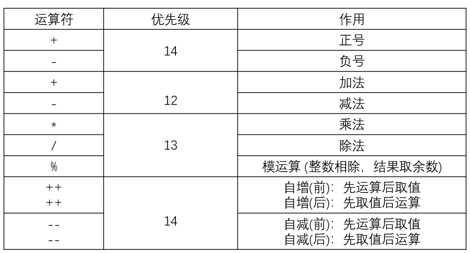

​	运算符的优先级和结合性 --> [Here](#运算符的优先级和结合性)

- **取模运算**：

  **取模公式： a % b = a - a / b * b**

  ```c
  int res1 = 10 % 3;	//余数为1
  int res2 = -10 % 3;	//余数为-1
  int res3 = 10 % -3;	//余数为1
  int res4 = -10 % -3; //余数为-1
  ```

  取模运算**只能是整数，不能是实型**。

- **自增、自减运算**：

  - **++(前)/--(前)运算规则**：

  ```c
  int i = 10;
  int j = ++i;	//运算规则等价于 int j = i;i = i + 1;
  ```

  - **(后)++/(后)--运算规则**：

  ```c
  int i = 10;
  int j = i++;	//运算规则等价于 i = i + 1;int j = i;
  ```

  - ++ 或者 -- 可以独立使用，就相当于自增，如果独立使用两者**完全等价**

  ```c
  k++;
  //k++ 等价于 k = k + 1;
  ++k;
  //++k 等价于 k = k + 1;
  ```

**注意**：	

- 对于除号"/" ，它的整数除和小数除是有区别的；整数之间做除法，只会保留整数部分而舍弃小数部分。

  ```c
  //处理流程:10/4 = 2.5 --> 截取整数 --> 2 --> 2.000000
  double a = 10 / 4; //2.000000 
  double b = 10.0 / 4; //如果希望保留小数，参与运算数必须有浮点数
  ```
  
- 如果双目运算符两边运算数的类型不一致，系统将自动进行类型转换，使运算符两边类型达到一致后，再进行计算。

- 单目运算符"+"和 "-"、"++"和 "- -"的结合性是**从右到左**的，其余运算符的结合性都是**从左到右**。

- "++" 和 "--" 的结合方向是**从右到左**，- i++相当于- (i++)。

  例：-3++等于i = 3 、(i++) = 3 、-(i++)=-3 然后 i自增 最后i = 4。 

**算术表达式**

​	用算术表达符和一对圆括号将运算数(或称操作数)连接起来的、符合C语言语法的表达式称为**算术表达式**。

​	算术表达式中,运算对象可以是**常量﹑变量和函数等**。**例**:2+sqrt( c) * b。

在计算机语言中,算术表达式的求值规律与数学中四则运算的规律类似,其**运算规则**和要求如下:

1. 在算术表达式中,可使用多层圆括号,但左右括号必须配对。运算时从内层圆括号开始,由内向外依次计算表达式的值。

2. 在算术表达式中,若包含不同优先级的运算符,则按运算符的优先级由高到低进行;若表达式中运算符的级别相同,则按运算符的结合方向进行。

   **例**：表达式a+b-c,因为+号和-号的优先级相同,它们的结合性为从左到右,因此先计算a+b,然后把所得结果减去c的值。

## 关系运算符

​	关系运算符的结果要么是真(非0表示 默认使用1)要么是假(0)。

​	关系运算符的作用：用于条件判断的表达常用在**if结构的条件中**或**循环结构的条件中**。

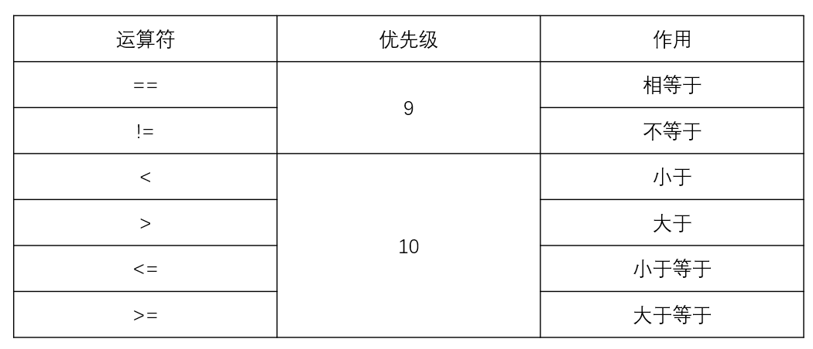

​	运算符的优先级和结合性 --> [Here](#运算符的优先级和结合性)

​	**关系表达式**：关系运算符组成的表达式。

## 逻辑运算符

​	用于连接**多个条件**(一般来讲是关系表达式)，最终的结果要么是真(非0表示 默认使用1)要么是假(0表示)

​	逻辑运算符的**作用**：用于判断条件中的逻辑关系。

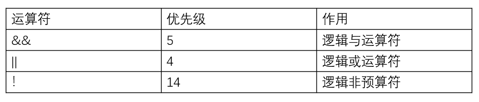

​	运算符的优先级和结合性 --> [Here](#运算符的优先级和结合性)

​	**逻辑与运算符**：如果两个操作数都非零(真)，则条件为真，否则结果为0(假)。

​	**逻辑或运算符**：如果两个操作数中有任意一个非零，则条件为真。

​	**逻辑非运算符**：用来逆转操作数的逻辑状态。如果条件为真则逻辑非运算符将其为假。

> 变量A的值为1，变量B为0.
>
> (A && B)为假(0)
>
> (A || B)为真(1)
>
> !(A && B)为真(1)

**说明**：短路现象

​	在进行&&(||)，如果第一个条件为假(真)，则**不再执行**后面的条件，整个结果为假(真)所以，也称为短路逻辑与(或)。

## 赋值运算符及表达式

​	赋值运算符就是将某个运算后的值，赋给指定的变量

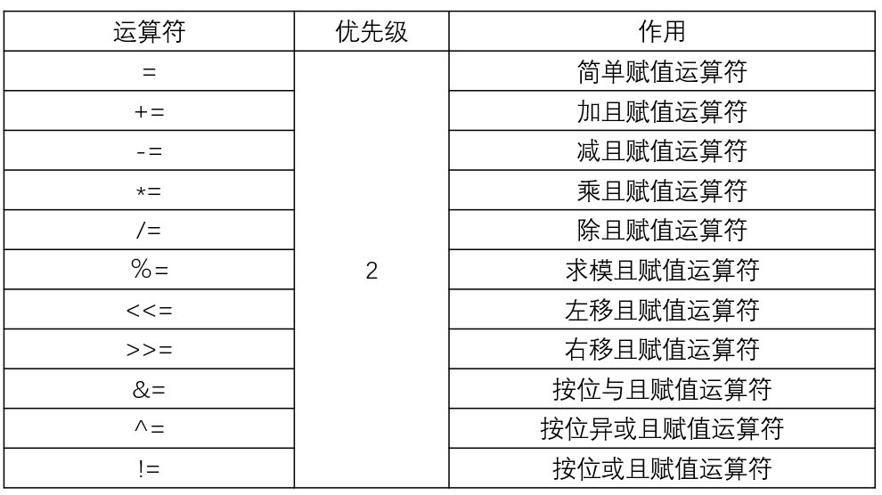

​	运算符的优先级和结合性 --> [Here](#运算符的优先级和结合性)

**赋值表达式**：

​	由赋值运算符组成的表达式称为**赋值表达式**。

**形式**：

​		**变量名 = 表达式**

赋值号的**左边**必须是一个代表某一个存储单元的**变量名**，赋值号的**右边**必须是C语言中**合法的表达式、变量、常量值**。原理就是把数据存入以该变量为标识的存储单元中。

**复合赋值表达式**

​	在赋值运算符之前加上其他运算符可以构成**复合赋值运算符**。

​	C语言规定可以使用**10种**复合赋值运算符，其中与算术运算有关的：+=、-=、*=、/=、%=(**注意：两个符号之间不能有空格**)。

**赋值运算中的类型转换**：

​	在赋值运算中,只有在赋值号右侧表达式的类型与左侧变量类型**完全一致**时，赋值操作才能进行。如果赋值运算符两侧的数据类型不一致，在赋值前，系统将**自动先把右侧表达式求得的数值按赋值号左边变量的类型进行转换**，也可以用**强制类型转换的方式人为地进行转换**后将值赋给赋值号左边的变量。这种转换仅限于**数值数据**之间,通常称为"**赋值兼容**"。对于地址值就不能赋给一般的变量，称为"**赋值不兼容**”。
​	在C语言的表达式(不包括赋值表达式)中,如果运算符两边的整数类型不相同，将进行类型之间的转换。
**转换规则**：

1. 若运算符两边一个是短整型,一个是长整型,则将短整型转换为长整型,然后进行运算。

2. 若运算符两边一个是**有符号整型**，一个是**无符号整型**，则将有符号整型转换成无符号整型，然后进行运算。

   在C语言的赋值表达式中，**赋值号右边的值先转换成与赋值号左边的变量相同的类型，然后进行赋值**。

**注意**：

1. 当赋值号左边的变量为**短整型**，右边的值为**长整型**时，短整型变量只能接受长整型数低位上两个字节中的数据，高位上两个字节中的数据将会丢失。也就是说，右边的值**不能超出短整型**的数值范围，否则将**得不到**预期的结果。

   ```c
   short a;
   unsigned long b = 98304;
   a = b;
   printf("%d",a);
   ```

   a的值为-32768。因为98304(二进制11000000000000000)已经超出短整型的数值范围(-32768-32768)，a截取b中低16位中的值(二进制100000000000000)，由于高位为1，所以a的值为-32768

2. 当赋值号左边的变量为**无符号整型**，右边为**有符号整型**时，则把内存中的内容**原样复制**。右边数值的范围**不应超出**左边变量可以接受的数值范围。同时需要**注意**，这时负数将转换为正数。**例**：变量a被说明为unsigned类型，在进行了a=-1；的赋值操作后，将使a中的值为65535

3. 当赋值号左边的变量为**有符号整型**，右边的值为**无符号整型**时，**复制机制同上**，**这时若符号位为1，将按负数处理**。

**说明**：

1. 在程序中可以多次给一个变量赋值，每赋一次值，与它相应的**存储单元**中的数据就会被更新一次，内存中当前的数据就是**最后一次**所赋的数据。
2. 赋值运算符的优先级别只高于逗号运算符，比任何其他运算符的优先级都**低**，且具有**自右向左**的结合性。
3. 赋值表达式x= y的作用是,将变量y所代表的存储单元中的内容**赋给**变量x所代表的**存储单元**，x中原有的数据被替换掉。赋值后,变量y中的内容**保持不变**。应读"**把右边变量的值赋给左边变量**",而不应读作"x等于y"。
4. 复合赋值运算符的优先级与赋值运算符的**优先级相同**。
5. 复合赋值运算符**等价于**：a+=3;等价于a=a+3;。若a=9 ，ａ+= a -= a+a  的值等于-18(先计算a+a =18 再计算 a -= 18 (a=-9)等于-9，再计算a += -9，最后等于 -18)。

## 条件运算符


​	运算符的优先级和结合性 --> [Here](#运算符的优先级和结合性)

## 自反赋值运算符


​	运算符的优先级和结合性 --> [Here](#运算符的优先级和结合性)

## 逗号运算符


​	运算符的优先级和结合性 --> [Here](#运算符的优先级和结合性)

## 指针运算符


​	运算符的优先级和结合性 --> [Here](#运算符的优先级和结合性)

## 三元运算符

**基本语法**：

​	**条件表达式 ? 表达式1 ：表达式2;**

​	运算符的优先级和结合性 --> [Here](#运算符的优先级和结合性)

**说明**：

1. 如果条件表达式为非0(真)，运算后的结果是表达式1。

2. 如果条件表达式为0(假)，运算后的结果是表达式2。

   ```c
   int a = 10;
   int b = 99;
   int res = a > b ? a++ : b--;
   ```

3. 表达式1和表达式2要为可以赋给接收变量的类型(或可以自动转换)，否则会有精度损失。

   ```c
   int n = a > b ? 1.1 : 1.2;//警告 double --> int
   ```

4. 三元运算符可以转换成if-else语句。

## 单目运算符

**单目运算**是指运算符包括**算术运算符**、**逻辑运算符**、**位逻辑运算符**、**位移运算符**、**关系运算符**、**自增自减运算符**。

**说明**：

1. 单目运算级的优先级**高于**双目运算符以及多目运算符。
2. 单目操作符 也就是**只接受**一个操作数的操作符，包括 ! ,++,sizeof ,~,--,(type)
3. 单目运算符在运算优先级里位**第二位**。

**例**：

​	~ 按位取反运算符 （把所有二进制的数字取反）

​	如 ~00001100=11110011

​	运算符的优先级和结合性 --> [Here](#运算符的优先级和结合性)

## 位运算符

​	位运算符作用于位，并逐位执行操作。

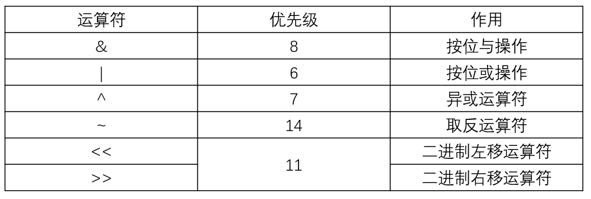

​	运算符的优先级和结合性 --> [Here](#运算符的优先级和结合性)

**说明**：

 1. 按位与操作：两位全为1，结果为1，否则为0。

    ```c
    int a = 2;
    //0000 0000 0000 0000 0000 0000 0000 0010(2)
    int b = -3;
    //1000 0000 0000 0000 0000 0000 0000 0011(-3原码)
    //1111 1111 1111 1111 1111 1111 1111 1100(-3反码)
    //1111 1111 1111 1111 1111 1111 1111 1101(-3补码)
    printf("%d\n",a&b);//0
    //0000 0000 0000 0000 0000 0000 0000 0000(0)
    ```

 2. 按位或操作：两位有一个为1，结果为1，否则为0。

    ```c
    int a = 2;
    //0000 0000 0000 0000 0000 0000 0000 0010(2)
    int b = -3;
    //1000 0000 0000 0000 0000 0000 0000 0011(-3原码)
    //1111 1111 1111 1111 1111 1111 1111 1100(-3反码)
    //1111 1111 1111 1111 1111 1111 1111 1101(-3补码)
    printf("%d\n",a|b);//-1
    //1111 1111 1111 1111 1111 1111 1111 1111(补码)
    //1111 1111 1111 1111 1111 1111 1111 1110(反码)
    //1000 0000 0000 0000 0000 0000 0000 0001(原码 -1)
    ```

 3. 按位异或操作：两位一个为0，一个为1，结果为1，否则其他情况为0。

    ```c
    int a = 2;
    //0000 0000 0000 0000 0000 0000 0000 0010(2)
    int b = -3;
    //1000 0000 0000 0000 0000 0000 0000 0011(-3原码)
    //1111 1111 1111 1111 1111 1111 1111 1100(-3反码)
    //1111 1111 1111 1111 1111 1111 1111 1101(-3补码)
    printf("%d\n",a^b);//-1
    //1111 1111 1111 1111 1111 1111 1111 1111(补码)
    //1111 1111 1111 1111 1111 1111 1111 1110(反码)
    //1000 0000 0000 0000 0000 0000 0000 0001(原码 -1)
    ```

 4. 按位取反：0-->1,1-->0。

    ```c
    int8_t a = 1;//-2
    int8_t a = 0;//-1
    int8_t a = -2;//1
    e =~e;
    //0000 0001(1)
    //1111 1110(反码)
    //1111 1101(补码)
    //1000 0010(原码 -2)
    //-----
    //0000 0000(0)
    //1111 1111(反码)
    //1111 1110(补码)
    //1000 0001(原码 -1)
    //-----
    //1000 0010(-2)
    //1111 1101(反码)
    //1111 1110(补码)
    //0000 0001(1)
    printf("%d",e);
    ```

 5. `<<`在一定的范围内 每向左移1位 相当于 * 2

    `>>`在一定的范围内 每向右移1位 相当于 / 2

    - **最高效方式的计算 2*8    2 << 3  或 8 << 1**

 6. 二进制左移将一个数的各二进制全部左移若干位，**符号位不变，低位补零**。

 7. 二进制右移将一个数的各二进制全部右移若干位，**低位溢出，符号位不变，并用符号位补溢出的高位**。

    ```c
    int a = 1 << 2;//4
    //0000 0000 0000 0000 0000 0000 0000 0001(1)
    //0000 0000 0000 0000 0000 0000 0000 0100(4)
    int a = 1 >> 2;//0
    //0000 0000 0000 0000 0000 0000 0000 0001(1)
    //0000 0000 0000 0000 0000 0000 0000 0000(10 >> 2)
    int a = -10 >> 2;//-3
    //1000 0000 0000 0000 0000 0000 0000 1010(10)
    //1111 1111 1111 1111 1111 1111 1111 0101(反码)
    //1111 1111 1111 1111 1111 1111 1111 0110(补码)
    //1111 1111 1111 1111 1111 1111 1111 1101(-10 >> 2补码)
    //1111 1111 1111 1111 1111 1111 1111 1100(反码)
    //1000 0000 0000 0000 0000 0000 0000 0011(原码)
    int a = -1 >> 2;//-1
    //1000 0000 0000 0000 0000 0000 0000 0001(-1)
    //1111 1111 1111 1111 1111 1111 1111 1110(反码)
    //1111 1111 1111 1111 1111 1111 1111 1111(补码)
    //1111 1111 1111 1111 1111 1111 1111 1111(-1 >> 2)
    //1111 1111 1111 1111 1111 1111 1111 1110(反码)
    //1000 0000 0000 0000 0000 0000 0000 0001(原码)
    ```

**位运算实例之提取颜色通道**

1. 颜色

   ```c
   uint32_t color = 0xFFFFFFFF;//ARGB(Alpha,Red,Green,Bule)
   ```

2. 只取到红色的值

   ```c
   uint32_t color = 0x00FF0000;//ARGB(Alpha,Red,Green,Bule)
   ```

3. 取红色通道值

   ```c
   uint32_t color = 0xFFFEFAFB;//ARGB(Alpha,Red,Green,Bule)
   //1111 1111 1111 1110 1111 1010 1111 1011
   uint32_t tmp = color&0x00FF0000;
   //0000 0000 1111 1111 0000 0000 0000 0000
   uint8_t red = tmp >> 16;
   printf("%d\n",red);
   ```

## 逗号运算符

​	" , " 是C语言提供的一种特殊运算符,用逗号将表达式连接起来的式子称为**逗号表达式**。

​	运算符的优先级和结合性 --> [Here](#运算符的优先级和结合性)

**一般形式**
						**表达式1,表达式2,…,表达式n**
**说明**

1. 逗号运算符的结合性为从左到右,因此逗号表达式将从左到右进行运算。即先计算表达式1,然后计算表达式2,依次进行,最后计算表达式n。最后一个表达式的值就是此逗号表达式的值。

   **例**: (i = 3,i++,++i,i + 5)这个逗号表达式的值是10,i的**值为5**。

2. 在所有运算符中,逗号运算符的**优先级最低**。

3. int a,b;不是逗号表达式。

4. 不建议经常使用。

# 顺序控制结构

​	程序从上到下逐行地执行，中间没有任何判断和跳转

**说明**：

​	C中定义变量时采用合法的**前向引用的原则**

```c
void main(){
    int num1 = 12;
    int num2 = num1 + 2;
    //错误形式
    //int num2 = num1 + 2;
    //int num1 = 12;
}
```

## 赋值语句

​	在赋值表达式的尾部加上一个" ; "，就构成了**赋值语句**，也叫**表达式语句**。赋值语句是一种可执行语句，应当出现在函数的**可执行部分**。应当注意，不要把变量定义时的赋初值和赋值语句**混为一谈**。

​	**例**：`a = b + c`是赋值表达式，`a = b + c;`是赋值语句。`i++;`、`--i;`、`a=b,b=c;`也是赋值语句。

## 数据输出￥

​	把数据从计算机内部送到计算机外部设备上的操作称为"**输出**"。

**调用格式**：

```c
print(格式输入,输出项1，输出项2,...);
```

**步骤**：

1. **include <stdio.h>**。

2. 使用**printf**函数。

3. 使用适当的**格式参数**输出。

**说明**：

 1. 在printf函数调用之后加上"`;`"，构成**输出语句**。

 2. 用双引号括起来的字符串部分是**输出格式控制**，决定了输出数据的**内容和格式**。后面的输出项是printf函数的**实参**。

 3. 输出格式说明的作用是将要输出的数据按照约定的格式输出。**格式说明**有**"%"符号**和紧跟在其后的**格式描述符**组成。

 4. 除了格式转换说明外，字符串中的其他字符(包括空格)将按原样输出。

 5. printf的各输出项之间要用逗号隔开(函数的各个参数之间必须用逗号隔开)。输出项可以是任意合法的**常量、变量或表达式**。

    printf可以没有输出项,函数的调用形式将为printf(格式控制），输出结果就是格式控制中的**固定字符串**。

    ```c
    printf("OK");
    ```

 6. 通常输出的数据如果是负数，前面有符号"`-`"，但正数前面的"`+`"一般都省略了。如果要每一个数前面都带正负号，可以在"%"和格式字符间加一个"+"号来实现。

    ```c
    int n = 4;
    printf("%+d",n);
    ```

7. 

**输出数据所占宽度说明**：

​	当使用%d、%c、%f...的格式说明时，输出数据所占的宽度(域宽)由系统决定，通常按照数据本身的**实际宽度输出**，前后不加空格，并采用**右对齐**的形式。

​	**可以用以下方法控制输出数据所占的宽度(域宽)**：

1. 在%和格式字符之间**插入**一个整数常数来指定输出的宽度n。

   ```c
   int n = 1234;
   printf("%4d",n);//1234
   ```

   如果指定的宽度n不够，输出时将**自动突破**，保证数据完整输出。

   ```c
   printf("%2d",n);//1234
   ```

   如果指定的宽度n超过输出数据的实际宽度，输出时将会**右对齐**，左边**补以空格**，达到指定的宽度。

   ```c
   printf("%6d",n);//空空1234
   ```

2. 对于float和double类型的实数，可以用"`n1.n2`"的形式来指定输出宽度(n1，n2分别代表一个整常数)，


printf语句是从右到左计算，从左到右输出

​	**占位符**： -->  [Here](#C语言占位符)

## 数据输入￥

​	在编程中，需要接受用户输入的数据，可以使用键盘输入语句获取。

**调用格式**：

```c
scanf(格式控制,输入项1,输入项2,...)
```


**步骤**：

1. **include <stdio.h>**。
2. 使用**scanf**函数。
3. 使用适当的**格式参数**接受输入。

```c
#include <stdio.h>
void main(){
    char name[] = "";
    int age = 0;
    double sal = 0.0;
    char gender = ' ';
    printf("请输入名字");
    scanf("%s",name);
    printf("请输入年龄");
    scanf("%d",&age);//需要存放到age变量指向的地址
    printf("请输入薪水");
    scanf("%lf",&sal);
    printf("请输入性别");
	scanf("%c",&gender);//接收到上面的回车符
    scanf("%c",&gender);//等待用户输入
    printf("\nname:%s age:%d sal:%.2f gender:%c",name,age,sal,gender);
}
```

**说明**：

 	1. 在scanf函数调用之后加上"`;`"，构成**输入语句**。


​	**占位符**： -->  [Here](#C语言占位符)

## 复合语句和空语句

**复合语句**：

​	在C语言中，一对花括号"`{}`"不仅可以用作函数体的开头和结尾的标志，也可以用作复合语句的开头和结尾的标志。复合语句也可称为 "**语句块**"。

**语句形式**：

```c
{语句1 语句2 ....... 语句n}
```

**说明**：

1. 用一对花括号把若干语句括起来构成一个语句组。一个复合语句在语法上视为**一条语句**，在一对花括号内的语句**数量不限**。

2. 在复合语句中，不仅可以有**执行语句**，也可以有**定义部分**，定义本复合语句中的**局部变量**。

   ```c
   {a++; b *= a; printf("b = %d\n",b);}
   ```

**空语句**：

​	C语言中的所有语句都必须由一个分号";"作为结束。如果**只有一个分号**，称为**空语句**。

**注意**：

 1. 程序执行时不会产生任何动作。

 2. 程序设计中有时需要加一个空语句来表示存在一条语句，但随意加分号也会导致逻辑上的错误，而且这种错误十分隐蔽，编译器也不会提示逻辑错误。

    ```c
    main(){
        ;
    }
    ```

# 选择控制结构

## if语句

​	如果if中的代码块，只有一条语句，则可以省略{}(**不推荐**)。

### 单分支

**基本语法**：

```c
if(条件表达式){
	执行代码块;
}
```

**说明**：

​	当条件表达式为真(非0)时，就会执行{ }的代码，返回假(0)时，不会执行{ }的代码。

**流程图**：

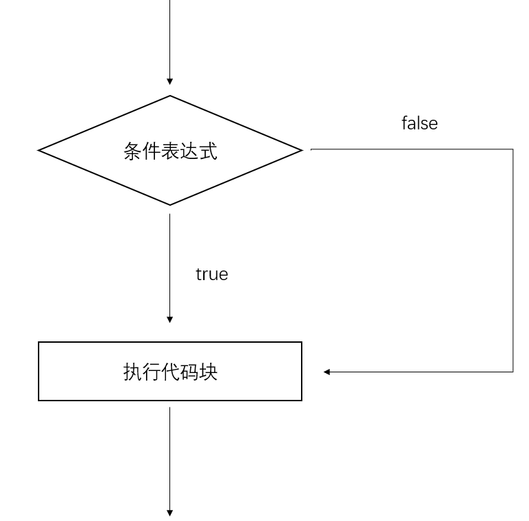

### 双分支

**基本语法1**：

```c
if(条件表达式){
    执行代码块1;
}else{
    执行代码块2;
}
```

**说明**：

​	当条件表达式成立(为真)，执行代码块1，否则执行代码块2。

**流程图**：

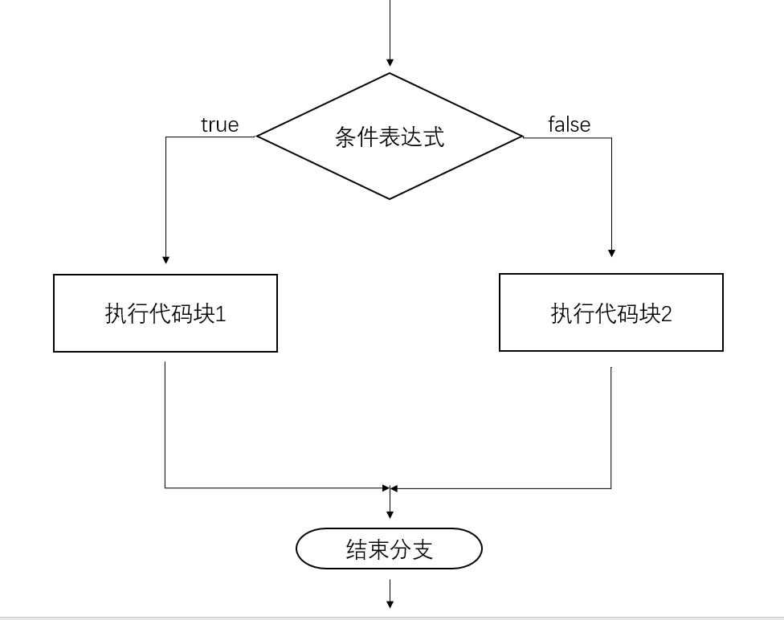

**基本语法2**：

```c
if(条件表达式1){
    执行代码块1;
}else if(条件表达式2) {
    执行代码块2;
}else if(条件表达式3) {
    执行代码块3;
}...
else{
    执行代码块n;
}
```

**说明**：

​	当条件表达式1成立(为真)，执行代码块1，如果表达式1不成立，才会去判断表达式2是否成立，若成立则执行代码块2，以此类推，如果所有表达式都不成立，则执行else的代码块。

**注意**：

​	**只能有一个执行入口**。

**流程图**：

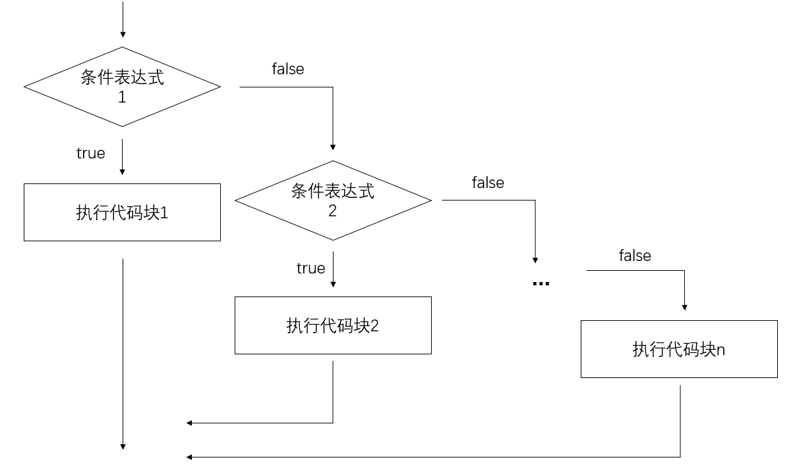

### 嵌套分支

​	在一个分支结构中又完整的嵌套了另一个完整的分支结构。

​	里面的分支的结构称为**内层分支**外面的分支结构称为**外层分支**。

**注意**：

​	嵌套分支不适合过多，最多不超过3层。

**基本语法**：

```c
if(){
    if(){//被包含的可以是单分支，双分支，多分支
        
    }else{
        
    }
}
```

## switch语句

**基本语法**：

```c
switch(表达式){
    case 常量1://当表达式的值等于常量1
    语句块1;
    break;//退出switch
    case 常量2://含义一样
    语句块2;
    break;
    ...
    case 常量块n:
    语句块n;
    break;
    default:
    default语句块;
  //break;
}
```

**流程图**：

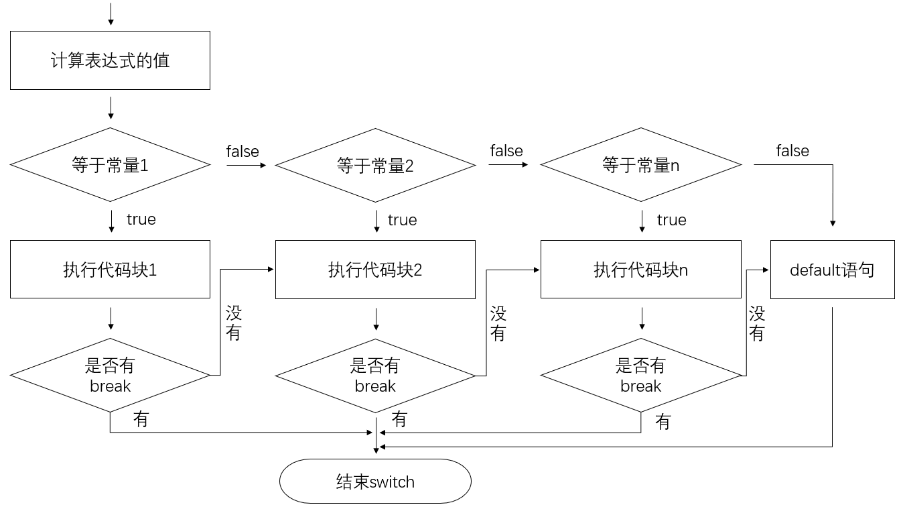

**说明**：

1. switch语句中的expression是一个**常量表达式**，必须是一个整型(char，short，int，long等)或者枚举类型。
2. case子句是**可选**的，当没有匹配的case时，执行default。
3. break语句用来在执行完一个case分支后使程序跳出switch语句块。
4. 如果没有break 程序会一直往下走 直到**break** 或**程序结束**。这种现象叫做**穿透**。

**例**：

```c
char c1 = ' ';
printf("请输入一个字符(abc)");
scanf("%c",&c1);
//switch
//表达式：任何有值都可以看成一个表达式
switch(c1){
    case 97://‘a'==> 97
    	printf("星期一");
    	break;//退出switch
    case 'b':
    	printf("星期二");
    	break;//退出switch
    case 'c':
    	printf("星期三");
    	break;//退出switch
    default:
    	printf("错误");
}
```

**switch与if比较**：

1. 如果判断的具体数值不多，而且符合整型、枚举类型，虽然两个语句都可以使用，建议**使用switch语句**。
2. 其他情况：**对区间判断**，对结果为真假的判断，使用if，**if的使用范围更广**。

# 循环控制结构

## while语句

**基本语法**

```c
循环变量初始化;
while(循环条件){
	循环体(语句);
    循环变量迭代;
}
```

**说明**：

​	循环变量初始化后，满足循环条件，进入循环体，执行循环变量迭代得到结果**返回到**循环条件，若**满足**则继续循环，**不满足**则退出继续执行下面代码。

**流程图**：

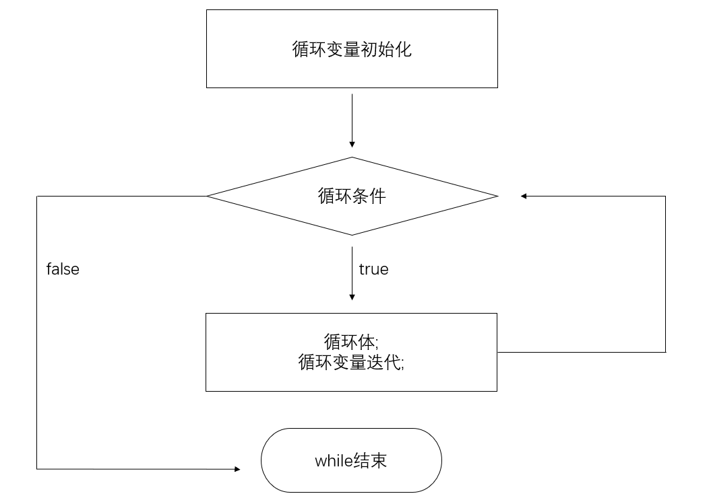

**注意**：

1. 循环条件是返回一个表示真(非0)假(0)的表达式。
2. while循环是先判断再执行语句。

**例**：

```c
#include <stdio.h>
#include <stdlib.h>

int main(void){
    int i = 0;
    while(i < 100){
        if(i % 2 == 1){
      //if(i % 2)也可以
            printf("%d\n",i);
        }
        i++;
    }
}
```

## do-while语句

**基本语法**：

```c
循环变量初始化;
do{
	循环体(多条语句);
    循环变量迭代;
}while(循环条件);
```

**说明**：

​	循环变量初始化后，先进入循环体，执行循环变量迭代得到结果满足循环条件则继续循环，不满足则退出继续执行下面代码。

**流程图**：

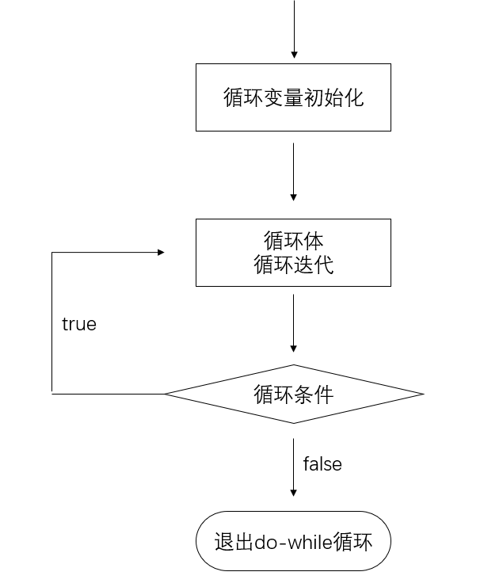

**注意**：

1. 循环条件是返回一个表示真(非0)假(0)的表达式。
2. do-while循环是先执行，再判断。

**例**：

```c
do{
    printf("%d\n",i);
    i++
}while(i<100);
```

## for循环

**基本语法**

```c
循环变量定义;
for(循环变量初始化;循环条件;循环变量迭代){
	循环操作(语句);
}
```

**说明**：

​	循环变量定义后，首先进行循环变量的初始化，满足循环条件，进入循环体，执行循环变量迭代得到结果**返回到**循环条件，若**满足**则继续循环，**不满足**则退出继续执行下面代码。

**流程图**：

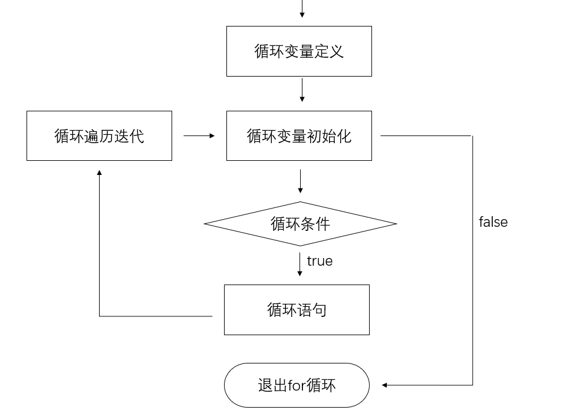

**注意**：

1. 循环条件是返回一个表示真(非0)假(0)的表达式。

2. for(;循环判断条件;)中的初始化和变量迭代可以不写(写道其他地方)，但是两边的分号不能省略。

   ```c
   int i = 1;
   for(;i <= 5;){
       printf("hello world");
       i++;
   }
   ```

3. 循环初始化值可以有多条初始化语句，但要求类型一样，并且中间用逗号隔开，循环变量迭代也可以用多条变量迭代语句，中间用逗号隔开。

   ```c
   int i;
   int j;
   for(i = 0,j=0;j < count;i++,j += 2){
       //i=0 j=0
       //i=1 j=2
       //i=2 j=4
       //...
   }
   ```

## 嵌套循环结构

​	将一个循环放在另一个循环体内，就形成了**嵌套循环**。

​	for、while、do-while均可以作为**外层循环**和**内层循环**。

**基本语法**：

```c
if(条件表达式){
	执行代码块;
}
```

**说明**：

​	当条件表达式为真(非0)时，就会执行{ }的代码，返回假(0)时，不会执行{ }的代码。

**注意**：

1. 建议一般使用两层，最多不要超过3层，如果嵌套循环过多，会造成可读性降低。
2. 实质上，嵌套循环就是把内层循环当成外层循环的循环体。当只有内层循环的循环条件为false时，才会完全跳出内层循环，才可结束外层的当此循环，开始下一循环。
3. 设外层循环次数为`m`次，内层为`n`次，则内层循环体实际上需要执行`m*n=mn`次

**例**：

- **九九乘法表**：

  ```c
  for(int i = 1;i <= 9;i++){
  	for(int j = 1;j <= i;j++){
  		printf("%d * %d = %d",i,j,i*j);
      }
      printf("\n");
  }
  ```

# 跳转控制语句

## break语句

​	break语句用于**终止某个语句块的执行**，一般使用在switch或者循环(三大循环)中。

​	在执行循环的过程中，当满足某个条件时，用break可以**提前退出**该循环。

**基本语法**：

```c
{
    ...
    break;
    ...
}
```

**流程图**：

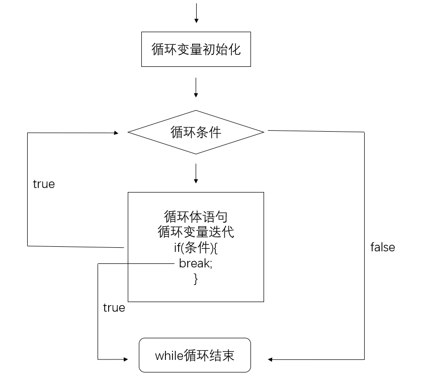

**说明**：

1. if里**不能**有break。

**例**：

```c
int i;
for(i = 0;i < 10;i++){
    if(i == 3){
        break;
    }
    printf("%d\n",i);//012
}
```

## continue语句

​	continue语句用于**结束本次循环**，继续执行下一次循环。

**基本语法**：

```c
{
    ...
    continue;
    ...
}
```

**流程图**：

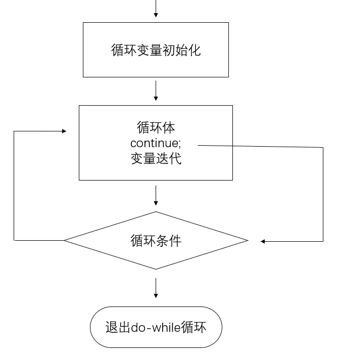

**说明**：

1. continue语句，**只能配合循环语言使用**，不能单独和switch、if使用。

   ```c
   void main(){
       int i = 0;
       switch(i){
           case 1:
               continue;//错误
       }
       if(i > 1){
           continue;//错误
       }
   }
   ```

2. 只是跳过本次循环**继续**下一循环。

**例**：

```c
void main(){
    int i = 1;
    while(i <= 4){
        i++;
        if(i == 3){
            continue;
        }
        printf("i = %d\n",i);
    }
}
```

## return语句

return使用在函数，表示跳出所在的函数。

**基本语法**：

```c
返回类型 函数名(形参列表){
    语句;
    return 返回值;
}
```

**说明**：

1. 返回值类型要**明确**，要求返回值和返回类型要**匹配**，或者可以相互转换(**自动或强制**)。

## goto语句

**基本语法**：

```c
goto label
...
label:statment
```

**流程图**：

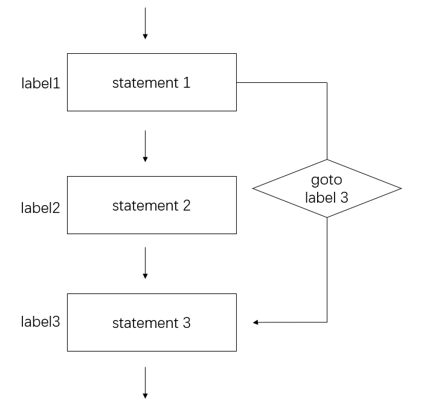

**注意**：

1. C语言的goto语句可以无条件地转移到程序中指定的行。
2. goto语句通常与条件语句配合使用，可以来实现条件转移，跳出循环体等功能。
3. 在C程序设计中一般不主张使用goto语句，以免造成程序流程的混乱，使理解和调试程序都产生困难。

**例**：

```c
void main(){
    printf("start\n");
    goto label;
    printf("ok1");
    printf("ok2");
    label://label是标签 goto label 是跳到label
    printf("ok3");
    printf("ok4");
    
}
```

**输出1-100**

```c
void main(){
    int i = 1;
    label:
    printf("%d\n",i);
    i++;
    if(i<=100){
        goto label;
    }
}
```

# 数组￥

![image-20211107100704366](C:\Users\LetengZzz\AppData\Roaming\Typora\typora-user-images\image-20211107100704366.png

![image-20211107101238863](C:\Users\LetengZzz\AppData\Roaming\Typora\typora-user-images\image-20211107101238863.png

![image-20211107101258478](C:\Users\LetengZzz\AppData\Roaming\Typora\typora-user-images\image-20211107101258478.png

![image-20211107101415809](C:\Users\LetengZzz\AppData\Roaming\Typora\typora-user-images\image-20211107101415809.png

![image-20211107101442470](C:\Users\LetengZzz\AppData\Roaming\Typora\typora-user-images\image-20211107101442470.png

![image-20211107101540837](C:\Users\LetengZzz\AppData\Roaming\Typora\typora-user-images\image-20211107101540837.png

![image-20211107101715792](C:\Users\LetengZzz\AppData\Roaming\Typora\typora-user-images\image-20211107101715792.png

![image-20211107101816212](C:\Users\LetengZzz\AppData\Roaming\Typora\typora-user-images\image-20211107101816212.png

![image-20211107140540240](C:\Users\LetengZzz\AppData\Roaming\Typora\typora-user-images\image-20211107140540240.png

![image-20211107140731371](C:\Users\LetengZzz\AppData\Roaming\Typora\typora-user-images\image-20211107140731371.png

![image-20211107142958975](C:\Users\LetengZzz\AppData\Roaming\Typora\typora-user-images\image-20211107142958975.png

![image-20211107140833105](C:\Users\LetengZzz\AppData\Roaming\Typora\typora-user-images\image-20211107140833105.png

![image-20211107143012177](C:\Users\LetengZzz\AppData\Roaming\Typora\typora-user-images\image-20211107143012177.png

![image-20211107143417375](C:\Users\LetengZzz\AppData\Roaming\Typora\typora-user-images\image-20211107143417375.png

![image-20211107143513660](C:\Users\LetengZzz\AppData\Roaming\Typora\typora-user-images\image-20211107143513660.png

![image-20211107143625416](C:\Users\LetengZzz\AppData\Roaming\Typora\typora-user-images\image-20211107143625416.png

![image-20211107143649887](C:\Users\LetengZzz\AppData\Roaming\Typora\typora-user-images\image-20211107143649887.png

![image-20211107143753640](C:\Users\LetengZzz\AppData\Roaming\Typora\typora-user-images\image-20211107143753640.png

![image-20211107143904642](C:\Users\LetengZzz\AppData\Roaming\Typora\typora-user-images\image-20211107143904642.png

![image-20211107144034263](C:\Users\LetengZzz\AppData\Roaming\Typora\typora-user-images\image-20211107144034263.png

![image-20211107144121085](C:\Users\LetengZzz\AppData\Roaming\Typora\typora-user-images\image-20211107144121085.png


最后的表达方式默认加入\0


## 冒泡排序￥


## 顺序查找和二分查找￥


## 二维数组￥


# 函数

​	为完成某一功能的程序指令(语句)的集合，称为**函数**。也可称为**方法**等叫法。

​	**函数的目的**：为了解决传统方式的代码冗余(即有过多重复的代码)、不利于代码的维护的弊病。

​	在C语言中，函数分为：**自定义函数**、**系统函数**。

**基本语法**：

```c
返回类型　函数名(形参列表){
    执行语句;//函数体
    return 返回值;//可选
}
```

**说明**：

 1. 形参列表：表示函数的输入。

 2. 函数中的语句：表示为了实现某一功能代码块。

 3. 函数可以有返回值，也可以没有，如果没有返回值，返回类型声明为void。当有返回值时，返回值类型要**明确**，要求返回值和返回类型要**匹配**，或者可以相互转换(**自动或强制**)。

    ```c
    double getSum(int n1,int n2){
        return n1+n2;//int --> double自动转换
    }
    ```

**例**：

```c
//说明：
//1.函数名cal
//2.有返回值 double
//3.形参列表为(int n1,int n2,char oper)
//4.在函数中，使用的变量名需要和形参列表中的变量名一样
double cal(int n1,int n2,char oper){
    double res = 0.0;//保存运算结果
    switch(oper){
        case '+':
            res = n1 + n2;
            break;
        case '-':
            res = n1 - n2;
            break;
        case '*':
            res = n1 * n2;
            break;
        case '/':
            res = n1 / n2;
            break;
        default:
            printf("运算符有误");
    }
    printf("%d %c %d = %.2f\n",n1,oper,n2,res);
    return res;
}
void main(){
    int num1 = 10;//第一个数
    int num2 = 20;//第二个数
    double res = 0.0;//结果
    char oper = "-";//运算符
    
    //使用函数来完成
    res = cal(num1,num2,oper);//调用函数，使用函数
    printf("res=",res);
}
```

## 函数调用机制

**例**：

```c
#include <stdio.h>
//说明
//函数名字test
//函数没有返回 void
//完成功能 传入一个数+1
void test(int n){
	int n2 = n + 1;
    printf("n2 = %d",n2);
}
void main(){
    int num = 6;
    test(num);//n为值传递，因此不会改变main函数的num
}
```

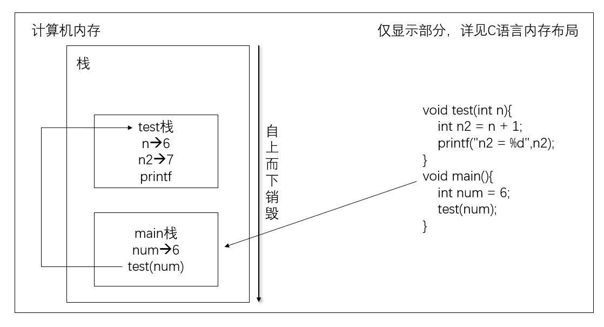

```c
#include <stdio.h>

int getSum(int n1,int n2){
	return n1 + n2;
}
void main(){
    int num = 6;
    int res = getSum(1,9);
    printf("res = %d",res);
}
```

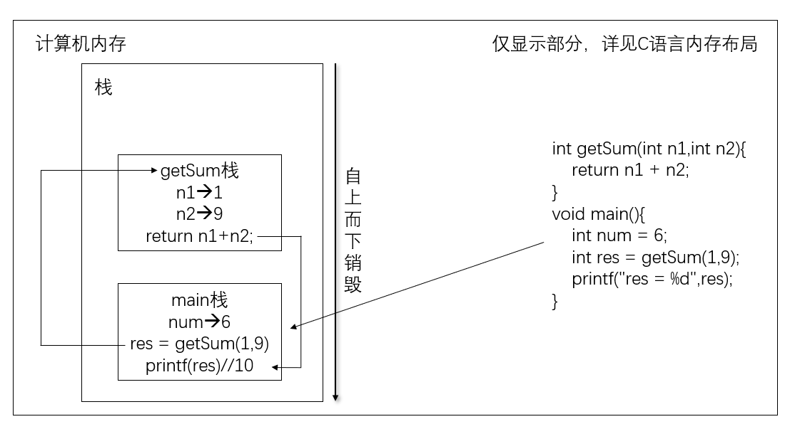

**函数调用规则**：

1. 当调用(执行)一个函数时，就会开辟一个独立的空间(栈)。
2. 每个栈空间是相互独立。
3. 当函数执行完毕后(或者执行到return)，会返回到调用函数位置，继续执行。
4. 如果函数有返回值，则将返回值赋给接受的变量。
5. 当一个函数返回后，该函数对应的栈空间也就销毁。

## 递归调用

一个函数在函数体内又调用了本身，我们称为**递归调用**。

**示例一**：

```c
#include <stdio.h>
void test(int n){
    if(n > 2){
        test(n-1);
    }
    printf("n=%d\n",n);
}
void main(){
	test(4);//n=2\n n=3\n n=4\n
}
```

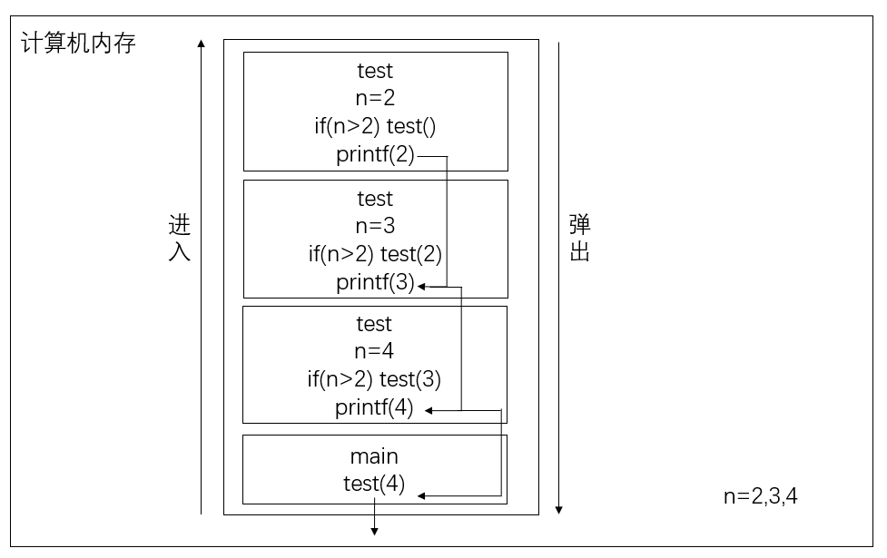

**示例二**：

```c
#include <stdio.h>
void test(int n){
    if(n > 2){
        test(n-1);
    } else{
        printf("n=%d\n",n);
    }
}
void main(){
	test(4);
}
```

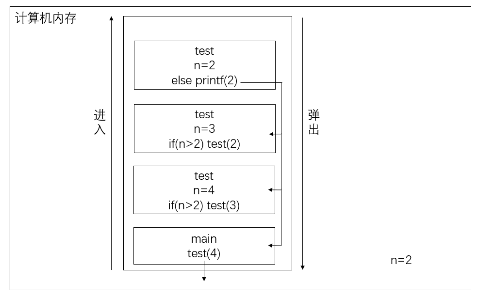

**注意**：

1. 栈：**先进后出**原则。
2. 调用函数时，开辟的函数栈，都会完整的执行函数代码。

**遵守的原则**：

1. 执行一个函数时，就创建一个新的受保护的独立空间(新函数栈)。
2. 函数的局部变量是独立的，不会相互影响。
3. 递归必须向退出递归的条件逼近，否则就是无限递归，死龟了
4. 当一个函数执行完毕，或者遇到return,就会返回，遵守谁调用，就将结果返回给谁

## 实参、形参未完成

## 回调函数

函数指针变量可以作为某个函数的参数来使用的，回调函数就是一个通过函数指针调用的函数。
简单的讲:回调函数是由别人的函数执行时调用你传入的函数（通过函数指针完成〉

**例**：用回调函数的方式，给一个整型数组int arr[10]赋10个随机数。

```c
#include <stdio.h>
#include <stdlib.h>
//回调函数
//int (*f)(void)
//f就是 函数指针，它可以接收的函数是(返回int，没有形参的函数)
//f在这里被initArray调用，充当了回调函数角色
void initArray(int *array,int arraySize,int (*f)(void)){
    int i;
    for (int i = 0; i < arraySize; i++) {
        array[i] = f();//通过函数指针调用了getNextRandomValue函数
        //array[i] = (*f)();
    }
}
//获取随机值
int getNextRandomValue(void){
    return rand();//rand系统函数，会返回一个随机整数
}

int main(){
    int myarray[10],i;
    initArray(myarray,10,getNextRandomValue);
    for (int i = 0; i < 10; ++i) {
        printf("%d\n",myarray[i]);
    }
    getchar();
    return 0;
}
```

## 常用函数

### 常用字符串函数

**头文件**`<string.h>`

1. 得到字符串的长度：

   ```c
   size_t strlen(const char *str)
   ```

   计算字符串`str`的长度，直到空结束字符，但不包括空结束字符。

2. 拷贝字符串：

   ```c
   char* strcpy(char* dest,const char *src)
   ```

   把`src`所指向的字符串复制到`dest`。

   **注意**：拷贝字符串会将原来的内容覆盖。

3. 连接字符串：

   ```c
   char* strcat(char* dest,const char *src)
   ```

   把`src`所指向的字符串追加到`dest`所指向的字符串的结尾。

4. 从控制台读取字符并立即回显，用于从标准输入控制台读取字符：

   ```c
   getchar();
   ```

5. 字符串比较：

   ```c
   int strcmp(const char *str1,const char *str2)
   ```

   把`str1`所指向的字符串和`str2`所指向的字符串进行比较。**返回0表示相等**，**非0表示不相等**。

**例**：

```c
#include <stdio.h>
#include <string.h>//头文件中声明字符串相关的系统函数
void main(){
    char src[50],dest[50];//定义了两个字符数组(字符串)，大小为50
    char *str = "abcdef";
    printf("str.len=%d",strlen(str));//统计字符串的大小
    strcpy(src,"hello");//将hello拷贝到src
    //注意：拷贝字符串会将原来的内容覆盖
    strcpy(dest,"hh");
    strcat(dest,src);//strcat是将src字符串的内容连接到dest，但不会覆盖dest原来的内容，而是连接
    printf("最终目标字符串 %s",dest);//hellohh
  //getchar();
}
```


### 常用日期时间函数

**头文件**`<time.h>`

1. 获取当前时间：

   ```c
   char* ctime(const time_t timer)
   ```

   返回一个表示当地时间的字符串，当地时间是基于参数`timer`。

2. 统计函数执行时间：

   ```c
   double difftime(time_t time1,time_t time2)
   ```

   返回`time1`和`time2`之间相差的秒数(`time1`-`time2`)

**例**：

```c
#include <stdio.h>
#include <time.h>//该头文件中，声明和日期和时间相关的函数
int main(){
    time_t curtime;//time_h是一个结构体类型
    time(&curtime);//time()完成初始化
    printf("当前时间=%s",ctime(&curtime));//返回一个表示当地时间的字符串
    return 0;
}
```

```c
#include <stdio.h>
#include <time.h>//该头文件中，声明和日期和时间相关的函数
void test(){//运行test函数，查看执行花费时间
    int i = 0;
    int sum = 0;
    int j = 0;
    for(i=0;i<77777777;i++){
        sum = 0;
        for(j=0;j<10;j++){
            sum +=j;
        }
    }
}
void main(){
    //先得到执行test前的时间
    time_t start_t,end_t;//time_h是一个结构体类型
    double diff_t;//存放时间差
    printf("程序启动...\n");
    time(&start_t);//初始化得到当前时间
    test();//执行test
    //再得到执行test后的时间
    time(&end_t);//得到当前时间
    diff_t = difftime(end_t,start_t);//时间差，按秒end_t-start_t
    //得到两个时间差就是耗用的时间
    printf("执行时间 = %f\n",diff_t);
  //getchar();
}
```

### 常用数学函数

math.h头文件定义了各种数学函数和一个宏。在这个库中所有可用的功能都带有一个double类型的参数，且都返回double 类型的结果。

1. 返回e的x次幂的值：

   ```c
   double exp(double x)
   ```

2. 返回x的自然对数(基数为e的对数)：

   ```c
   double log(double x)
   ```

3. 返回x的y次幂：

   ```c
   double pow(double x,double y)
   ```

4. 返回x的平方根：

   ```c
   double sqrt(double x)
   ```

5. 返回x的绝对值：

   ```c
   double fabs(double x)
   ```

**例**：

```c
#include <stdio.h>
#include <math.h>
void main(){
    double d1 = pow(2.0,3.0);
    double d2 = sqrt(5.0);
    printf("d1=%.2f",d1);
    printf("d2=%.2f",d2);
  //getchar();
}
```

## static关键字

### 静态变量

局部变量被`static`修饰后，我们称为**静态局部变量**。

```c
#include <stdio.h>
void main(){
    static int n;//n就是静态局部变量，默认初始化值为0
    printf("\n n=%d",n);
}
```

**说明**：

1. 对应静态局部变量在声明时未赋初值，编译器也会把它**初始化**为0。
2. 静态局部变量存储于进程的静态存储区(全局性质)，只会被初始一次，即使函数返回，它的值也会**保持不变**。

  C语言内存布局 --> [Here](#C语言内存布局)

**例**：

```c
#include <stdio.h>
void fn(void){
    int n = 10;//普通局部变量，每次执行都会初始化，n在栈区
    printf("n = %d\n",n);
    n++;
    printf("n++=%d\n",n);
}
void fn_static(void){
    static int n = 10;//静态局部变量，放在静态存储区，全局性质空间
    printf("static n = %d\n",n);
    n++;
    printf("static n++ = %d\n",n);
}
int main(){
    fn();//10 11
    printf("---\n");
    fn_static();//10 11
    printf("---\n");
    fn();//10 11
    printf("---\n");
    fn_static();//11 12
    return 0;
}
```

**注意**：

1. 普通全局变量对整个工程可见，其他文件可以使用`extern`外部声明后直接使用。也就是说其他文件不能再定义一个与其相同名字的变量了(否则编译器会认为它们是同一个变量)，静态全局变量**仅对当前文件可见，其他文件不可访问**，其他文件可以定义与其同名的变量，两者互不影响。

   `file01.c`:

   ```c
   int num = 10;//普通全局变量
   static int num2 = 20;//静态全局变量，只能在本文件中使用，而不能在其他文件使用
   ```

   `file02.c`:

   ```c
   #include <stdio.h>
   
   extern int num;
   //extern int num2;//显示没有找到num2
   //int num = 20; 显示已经定义
   int num2 = 60;//不会报错
   void main(){
       printf("\nnum = %d",num);
   }
   ```

2. 定义不需要与其他文件共享的全局变量时，加上`static`关键字能够有效地降低程序模块之间的耦合，避免不同文件同名变量的冲突，且不会误使用。

### 静态函数

​	函数的使用方式与静态变量类似，在函数的返回类型前加上`static`，就是**静态函数**。

**例**：

```c
#include <stdio.h>
void fun1(void){//普通函数(非静态函数)
	printf("hello from fun1 \n");
}
static void fun2(void){//静态函数 只能在本文件中使用
	printf("hello from fun2 \n");
}
```

**说明**：

1. 非静态函数可以在另一个文件中通过extern引用。

2. 静态函数只能在声明它的文件中可见,其他文件不能引用该函数。

3. 不同的文件可以使用相同名字的静态函数，互不影响。

   ```c
   #include <stdio.h>
   
   extern void fun1(void);
   //extern void fun2(void);//不可以
   //void fun1(){}//不可以
   void fun2(){//可以定义
       ...
   }
   void main(){
       fun1();
   	//fun2(); 不可以
   }
   ```

## 头文件￥


## 注意￥


因为函数放在了主函数的下面所以要声明函数


不可以重载 


# 宏定义

**宏定义**：用一个**标识符**来表示一个字符串，如果在后面的代码出现了该标识符，那么就**全部替换**成指定的字符串。

**宏替换**或**宏展开**：在**预处理阶段**，对程序中所有出现的"**宏名**"，预处理器都会用宏定义中的字符串去**代换**。

​	#define叫做**宏定义命令**。

**表示形式**：

```c
#define 宏名 字符串
```

**例**：

```c
#define N 100//N为宏名 100是宏的内容(宏所表示的字符串)
int main(){
    int sum = 20 + N;//N被100替代
    printf("%d\n",sum);
    return 0;
}
```

**说明**：

1. 宏定义是由**源程序**中的宏定义命令#define完成的，宏替换是由**预处理程序**完成的。
2. #表示一条预处理命令，所有的预处理命令都以#开头。
3. 字符串是一般意义上的字符序列，不需要双引号。
4. 程序中反复使用的表达式可以使用宏定义。

```c
#include <stdio.h>
#define M (n*n+3*n)
//#define M n*n+3*n    
int main(){
	int sum,n;
    printf("input a number:");
    scanf("%d",&n);
    sum = 3*M + 4*M + 5*M;//3*(n*n+3*n)+4*(n*n+3*n)+5*(n*n+3*n)
  //sum = 3*M + 4*M + 5*M;  3*n*n+3*n+4*n*n+3*n+5*n*n+3*n
    printf("sum = %d\n",sum);
    return 0;
}
```

**注意**：

1. 如果宏对应的字符串有`()`，那么就一定**不能省略**。

2. 宏名是标识符的一种，命名规则和变量相同。字符串可以是数字、表达式、if语句、函数等。

3. 宏定义是用宏名来表示一个字符串，在宏展开时又以该字符串取代宏名，这是一种**简单的替换**，字符串中可以含任何字符，可以是**常数、表达式、if语句、函数等**。预处理程序对它**不作任何检查**，如有错误，只能在编译已被宏展开后的源程序时发现。

4. 宏定义不是说明或语句，**在行末不必加分号**，如加上分号则来分号也被一起替换。

5. 宏定义必须写在函数之外，其作用域为宏定义命令起**到源程序结束**。如要终止其作用可以使用`#undef`命令。

   ```c
   #define PI 3.14159
   int main(){
       printf("PI= %f",PI);
       return 0;
   }
   #undef PI//取消宏定义
   void func(){
       printf("PI= %f",PI);//不能使用到PI
   }
   ```

6. 代码中宏名如果被**引号**包围，那么预处理程序**不对其做宏替代**。

   ```c
   #define OK 100
   void main(){
       printf("OK!!");//不会宏替代
   }
   ```

7. 宏定义允许嵌套，在宏定义的字符串中可以使用已经定义的宏名，在宏展开时由预处理程序层层代换。

   ```c
   #define PI 3.14159
   #define S PI*y*y
   printf("%f",S)//3.14159*y*y
   ```

8. 习惯上宏名用**大写字符**表示，以便与变量区别。但也允许用小写。

9. 可用宏定义表示数据类型，以便方便书写。

   ```c
   #define UINT unsigned int
   void main(){
       UINT a,b;//宏替换 unsigned int a,b;
   }
   ```

10. 宏定义表示数据类型和用[typedef](#自定义类型)定义数据说明符的区别：宏定义只是**简单的字符串替换**，由**预处理器**来处理；而typedef是在编译阶段由**编译器**处理的，它**并不是简单的字符串替换**，而给原有的数据类型起一个新的名字，将它作为一种新的数据类型。

**带参数的宏定义**：

​	C语言允许宏带有参数。

​	在宏定义中的参数称为"**形式参数**"，在宏调用中的参数称为"**实际参数**"，这点和函数有些类似对带参数的宏，在展开过程中不仅要进行字符串替换，还要**用实参去替换形参**。
**表示形式**：

```c
#define 宏名(形参列表) 字符串
```

带参宏**调用**的一般形式：

```c
宏名(实参列表);
```

**注意**：

1. 在字符串中可以含有各个形参。

**例**：

```c
#include <stdio.h>
#define MAX(a,b) (a>b)?a:b
//MAX就是带参数的宏
//(a,b)是形参
//(a>b)?a:b是带参数的宏对应字符串，该字符串中可以使用形参
int main(){
    int x,y,max;
    scanf("%d %d",&x,&y);
    max = MAX(x,y);
    //MAX(x,y)调用带参数宏定义
    //在宏替换时(预处理，由预处理器)，会进行字符串的替换，同时会使用实参，去替换形参
    //即MAX(x,y)宏替换后(x>y)?x:y
    printf("max=%d\n",max);
    return 0;
}
```

**注意**：

1. 带参宏定义中，形参之间可以出现空格，但是宏名和形参列表之间不能有空格出现。
   #define MAX(a,b) (a>b)?a:b如果写成了define MAX (a,b) (a>b)?a:b
   将被认为是无参宏定义，宏名MAX代表字符串(a,b) (a>b)?a:b而不是: MAX(a,b)代表(a>b)?a:b了。

2. 在带参宏定义中，不会为形式参数分配内存，因此不必指明数据类型。而在宏调用中，实参包含了具体的数据，要用它们去替换形参，因此实参必须要指明数据类型。

3. 在宏定义中，字符串内的形参通常要用括号括起来以避免出错。

   ```c
   #include <stdio.h>
   #include <stdlib.h>
   #define SQ(y) y*y
   int main(){
       int a,sq;
       scanf("%d",&a);
       sq = SQ(a);//宏替换 a+1*a+1
       printf("sq=%d\n",sq);
       system("pause");
       return 0;
   
   }
   ```

**带参宏定义和函数的区别**：

1. 宏展开仅仅是字符串的替换，不会对表达式进行计算；宏在编译之前就被处理掉了，它没有机会参与编译，也不会占用内存。
2. 函数是一段可以重复使用的代码，会被编译，会给它分配内存，每次调用函数，就是执行这块内存中的代码。

**例**：计算平方值

1. 函数计算值

   ```c
   #include <stdio.h>
   int SQ(int y){
       return ((y)*(y));
   }
   void main(){
       int i = 1;
       while (i <= 5){
           printf("%d^2 = %d\n",(i-1), SQ(i++));
           //1 = 1 2 = 4 3 = 9 4 = 16 5 = 25
           //从sq执行然后在执行(i-1)  (printf从右到左计算 从左到右输出)
       }
   }
   ```

2. 宏计算值

   ```c
   #include <stdio.h>
   #define SQ(y) ((y)*(y))
   //int SQ(int y){
   //    return ((y)*(y));
   //}
   void main(){
       int i = 1;
       while (i <= 5){
           printf("%d^2 = %d\n",i-2, SQ(i++));//SQ(i++)宏调用展开 ((i++)*(i++))
           //只计算了1，3，5 --> 1,9,25
           //从sq执行然后在执行(i-1)  (printf从右到左计算 从左到右输出)
       }
   }
   ```

​    预处理命令 --> [Here](#预处理命令)

​	C语言常见预处理指令 --> [Here](#C语言常见预处理指令)

# 动态内存分布￥


![image-20211107160830406](C:\Users\LetengZzz\AppData\Roaming\Typora\typora-user-images\image-20211107160830406.png

![image-20211107160925463](C:\Users\LetengZzz\AppData\Roaming\Typora\typora-user-images\image-20211107160925463.png

realloc![image-20211107161007407](C:\Users\LetengZzz\AppData\Roaming\Typora\typora-user-images\image-20211107161007407.png

![image-20211107161045643](C:\Users\LetengZzz\AppData\Roaming\Typora\typora-user-images\image-20211107161045643.png

![image-20211107161137363](C:\Users\LetengZzz\AppData\Roaming\Typora\typora-user-images\image-20211107161137363.png

C99支持 如果不是要强制转换![image-20211107161313259](C:\Users\LetengZzz\AppData\Roaming\Typora\typora-user-images\image-20211107161313259.png

![image-20211107161449210](C:\Users\LetengZzz\AppData\Roaming\Typora\typora-user-images\image-20211107161449210.png

![image-20211107161952452](C:\Users\LetengZzz\AppData\Roaming\Typora\typora-user-images\image-20211107161952452.png

类似数组,p[i]取得第一个元素

![image-20211107163139873](C:\Users\LetengZzz\AppData\Roaming\Typora\typora-user-images\image-20211107163139873.png

![image-20211107163150716](C:\Users\LetengZzz\AppData\Roaming\Typora\typora-user-images\image-20211107163150716.png

堆区里分配的连续区域的首个地址传过去就和数组的首地址一样了

![image-20211107163429174](C:\Users\LetengZzz\AppData\Roaming\Typora\typora-user-images\image-20211107163429174.png

![image-20211107163538385](C:\Users\LetengZzz\AppData\Roaming\Typora\typora-user-images\image-20211107163538385.png


- Dev C++ --> [Here](https://blog.csdn.net/swordtraveller/article/details/86595363?ops_request_misc=%257B%2522request%255Fid%2522%253A%2522163626956416780271541839%2522%252C%2522scm%2522%253A%252220140713.130102334..%2522%257D&request_id=163626956416780271541839&biz_id=0&utm_medium=distribute.pc_search_result.none-task-blog-2~all~sobaiduend~default-1-86595363.pc_search_result_hbase_insert&utm_term=Dev+C%2B%2B%E6%96%AD%E7%82%B9%E8%B0%83%E8%AF%95&spm=1018.2226.3001.4187)
- Visual C++ 6.0 --> [Here](https://blog.csdn.net/weixin_45468845/article/details/107854610?ops_request_misc=%257B%2522request%255Fid%2522%253A%2522163627010416780262527079%2522%252C%2522scm%2522%253A%252220140713.130102334..%2522%257D&request_id=163627010416780262527079&biz_id=0&utm_medium=distribute.pc_search_result.none-task-blog-2~all~baidu_landing_v2~default-1-107854610.pc_search_result_hbase_insert&utm_term=Visual+C%2B%2B+6.0%E6%96%AD%E7%82%B9%E8%B0%83%E8%AF%95&spm=1018.2226.3001.4187)
- Code::Blocks --> [Here](https://blog.csdn.net/amjgg66668/article/details/101844107?ops_request_misc=%257B%2522request%255Fid%2522%253A%2522163627012416780274138721%2522%252C%2522scm%2522%253A%252220140713.130102334.pc%255Fall.%2522%257D&request_id=163627012416780274138721&biz_id=0&utm_medium=distribute.pc_search_result.none-task-blog-2~all~first_rank_ecpm_v1~rank_v31_ecpm-1-101844107.pc_search_result_hbase_insert&utm_term=Code%3A%3ABlocks%E6%96%AD%E7%82%B9%E8%B0%83%E8%AF%95&spm=1018.2226.3001.4187)
- Turbo C --> [Here](https://blog.csdn.net/rankfyang/article/details/4325744?ops_request_misc=&request_id=&biz_id=102&utm_term=Turbo%20C%E6%96%AD%E7%82%B9%E8%B0%83%E8%AF%95&utm_medium=distribute.pc_search_result.none-task-blog-2~all~sobaiduweb~default-0-4325744.pc_search_result_hbase_insert&spm=1018.2226.3001.4187)
- Clion --> [Here](https://blog.csdn.net/lblmlms/article/details/107846759?ops_request_misc=&request_id=&biz_id=102&utm_term=CLion%E6%96%AD%E7%82%B9%E8%B0%83%E8%AF%95&utm_medium=distribute.pc_search_result.none-task-blog-2~all~sobaiduweb~default-2-107846759.pc_search_result_hbase_insert&spm=1018.2226.3001.4187)
- Eclipse --> [Here](https://blog.csdn.net/u011781521/article/details/55000066/?ops_request_misc=&request_id=&biz_id=102&utm_term=Eclipse%E6%96%AD%E7%82%B9%E8%B0%83%E8%AF%95&utm_medium=distribute.pc_search_result.none-task-blog-2~all~sobaiduweb~default-0-55000066.pc_search_result_hbase_insert&spm=1018.2226.3001.4187)

# 文件操作


# 进度


3

4

# 进制

**采用不同的进制的原因**是不同的领域用到的技术形式不相同　

- 在计算机底层都以**二进制**形式存在。

## 进位计数制

​	**按照进位的方法进行计数，称为进位计数制。**

​	**常见的进位计数制**：二进制、八进制、十进制、十二进制、十六进制等等。

  **R进制数的特点：**

- 具有R个不同的数符。0，1，2．．．，R－１

- 逢R进一。

  进位计数制的一般表达式(按权展开式)：

  R进制的表示方法，任一R进制数S可表示为

  > S=a<sub>n-1</sub> a<sub>n-2</sub> ... a<sub>1</sub> a<sub>0</sub> . a<sub>-1</sub>...+a<sub>-m</sub>           位置表示法
  >
  > =a<sub>n-1</sub>R<sup>n-1</sup> + ... + a<sub>1</sub>R<sup>1</sup> + a<sub>0</sub>R<sup>0</sup> + a<sub>-1</sub>R<sup>-1</sup> ... +a<sub>-m</sub>R<sup>-m</sup> (按权展开式)
  >
  > 其中:a<sub>i</sub> : R 进制中的数字符号
  >
  > ​		 R：基数
  >
  > ​         R<sup>i</sup> : 位权，简称权

##  十进制N<sub>D</sub>

**特点：**

1. 有十个数码：0~9

2. 逢十进一

加权展开式以10为基数，各位系数为0~9

> ​	N<sub>D</sub> = d<sub>n-1</sub> * 10<sup>n-1</sup> + d<sub>n-2</sub> * 10<sup>n-2</sup>+...+d<sub>0</sub> * 10<sup>0</sup>+d<sub>-1</sub> * 10<sup>-1</sup>+...

​	例:(1234.5)<sub>10</sub> = 1 * 10<sup>3</sup> + 2 * 10<sup>2</sup> +3 * 10<sup>1</sup> +  4 * 10<sup>0</sup> +5 * 10<sup>-1</sup> 

## 	二进制N<sub>B</sub>

**特点**：

1. 有两个数码：0、1

2. 逢二进一

加权展开式以2为基数，各位系数为0、1

> N<sub>B</sub> = b<sub>n-1</sub> * 2<sup>n-1</sup> + b<sub>n-2</sub> * 2<sup>n-2</sup>+...+b<sub>0</sub> * 2<sup>0</sup>+b<sub>-1</sub> * 2<sup>-1</sup>+...

例: `1101.101B` = 1 * 2<sup>3</sup> + 1 * 2<sup>2</sup> +0 * 2<sup>1</sup> +  1 * 2<sup>0</sup> +1 * 2<sup>-1</sup> +0 * 10<sup>-2</sup> +1 * 2<sup>-3</sup> 

**注意:**不够八位最好前面加上0 凑成八位

## 八进制N<sub>O/Q</sub>

**特点：**

1. 有八个数码：0~7

2. 逢八进一

加权展开式以8为基数，各位系数为0、1

> N<sub>O</sub> = b<sub>n-1</sub> * 8<sup>n-1</sup> + b<sub>n-2</sub> * 8<sup>n-2</sup>+...+b<sub>0</sub> * 8<sup>0</sup>+b<sub>-1</sub> * 8<sup>-1</sup>+...

例: `7451` =  7 * 8<sup>3</sup> + 4 * 8<sup>2</sup> +5 * 8<sup>1</sup> +  1 * 8<sup>0</sup> 

## 十六进制N<sub>H</sub>

​	因为二进制太长 所以采用十六进制 

​	一位十六进制可以表示四位二进制

**特点：**

1. 有十六个数码：0~9、A~F

2. 逢十六进一

加权展开式以16为基数，各位系数为0~9，A~F

> N<sub>H</sub> = h<sub>n-1</sub> * 16<sup>n-1</sup> + h<sub>n-2</sub> * 16<sup>n-2</sup>+...+h<sub>0</sub> * 16<sup>0</sup>+h<sub>-1</sub> * 16<sup>-1</sup>+...

例:`DFC.8H` = 13 * 16<sup>2</sup> +15 * 16<sup>1</sup> +  12 * 16<sup>0</sup> +8 * 16<sup>-1</sup> 

**注意**

不同进位制数以后缀区别,十进制数可不 带后缀。或加括弧，再在括弧之后注明。

- `101`、`101D`、`101B`、`101H`、`101H`
- (20)<sub>10</sub>、(1101)<sub>2</sub>、(345)<sub>16</sub>


## 不同进制计数制的转换

### 			二进制、十六进制转换成十进制

**方法：**

​			先将二、十六进制数按权展开，然后按照十进制运算法则求和

**举例：** 

​			`1011.1010B`=1 * 2<sup>3</sup>+1 * 2<sup>1</sup>+1 * 2<sup>0</sup>+1 * 2<sup>-1</sup>+1*2<sup>-3</sup>

​								   =(11.625)<sub>10</sub>

​			`DFC.8H`=13 * 16<sup>2</sup> + 15 * 16<sup>1</sup> + 12 * 16<sup>0</sup> + 8 * 16<sup>-1</sup> 

​						  =(3580.5)<sub>10</sub>

### 			十进制转换成二进制、十六进制

**方法：**

​	**整数部分,除基取余**

​		不断**除以**所要转换的进制基数，直至**商为0**。每除一次取一个余数，从低位排向高位。

​	**小数部分,乘基取整**
​		用转换进制的基数乘以小数部分，直至小数为0或达到转换精度要求的位数。每**乘一次取一次整数**，从最高位排到最低位。

**举例：**

​	**二进制最好前面加上0 凑成八位**

​	39转换成二进制数        
​	(39)<sub>10</sub>=`00100111B`

​	208转换成十六进制数   
​	`208D` = `D0H`

​	`0.625D`转换成十六进制数
​	0.625 × 16 = 10.0	 `0.625D` = `0.AH`

​	`208.625D` 转换成十六进制数 
​	`208.625D`= `D0.AH`

​	0.25十进制 转换成 二进制数
​	`0.25D`=`0.01B`

​	(15.8125)<sub>10</sub>转换成二进制数 	
​	(15.8125)<sub>10</sub>=`00001111.1101`

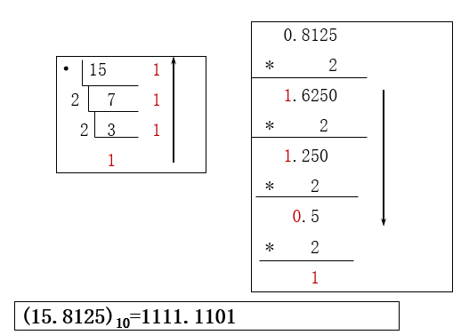

​        

### 二进制转换成十六进制

​	由2<sup>4</sup>=16可知 四位二进制数对应一位十六进制数。
例:   `3AF.2H` 
​      		= <u>0011</u> <u>1010</u> <u>1111</u>.<u>0010</u> =`1110101111.001B` 	
​				      3      A       F        2

​           `1111101.11B` 
​			   = <u>0111</u> <u>1101</u>.<u>1100</u>  = `7D.CH`         
​					  7       D       C
​    二进制转换为16进制时，整数部分从**最低位**进行划分，**每4位二进制数为一组**，不足4位的，最高位补零；**小数部分**从**最高位**进行划分，每4位二进制数为一组，不足4位的最低为补零

## 技巧：

​	按照`8421`方法，即对应二进制四位

### 			十六进制转为二进制


​				`8421`排列组合成十六进制数

​				`37FH`

​					=  	  3 	    7 	    F
​					   	`8421` `8421` `8421`

​						    **0011  0111  1111**

### 			 二进制转换为十六进制


​				每四位为一个 `8421`

​				`0110111100B`

​					=     <u>0001</u>  <u>1011</u>  <u>1100</u>
​					   	`8421` `8421` `8421`

​							    **1        B         C**		

### 			八进制二进制互相转换


​				同理，只不过将 `8421` 变为 `421`

​				`11010110`

​					=  	  11   010   110
​					    	`421`  `421`  `421`

​    						    **3       2       6**
​				
​				`765`

​					=  	  7        6       5
​					    	`421`  `421`  `421`

​    			     	    **111    110     101**

### 		十进制转换二进制


​				可将十进制先转换成十六进制再转成二进制

​				`39D`

​					=  	 <u>39</u> / 16		余7 

​								2	           余2
​					
​					=    `2    7  H`
​					= `8421` `8421`

​					= **0010   0111**  B
​				`0.25D`

​					=  	 <u>0.25</u> * 16		=4
​					=    `0.4H`
​					= `8421` 

​					= **0.01**  B

## 	原码、反码、补码

对于有符号的而言：

 1. 二进制的最高位是符号位：0表示正数，1表示负数。

 2. 正数的原码、反码、补码都一样(三码合一)。

 3. 负数的反码=他的原码符号位不变，其他位取反(0-->1 1-->0)。

 4. 负数的补码=它的反码+1

 5. 0的反码、补码都是0

 6. 计算机运算的时候，都是以**补码的方式**来运算。	

    ```c
    //2的原码、反码、补码
    //0000 0000 0000 0000 0000 0000 0000 0010
    //-3的原码
    //1000 0000 0000 0000 0000 0000 0000 0011
    //-3的反码
    //1111 1111 1111 1111 1111 1111 1111 1100
    //-3的补码
    //1111 1111 1111 1111 1111 1111 1111 1101
    ```

# 项目

## 家庭收支记账软件

## 客户信息管理系统


# 附录

## C语言关键字

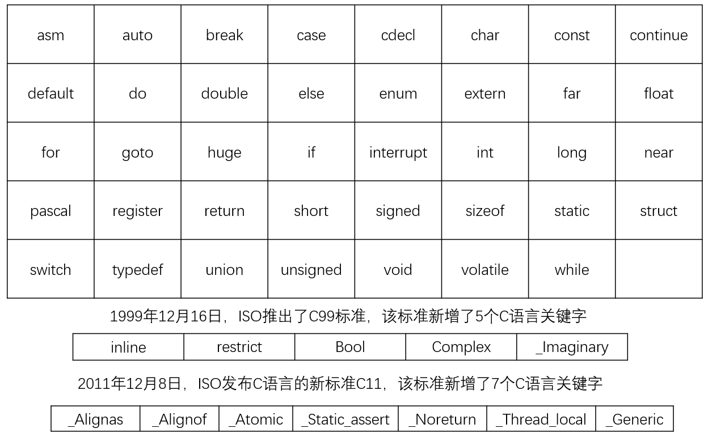

## C语言占位符

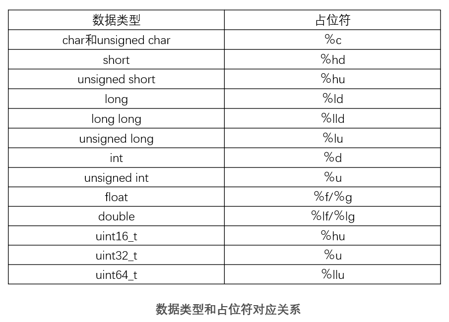

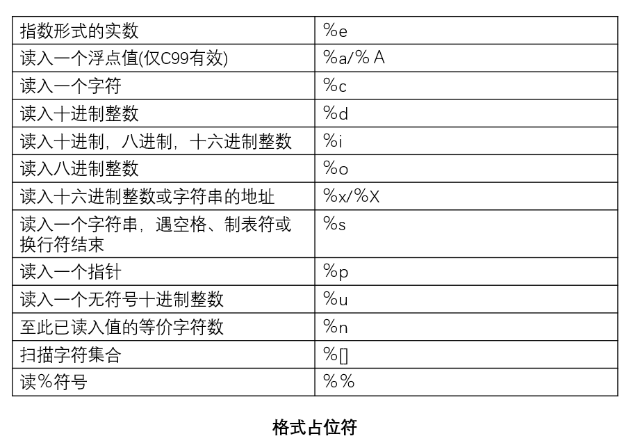

- **对于float类型的变量，printf()中的说明符可以用%f或%lf，而scanf()中的说明符则只能**

**用%f**。

- **对于double类型的变量，printf()中的说明符可以用%f或%lf，而scanf()中的说明符则只**

**能用%lf**。

- **对于long double类型的变量，printf()中的说明符可以用%f或%lf，而scanf()中的说明符**

**则只能用%lf**。

- `%s`输入一个字符串，直到遇到"`\0`"，若字符串长度超过指定的精度则自动突破，**不会截断字符串**。

**长度修饰符**：

​	在%和格式字符之间，可以加入长度修饰符，以保证数据输出格式的正确和对齐。对于长整型(long)应该加`l`，即**%ld**。对于短整型数(short)可以加`h`，即`%hd`。


小数形式的实数，默认情况保留小数点6位，**保留小数点后n位数→%.nf (n<=6)**

**据大小自动选f格式或e格式，且去掉无意义的零**:`%g`/`%lg`

## C语言标准库

​	C标准库是一组C内置**函数、常量、头文件**。

- --->[assert.h](/C语言标准库/assert.h)

- --->[ctype.h](/C语言标准库/ctype.h)

- --->[errno.h](/C语言标准库/errno.h)

- --->[float.h](/C语言标准库/float.h)

- --->[limits.h](/C语言标准库/limits.h)

- --->[locale.h](/C语言标准库/locale.h)

- --->[math.h](/C语言标准库/math.h)

- --->[setjmp.h](/C语言标准库/setjmp.h)

- --->[signal.h](/C语言标准库/signal.h)

- --->[stdarg.h](/C语言标准库/stdarg.h)

- --->[stddef.h](/C语言标准库/stddef.h)

- --->[stdio.h](/C语言标准库/stdio.h)

- --->[stdlib.h](/C语言标准库/stdlib.h)

- --->[string.h](/C语言标准库/string.h)

- --->[time.h](/C语言标准库/time.h)

## C语言常见预处理指令

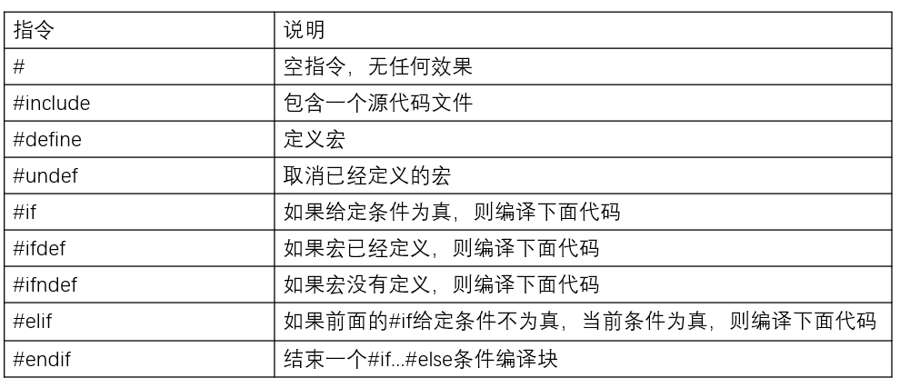

## 进制之间的转换

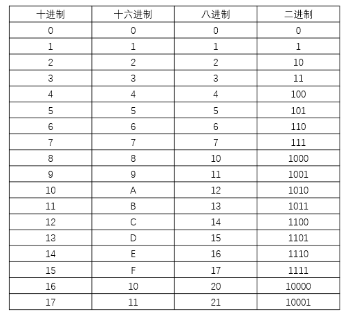

## ASCII码

**介绍：**

​	在计算机内部,所有数据都使用**二进制**表示。每一个二进制位(bit)有0和1两种状态,因此8个二进制位就可以组合出**256种**状态,这被称为一个字节(byte).一个字节一共可以用来表示256种不同的状态,每一个状态对应一个符号,就是256个符号,从0000000到11111111.

​	ASCII码:上个世纪60年代,美国制定了一套字符编码,对英语字符与二进制位之间的关系,做了统一规定。这被称为ASCII码。 ASCII码一共规定了128个字符的编码,比如空格"SPACE"是32 (二进制00100000) ,大写的字母A是65 (二进制01000001) 。这128个符号(包括32个不能打印出来的控制符号) ,只占用了一个字节的后面7位,最前面的1位统一规定为0

**缺点:**

​	不能表示所有字符。

​	相同的编码表示的字符不一样,比如, 130在法语编码中代表了ё,在希伯来语编码中却代表了字母Gimel (ξ)

​	

## 常用转义字符

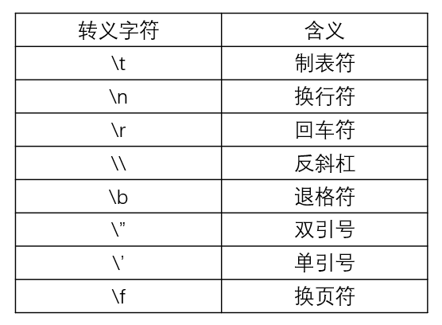  

  

## 运算符的优先级和结合性

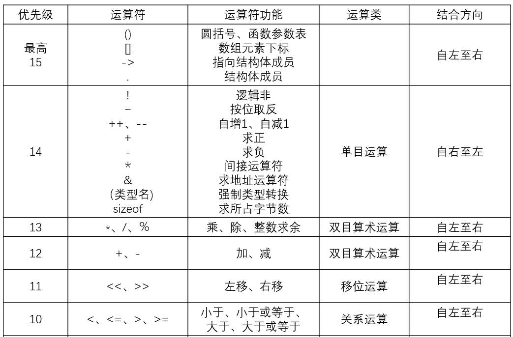

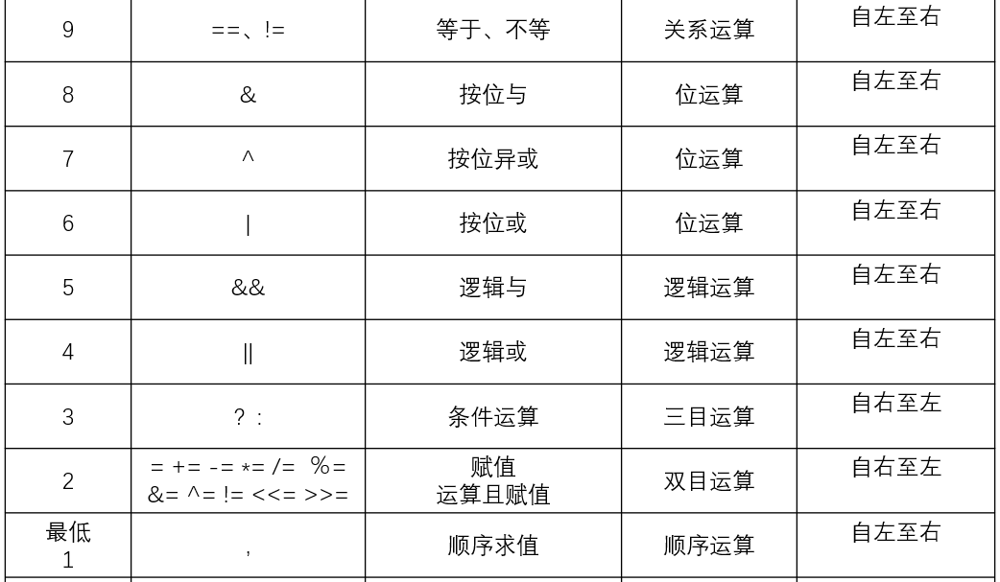

**说明** ：同一优先级的运算次序由结合方向决定。例如，*号和/号有相同的优先级，其结合方向为自左至右，因此，`3*5/4`的运算次序是先乘后除。单目运算符--和++具有同一优先级，结合方向为自右至左，因此，表达式:--i++ 相当于 --(i++)。

**注意**：

1.  `vc`  `gcc`编辑器，在**计算参数**的时候，无论是**系统函数**还是**自定义函数**都是 **从右向左**的顺序计算的。
2. C语言的`printf`函数是先**从右往左**计算各表达式的值（**入栈**），再**从左往右**输出各表达式的值（**出栈**）。

**小结** ：

1. 结合方向只有三个是从右到左，其余都是从左到右。
2. 所有双目运算符中只有赋值运算符的结合方向是从右向左。
3. 另外两个从右到左的结合运算符是：单目运算、三目运算。
4. 逗号的运算符优先级最低。
5. 大致优先级顺序：算术运算符 > 关系运算符 ＞ 逻辑运算符(逻辑非! 除外) > 赋值运算符 > 逗号运算符。

## 双目运算符中两边运算量 类型转换规律

运算所需变量为**两个**的运算符叫做双目运算符，或者要求运算对象的**个数是2**的运算符称为双目运算符。


## int补充知识

在`C99`标准中定义了这些数据类型，具体定义在：`/usr/include/stdint.h   ISO C99: 7.18 Integer types`

```c
#ifndef __int8_t_defined  
# define __int8_t_defined  
typedef signed char             int8_t;   
typedef short int               int16_t;  
typedef int                     int32_t;  
# if __WORDSIZE == 64  
typedef long int                int64_t;  
# else  
__extension__  
typedef long long int           int64_t;  
# endif  
#endif  
  
  
typedef unsigned char           uint8_t;  
typedef unsigned short int      uint16_t;  
#ifndef __uint32_t_defined  
typedef unsigned int            uint32_t;  
# define __uint32_t_defined  
#endif  
#if __WORDSIZE == 64  
typedef unsigned long int       uint64_t;  
#else  
__extension__  
typedef unsigned long long int  uint64_t;  
#endif  
```

首先要添加`stdint.h`

```c
#include <stdint.h>
```

**有符号类型**

- ​	int8_t

意思是8位整数(`8bit integer`)，八位等于一个字节 一个字节等于 -128-127所以`int8` 不超过-128-127

```
int8_t a = 1;
```

- ​	int16_t

意思是16位整数(`16bit integer`)，相当于short 占2个字节  -32768 ~ 32767

```
int16_t a = 1;
```

- ​	int32_t

意思是32位整数(`32bit integer`), 相当于 int   占4个字节  -2147483648 ~ 2147483647

`int32_`就是常见int

```c
int32_t a = 1;
```

- ​	int64_t

意思是64位整数(`64bit interger`), 相当于 long long  占8个字节  -9223372036854775808 ~ 9223372036854775807

```c
int64_t a = 1;
```

**无符号类型**

uint8是无符号 就是 0-255，uint8_t 实际是一个 char

```c
uint8_t a = 1;
```

## 常见问题及解决方法

```c
LINK : fatal error LNK1104
```

没有连接成功，无法打开

**解决办法**：修改源文件后，需要关闭控制台，才能正确运行

```
error C2143 语法错误 缺少;
```

缺少分号

**解决办法**：编译失败，注意错误出现的行数，再到源代码中指定位置改错

## 作者

Github --> [Here]()

