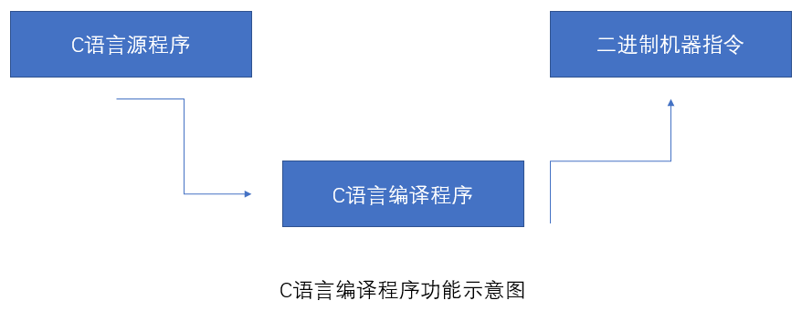
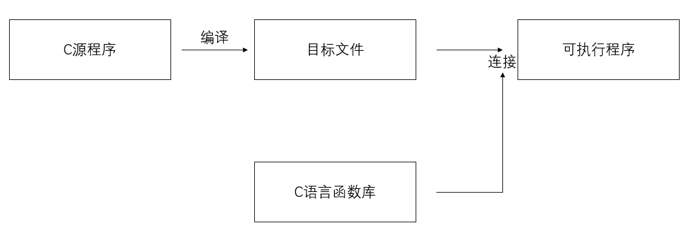

# *<u>**C语言**</u>*

- ## 程序设计基本概念

计算机不过是一种具有**内部存储能力**、由**程序自动控制**的电子设备。

**"程序"(program)：**连续执行的一条条能被计算机识别和执行的**有序指令**的集合。

**"程序设计语言"：**人与机器"对话"的一类媒介和工具，由语句(statement)组成。

**"语句"：**组成程序的**基本单位**。一个";"表示一个语句，单行一个";"叫空语句。每条语句都可以认为是一条指令

**机器语言：**(machine language)计算机直接使用的**二进制**形式的程序语言或机器代码。

**汇编语言：**(assembler language)一种面向机器的用**符号**表示的低级程序语言。相当于机器指令的助记符号，与机器语言相近。

**高级语言：**(high-level language)是易为人们所理解的**完全符号化**的程序设计语言。

**源程序：**用户用高级语言编写的程序。**C语言源程序文件名字后缀一般必须为"`.C`"**。

**目标程序：**由二进制代码组成的程序。**形式:0、1** C语言**后缀为"`.obj`"**。

**编译程序：**具有翻译功能的软件。由编译程序**转换**为**机器代码**。

**解释程序：**具有翻译功能的软件。由解释程序**转换**直接为**机器代码**。一条一条解释为二进制，必须从头到尾执行一遍。

**连接器**：用于连接相关的目标文件以生成可执行文件。

**连接(linker)：**将目标模块和其他一些必要的功能模块装配在一起，生成可执行文件，**执行文件后缀为"`.exe`"**

### 程序设计

#### 简单的程序设计一般包含以下几个部分：

- (1)**确定数据结构**。根据任务书提出的要求、指定的输人数据和输出结果，确定存放数据的数据结构。

- (2)**确定算法**。针对存放数据的数据结构来确定解决问题、完成任务的步骤。

- (3)**编码**。根据确定的数据结构和算法,使用选定的计算机语言编写程序代码,输人到计算机并保存在磁盘上,简称编程。

- (4)**在计算机上调试程序**。消除由于疏忽而引起的语法错误或逻辑错误;用各种可能的输人数据对程序进行测试，使之对各种合理的数据都能得到正确的结果,对不合理的数据能进行适当的处理。

- (5)**整理并写出文档资料。**

### 算法

算法是指为解决某个特定问题而采取的确定且有限的步骤。一个算法应当具有以下特征：

- (1)**有穷性。**一个算法包含的操作步骤应该是有限的。也就是说,在执行若干个操作步票之后,算法将结束，而且每一步都在合理的时间内完成。

- (2)**确定性**。算法中每一条指令必须有确切的含义,不能有二义性,对于相同的输人必能得出相同的执行结果。

- (3)**可行性。**算法中指定的操作,都可以通过已经验证过可以实现的基本运算执行有限次后实现。

- (4)**有零个或多个输人。**在计算机上实现的算法是用来处理数据对象的,在大多数情况下这些数据对象需要通过输人来得到。

- (5)**有一个或多个输出。**算法的目的是为了求“解”,这些“解”只有通过输出才能得到。

  算法可以用各种描述方法来进行描述,最常用的是**伪代码**和**流程图**。

#### 伪代码

​	伪代码是一种近似于高级语言但又不受语法约束的一种语言描述方式,这在英语国家中使用起来更为方便。

#### 流程图

​	流程图是算法的一种**图像化**表示方式。能直观、清晰，更有利于人们设计与理解算法。

​	

​	由这些基本图形中的框和流程线组成的流程图来表示算法形象直观,简单方便。但是,这种流程图对于流程线的走向没有任何限制,可以任意转向,在描述复杂的算法时所占篇幅较多，费时费力且不易阅读。

​	随着结构化程序设计方法的出现,**1973年**美国学者`I.Nassi`和`B.Shneiderman`提出了一种新的流程图形式,这种流程图完全去掉了流程线,算法的每一步都用一个矩形框来描述,把一个个矩形框按执行的次序连接起来就是一个完整的算法描述。这种流程图用两位学者名字的第一个英文字母命名,称为**N-S流程图**。

### 结构化程序和模块化结构

#### 结构化程序

​	结构化程序由三种基本结构组成。结构化的程序设计语言：层次清晰，便于按**模块化方式组织程序**，易于**调试和维护**。

- **顺序结构**

  如赋值语句、输入、输出语句都可构成顺序结构。当执行这些语句构成的程序时，将按照这些语句的先后顺序**逐条执行**，**没有分支**，**没有转移**。

  

- **选择结构**

  如if语句、switch语句都可以构成选择结构。当执行到这些语句时，将根据不同的条件去执行不同分支中的语句

  

- **循环结构**

  如for循环、while循环、do-while循环。将根据各自的条件，使同一组语句重复执行多次或一次也不执行。

  - 当型循环的特点是：当指定的条件满足(成立)时，就执行循环体，否则就不执行。

  
  
  
  - 直到型循环的特点是：执行循环体直到指定的条件满足(成立)时就不再执行循环体。
  
  

已经证明，由三种基本结构组成的算法可以解决任何复杂的问题。由三种基本结构所构成的算法称为**结构化算法**；由三种基本结构所构成的程序称作**结构化程序**。

例：先后输人若干个整数,要求打印出其中最大的数,当输人的数小于0时结束。用N-S流程图表示算法。

解题的思路是:先输人一个数,在没有其他数参加比较之前,它显然是当前最大的数，把它放到变量max中。让max始终存放当前已比较过的数中的最大值。然后输入第二个数,并与max比较,如果第二个数大于max，则用第二个数取代max中原来的值。如此先后输人和比较,每次比较后都将值大者放在max中,直到输入人的数小于0时结束。最后max中的值就是所有输入数中的最大值。


#### 模块化结构

​	当计算机在处理较复杂的任务时,所编写的程序经常由上万条语句组成,需要由许多人来共同完成。这时常常把这个复杂的任务分解为若千个子任务,每个子任务，又分成很多个小子任务，每个小子任务只完成一项简单的功能。在程序设计时,用一个个小模块来实现这些功能,每个程序设计人员分别完成一个或多个小模块。我们称这样的**程序设计方法为“模块化”的方法,由一个个功能模块构成的程序结构为模块化结构。**

​	由于把一个大程序分解成若干相对独立的子程序,每个子程序的代码一般不超过一页纸,因此对程序设计人员来说,编写程序代码变得不再困难。这时只需对程序之间的数据传递做出统一规范,同一软件可由一组人员同时进行编写,分别进行调试，这就大大提高了程序编制的效率。

​	软件编制人员在进行程序设计的时候,首先应当集中考虑主程序中的算法,写出主程序后再动手逐步完成子程序的调用。对于这些子程序也可用调试主程序的同样方法逐步完成其下一层子程序的调用。这就是**自顶向下、逐步细化、模块化**的程序设计方法。

​	C语言是一种结构化程序设计语言。它提供了**三种基本结构**的语句;**提供了定义“函数”的功能**,在c语言中没有子程序的概念，它提供的**函数**可以完成子程序的所有功能;c语言允许对函故单独进行编译,从而可以实现模块化。另外，c语言还提供了丰富的数据类型。这些都为结构化程序设计提供了有力的工具。

- ## C语言介绍

  C语言是结构化程序设计语言的代表作

  

  ### C语言的诞生

  - 70年代，由美国贝尔实验室的**`Thompson`** (肯·汤普森) 和**`D.M.Ritchie`** (丹尼斯·里奇)合作开发的**UNIX**操作系统和C语言诞生了，C语言**最初用于开发系统级程序**，UNIX操作系统和C语言像一对孪生姐妹，她们以自己崭新的面貌一开始就引起了人们的广泛注意。后来又经过不断改进和实践的考验，这对姐妹已迅速成长和成熟，展示出了强大的生命力，被公认为最优秀的**操作系统**和**计算机语言**之一。近30年来，C语言帮助了UNIX的成功，UNIX的发展又推动了C语言的普及和发展。C语言应用非常广泛，我们熟知的Windows操作系统基本上是用C语言编写的。

  - 1977年出现了不依赖于具体机器的C语言编译文本"可移植C语言编译程序"，使C语言移植到其他机器的工作大大简化。

  - 1983年，美国国家标准化协会(ANSI)根据C语言各种版本对C的发展和扩充，制定了新的标准ANSI C，比标准C 有了很大的发展。

  - 1988年，K&R 按照ANSI C修改了他们的《The C Programming Language》

  - 1987年，ANSI 公布了新标准--87 ANSI C

  - 1990年，国际标准化组织接受了87 ANSI C 为ISO C的标准(`ISO9899-1990`)

  - 1994年，ISO又修订了C语言标准

  - 1999年，ISO发布了最近的C语言规范，被称为`C99`，是目前C语言标准的最高版本。

  目前流行的C语言编译系统大多是以ANSI　C为基础进行开发的从而使C发展成一种独立于UNIX、独立于具体计算机类型的计算机语言。之后，C语言先后移植到大、中、小、微型计算机上，已独立于UNIX和PDP，风靡世界，成为当今世界上最为流行的、广大程序设计者最为喜爱的计算机语言之一。

  说明：不同版本 的C编译系统所实现的语言功能和语法规则略有差别，因此要了解所用的C语言智能编译系统的特点。

  ### C语言的特点：

  1. C语言是一种**结构化语言。**层次清晰，便于按**模块化方式组织程序**，易于**调试和维护**。

  2. C语言语句**简洁、紧凑、使用方便、灵活。**

       - 只有37个关键字，分为四个大类：

           - 数据结构关键字12个。
           - 控制语句关键字12个。
           - 存储类型关键字4个。
           - 其他关键字9字。

       - 9种控制语句

       - 数据构造能力强

       - 运算符丰富，共有34种运算符，可以实现其他高级语言难以实现的一些运算

       - 程序书写格式自由

  3. C语言程序**易于移植。**

  ​		用C语言编写的程序可以从一种环境不加或稍加改动就能搬到另一种环境中运行。

  4. ​	C语言由**强大的处理能力。**既可以用于系统软件的开发，也适合应用软件的开发。

  5. ​	C语言是一种中级语言，**生成的目标代码质量高，运行效率高。**

  ​		它既**具有高级语言的通用性及易写易读的特点，又具有汇编语言(低级语言)的"位处理"、"地址操作"等能力。**C语言允许直接访问物理地址，能进行位操作，能实现汇编语言的大部分功能，可以直接对硬件进行操作。

  ### C语言运行过程

  ​	C源程序经过 C编译程序**编译**之后生成一个后缀`.OBJ`的二进制文件(被称为**目标文件**)，然后由称为**"连接程序"(Link)**的软件，把此`.OBJ`文件与C语言提供的各种库函数**连接**起来**生成**一个后缀为`.EXE`的**可执行文件**。在操作系统环境下，只需**点击或输入**此文件的名字(而不必输入后缀`.EXE`)，该可执行文件就可以**运行**。

  

  ### C语言构成和格式

  ​	**头文件**：含有函数的声明和预处理语句，用于帮助访问外部定义的函数。头文件的扩展名"`.h`"

  例：

  ```c
  #include <stdio.h>
  void main(){
      int a;
      printf("Hello World");
  }
  ```

  - 以#开始的语句称为预处理器指令

      #include语句不是必须的 但是 如果由该语句 就必须将它放到程序的开始处，行尾不可以加";"

  - C都是由**主函数**开始执行 从主函数结束执行

  - main是主函数，C程序**有且只有一个**主函数。 
    main()函数是C程序的起点 main()函数可以返回一个值 也可以不返回值 如果某个函数没有返回值，那么在它的前面有一个关键字void

- 在函数的起始行后面用一对花括号"{ }" 括起来的部分为函数体。在函数定义的后面有一个左大括号 即"{"它表示函数的开始，后面是函数的主体 大括号也可以将语句块括起来,在函数定义的结尾处有一个右大括号 即"}"

- 函数体内通常有定义(说明)部分和执行语句部分。

  "int a" 为程序的**定义部分**。

  "print f("Hello World");"为程序的**执行部分**。

  执行部分的语句称为可执行语句，必须放在定义部分之后，语句的数量不限，程序中有这些语句向计算机系统发出操作指令。

- 函数主体中的每个语句都以**分号**结束。C程序中的一个语句可以跨越多行，并且用分号**通知编译器该语句已结束**。

#### 注释

- 多行注释


  ```c
  /*
  Hello World
  必须成对出现
  "/" 和 "*" 之间不能有空格
  注释可以出现在程序的任何地方
  注释部分对程序运行不起作用
  在注释之间不可以再嵌套/* */
  */
  ```

- 单行注释


  ```c
  //
  ```

  ### 标识符、常量、变量

  标识符：在C语言中，有许多符号的命名，如变量名、函数名、数组名等，都必须以

  #### 关键字

  #### 预定义标识符

  #### 用户标识符

  #### 常量

  整型常量

  实型常量

  字符常量

  字符串常量

  

  ### 整型数据

  

  ### 实型数据

  

  ### 算术表达式

  

  ### 赋值表达式

  

  ### 自加自减运算符和逗号

  

- ## 顺序结构

  ### 赋值语句

  

  ### 数据输出

  

  ### 数据输入

  

  ### 复合语句和空语句

  

- ## 选择结构

  ### 关系运算符、逻辑运算

  

  ### if语句

  

  ### 条件表达式构成的选择结构

  

  ### switch语句以及用switch语句

  

  ### 语句标号和goto语句

  

- ## 循环结构

  ### while语句

  

  ### do-while语句

  

  ### for循环

  

  ### 循环结构的嵌套

  

  ### break和continue语句

  

  

- ## 附录

  

