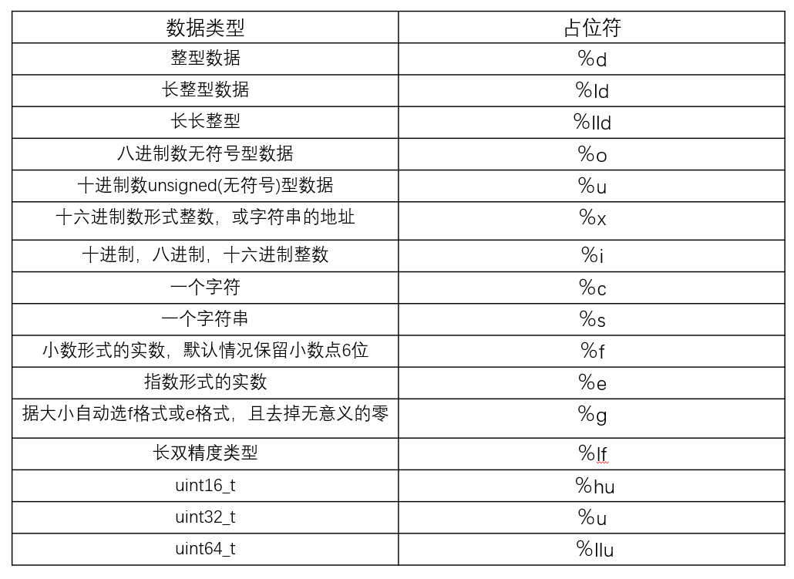

# *<u>**C语言**</u>*

- ## 程序设计基本概念

计算机不过是一种具有**内部存储能力**、由**程序自动控制**的电子设备。

**"程序"(program)：**连续执行的一条条能被计算机识别和执行的**有序指令**的集合。

**"程序设计语言"**：人与机器"对话"的一类媒介和工具，由语句(statement)组成。

**"语句"：**组成程序的**基本单位**。一个";"表示一个语句，单行一个";"叫空语句。每条语句都可以认为是一条指令

**机器语言：**(machine language)计算机直接使用的**二进制**形式的程序语言或机器代码。

**汇编语言：**(assembler language)一种面向机器的用**符号**表示的低级程序语言。相当于机器指令的助记符号，与机器语言相近。

**高级语言：**(high-level language)是易为人们所理解的**完全符号化**的程序设计语言。

**源程序**：用户用高级语言编写的程序。**C语言源程序文件名字后缀一般必须为"`.C`"**。

**目标程序：**由二进制代码组成的程序。**形式:0、1** C语言**后缀为"`.obj`"**。

**编译程序：**具有翻译功能的软件。由编译程序**转换**为**机器代码**。

**解释程序：**具有翻译功能的软件。由解释程序**转换**直接为**机器代码**。一条一条解释为二进制，必须从头到尾执行一遍。

**可执行程序**:二进制文件，可以运行的文件。

**连接器**：用于连接相关的目标文件以生成可执行文件。

**编译**: 有了C源文件，通过编译器将其编译成`.obj`文件(目标文件)。

**连接(linker)**：将目标模块和其他一些必要的功能模块装配在一起，生成可执行文件，**执行文件后缀为"`.exe`"**

**bit(位)**：计算机中最小的存储单位。`1byte = 8bit`

**byte(字节)**：计算机中基本存储单元。`1byte = 8bit`

****

### 程序设计

**简单的程序设计一般包含以下几个部分**：

- (1)**确定数据结构**。根据任务书提出的要求、指定的输人数据和输出结果，确定存放数据的数据结构。

- (2)**确定算法**。针对存放数据的数据结构来确定解决问题、完成任务的步骤。

- (3)**编码**。根据确定的数据结构和算法,使用选定的计算机语言编写程序代码,输人到计算机并保存在磁盘上,简称编程。

- (4)**在计算机上调试程序**。消除由于疏忽而引起的语法错误或逻辑错误;用各种可能的输人数据对程序进行测试，使之对各种合理的数据都能得到正确的结果,对不合理的数据能进行适当的处理。

- (5)**整理并写出文档资料。**

### 算法

算法是指为解决某个特定问题而采取的确定且有限的步骤。一个算法应当具有以下特征：

- (1)**有穷性**。一个算法包含的操作步骤应该是有限的。也就是说,在执行若干个操作步票之后,算法将结束，而且每一步都在合理的时间内完成。

- (2)**确定性**。算法中每一条指令必须有确切的含义,不能有二义性,对于相同的输人必能得出相同的执行结果。

- (3)**可行性**。算法中指定的操作,都可以通过已经验证过可以实现的基本运算执行有限次后实现。

- (4)**有零个或多个输人**。在计算机上实现的算法是用来处理数据对象的,在大多数情况下这些数据对象需要通过输人来得到。

- (5)**有一个或多个输出**。算法的目的是为了求“解”,这些“解”只有通过输出才能得到。

  算法可以用各种描述方法来进行描述,最常用的是**伪代码**和**流程图**。

#### 伪代码

​	伪代码是一种近似于高级语言但又不受语法约束的一种语言描述方式,这在英语国家中使用起来更为方便。

#### 流程图

​	流程图是算法的一种**图像化**表示方式。能直观、清晰，更有利于人们设计与理解算法。

​	

​	由这些基本图形中的框和流程线组成的流程图来表示算法形象直观,简单方便。但是,这种流程图对于流程线的走向没有任何限制,可以任意转向,在描述复杂的算法时所占篇幅较多，费时费力且不易阅读。

​	随着结构化程序设计方法的出现,**1973年**美国学者`I.Nassi`和`B.Shneiderman`提出了一种新的流程图形式,这种流程图完全去掉了流程线,算法的每一步都用一个矩形框来描述,把一个个矩形框按执行的次序连接起来就是一个完整的算法描述。这种流程图用两位学者名字的第一个英文字母命名,称为**N-S流程图**。

### 结构化程序

​	结构化程序由三种基本结构组成。结构化的程序设计语言：层次清晰，便于按**模块化方式组织程序**，易于**调试和维护**。

- **顺序结构**

  如赋值语句、输入、输出语句都可构成顺序结构。当执行这些语句构成的程序时，将按照这些语句的先后顺序**逐条执行**，**没有分支**，**没有转移**。

  

- **选择结构**

  如if语句、switch语句都可以构成选择结构。当执行到这些语句时，将根据不同的条件去执行不同分支中的语句

  

- **循环结构**

  如for循环、while循环、do-while循环。将根据各自的条件，使同一组语句重复执行多次或一次也不执行。

  - 当型循环的特点是：当指定的条件满足(成立)时，就执行循环体，否则就不执行。

  
  
  
  - 直到型循环的特点是：执行循环体直到指定的条件满足(成立)时就不再执行循环体。
  
  

已经证明，由三种基本结构组成的算法可以解决任何复杂的问题。由三种基本结构所构成的算法称为**结构化算法**；由三种基本结构所构成的程序称作**结构化程序**。

例：先后输人若干个整数,要求打印出其中最大的数,当输人的数小于0时结束。用N-S流程图表示算法。

解题的思路是:先输人一个数,在没有其他数参加比较之前,它显然是当前最大的数，把它放到变量max中。让max始终存放当前已比较过的数中的最大值。然后输入第二个数,并与max比较,如果第二个数大于max，则用第二个数取代max中原来的值。如此先后输人和比较,每次比较后都将值大者放在max中,直到输入人的数小于0时结束。最后max中的值就是所有输入数中的最大值。


### 模块化结构

​	当计算机在处理较复杂的任务时,所编写的程序经常由上万条语句组成,需要由许多人来共同完成。这时常常把这个复杂的任务分解为若千个子任务,每个子任务，又分成很多个小子任务，每个小子任务只完成一项简单的功能。在程序设计时,用一个个小模块来实现这些功能,每个程序设计人员分别完成一个或多个小模块。我们称这样的**程序设计方法为“模块化”的方法,由一个个功能模块构成的程序结构为模块化结构。**

​	由于把一个大程序分解成若干相对独立的子程序,每个子程序的代码一般不超过一页纸,因此对程序设计人员来说,编写程序代码变得不再困难。这时只需对程序之间的数据传递做出统一规范,同一软件可由一组人员同时进行编写,分别进行调试，这就大大提高了程序编制的效率。

​	软件编制人员在进行程序设计的时候,首先应当集中考虑主程序中的算法,写出主程序后再动手逐步完成子程序的调用。对于这些子程序也可用调试主程序的同样方法逐步完成其下一层子程序的调用。这就是**自顶向下、逐步细化、模块化**的程序设计方法。

​	C语言是一种结构化程序设计语言。它提供了**三种基本结构**的语句;**提供了定义“函数”的功能**,在c语言中没有子程序的概念，它提供的**函数**可以完成子程序的所有功能;c语言允许对函故单独进行编译,从而可以实现模块化。另外，c语言还提供了丰富的数据类型。这些都为结构化程序设计提供了有力的工具。

- ## C语言介绍

  C语言是结构化程序设计语言的代表作

  

  ### C语言的诞生

  - 70年代，由美国贝尔实验室的`Thompson` (肯·汤普森) 和`D.M.Ritchie` (丹尼斯·里奇)合作开发的**UNIX**操作系统和C语言诞生了，C语言**最初用于开发系统级程序**，UNIX操作系统和C语言像一对孪生姐妹，她们以自己崭新的面貌一开始就引起了人们的广泛注意。后来又经过不断改进和实践的考验，这对姐妹已迅速成长和成熟，展示出了强大的生命力，被公认为最优秀的**操作系统**和**计算机语言**之一。近30年来，C语言帮助了UNIX的成功，UNIX的发展又推动了C语言的普及和发展。C语言应用非常广泛，我们熟知的Windows操作系统基本上是用C语言编写的。
  - 1972年哦1月 C语言诞生。
  - 1977年出现了不依赖于具体机器的C语言编译文本"可移植C语言编译程序"，使C语言移植到其他机器的工作大大简化。
  - 1978年11月贝尔实验室正式发布C语言。
  - 1983年，美国国家标准化协会(ANSI)根据C语言各种版本对C的发展和扩充，制定了新的标准ANSI C，比标准C 有了很大的发展。
  - 1987年，ANSI 公布了新标准--87 ANSI C。
  - 1988年，K&R 按照ANSI C修改了他们的《The C Programming Language》。
  - 1989年12月，ANSI完成标准的制定(ANSI C 或C89)
  - 1990年，国际标准化组织接受了87 ANSI C 为ISO C的标准(`ISO9899-1990`)。(ISO C或C90)
  - 1994年，ISO又修订了C语言标准。
  - 1999年，ISO发布了最近的C语言规范，被称为`C99`。
  - 2011年12月8日，国际标准化组织(ISO)和国际电工委员会(IEC)发布的`C11`标准是C语言的第三个官方标准，也是C语言的最新标准，该语言更好的支持了汉字函数名和汉字标识符，一定程度上实现了汉字编程。
  
  目前流行的C语言编译系统大多是以ANSI　C为基础进行开发的从而使C发展成一种独立于UNIX、独立于具体计算机类型的计算机语言。之后，C语言先后移植到大、中、小、微型计算机上，已独立于UNIX和PDP，风靡世界，成为当今世界上最为流行的、广大程序设计者最为喜爱的计算机语言之一。
  
  **说明**：不同版本 的C编译系统所实现的语言功能和语法规则略有差别，因此要了解所用的C语言智能编译系统的特点。
  
  ### C语言的特点
  
  1. **代码级别的跨平台**。
  2. C语言是一种**结构化语言。**层次清晰，便于按**模块化方式组织程序**，易于**调试和维护**。
  3. C语言语句**简洁、紧凑、使用方便、灵活。**
  
       - 只有37个关键字，分为四个大类：
  
           - 数据结构关键字12个。
           - 控制语句关键字12个。
           - 存储类型关键字4个。
           - 其他关键字9字。
  
       - 9种控制语句
  
       - 数据构造能力强
  
       - 运算符丰富，共有34种运算符，可以实现其他高级语言难以实现的一些运算
  
       - 程序书写格式自由
  4. C语言程序**易于移植。**

  ​		用C语言编写的程序可以从一种环境不加或稍加改动就能搬到另一种环境中运行。

  5. ​	C语言由**强大的处理能力**。既可以用于系统软件的开发，也适合应用软件的开发。
  6. ​	C语言是一种中级语言，**生成的目标代码质量高，运行效率高**。
  
  ​		它既**具有高级语言的通用性及易写易读的特点，又具有汇编语言(低级语言)的"位处理"、"地址操作"等能力**。C语言允许直接访问物理地址，能进行位操作，能实现汇编语言的大部分功能，可以直接对硬件进行操作。
  
  ### C语言运行过程
  
  ​	**编辑**C源程序后经过 C编译程序**编译**之后生成一个后缀`.OBJ`的二进制文件(被称为**目标文件**，在计算机底层执行)，然后由称为**"连接程序"(Link)**的软件，把此`.OBJ`文件与C语言提供的各种库函数**连接**起来**生成**一个后缀为`.EXE`的**可执行文件**。(在计算机底层执行) 在操作系统环境下，只需**点击或输入**此文件的名字(而不必输入后缀`.EXE`)，该可执行文件就可以**运行**。
  
  
  
  ### C语言构成和格式
  
  ​	**头文件**：含有函数的声明和预处理语句，用于帮助访问外部定义的函数。头文件的扩展名"`.h`"
  
  例：
  
  ```c
  #include <stdio.h>
  void main(){
      int a;
      printf("Hello World");
  }
  ```
  
  - 以#开始的语句称为预处理器指令
  
      #include语句不是必须的 但是 如果由该语句 就必须将它放到程序的开始处，行尾不可以加";"
  
      使用尖括号`< >`和双引号`" "`的区别在于头文件的搜索路径不同：
  
      - 使用尖括号`< >`，编译器会到系统路径下查找头文件；
      - 而使用双引号`" "`，编译器首先在当前目录下查找头文件，如果没有找到，再到系统路径下查找。
  
  - C都是由**主函数**开始执行 从**主函数**结束执行
  
  - main是主函数，C程序**有且只有一个**主函数。 
    main()函数是C程序的起点 main()函数可以返回一个值 也可以不返回值 如果某个函数没有返回值，那么在它的前面有一个关键字void
  
- 在函数的起始行后面用一对花括号"{ }" 括起来的部分为**函数体**。在函数定义的后面有一个左大括号 即"{"它表示函数的开始，后面是函数的主体 大括号也可以将语句块括起来,在函数定义的结尾处有一个右大括号 即"}"

- 函数体内通常有定义(说明)部分和执行语句部分。

  "int a" 为程序的**定义部分**。

  "print f("Hello World");"为程序的**执行部分**。

  执行部分的语句称为可执行语句，**必须放在定义部分之后**，语句的数量不限，程序中有这些语句向计算机系统发出操作指令。

- 函数主体中的每个语句都以**分号**结束。C程序中的一个语句可以跨越多行，并且用分号**通知编译器该语句已结束**。

### 注释

1. 必须成对出现
2. "/" 和 "**" 之间不能有空格*
3. 注释可以出现在程序的任何地方
4. 注释部分对程序运行不起作用
5. 在注释之间不可以再嵌套/* */

- 多行注释


  ```c
  /*
  Hello World
  */
  ```

- 单行注释


  ```c
  //
  ```

### 键盘输入语句


### 规范代码风格

#### 	正确的注释和注释风格

​		如果注释的一个函数，可以使用**块注释**。

​		如果注释函数中的某一个语句，使用**单行注释**。

#### 	正确的缩进和空白

​		使用一次tab操作，实现缩进，默认整体向右边移动。

​		运算符两边习惯性各加一个空格。例：`2 + 4 * 5 `

#### 	块的风格

- ​		行尾风格

```c
int max(int a,int b){
	if(a > b){
		return a;
	}else{
		return b;
	}
}
```

- ​		次行风格

```c
int max(int a,int b)
{    
	if(a > b)
	{        
		return a;    
	}
	else
	{        
		return b;    
	}
}
```

  ### 标识符

​	在C语言中，有许多符号的命名，如变量名、函数名、数组名等，都必须遵守一定的规则，按此规则命名的符号称为**标识符**。

​	命名规则：

1. 只能由字母、数字和_(下划线)组成
2. 必须以字母或_(下划线)开头
3. 不能包含空白字符(换行符、空格和制表符称为空白字符)
4. C语言中的关键字、保留字不能用作标示符名
5. 区分大小写

**注意：**

- 大写字母和小写字母是不同的两个字符

- 标识符长度：C语言编译系统是有规定的，即标识符的前若干个字符有效，超过的字符不被识别。

**标识符可以分为三类：**

1. #### 关键字

   ​	C语言已经预先规定了一批标识符，它们在程序中都代表着固定的含义，不能另作他用，这些标识符称为关键字

   **C语言关键字 -->  [Here](#C语言关键字)**


2. #### 预定义标识符

   ​	C语言中**预先定义并具有特定含义**的标识符称为预定义标识符，如C语言提供的库函数的名字(如 `printf`)和预编译处理命令(如`define`)等。C语言允许把这类标识符重新定义另作他用,但这将使这些标识符失去预先定义的原意。鉴于目前各种计算机系统的C语言都一致把这类标识符作为固定的库函数名或预编译处理中的专门命令使用,因此为了避免误解,建议用户不要把这些预定义标识符另作他用。


3. #### 用户标识符

   ​	由用户根据**需要**定义的标识符称为用户标识符，又称自定义标识符。用户标识符一般用来给变量、函数、数组等命名。程序中使用的用户标识符除要遵守标识符命名规则外,还应注意做到"**见名知义**”,即选择具有一定含义的英文单词或汉语拼音作为标识符,如number1 , red 、yellow , green , work等,以增加程序的可读性。
   ​	如果用户标识符与关键字相同,则在对程序进行编译时系统将给出出错信息;如果用户标识符与预定义标识符相同,系统并不报错,只是该预定义标识符将失去原定含义,代之以用户确认的含义,这样有可能会引发一些运行时错误。

### 常量

​	在程序运行过程中，**其值不能被改变的量**叫变量。C语言中，有整型常量、实型常量、字符常量、字符串常量等类型。

#### 	常量的特点

- 在程序中保持不变

- 在程序内部频繁使用	

- 需要用比较简单的方式替代某些值	


​	整型常量和实型常量又称为**数值型数据**，它们有正值和负值的区分。

#### 	整型常量

​		只用数字表示，不带小数点，例如12、-1等。

1. **十进制**表示：用一串连续的数字表示十进制数。例:345 31684 0  -23456
       **只有十进制可以是负数。**
2. **八进制**表示：以数字0开头的一个连续数字序列，序列中只能有0-7这八个数字。
   例:045、`06745l`是合法的八进制数而019、423、-078是非法的八进制数。

3. **十六进制**表示：以`0X`或`0x`开头的连续数字和字母序列，序列中只能有0-9、A-F和 a-f这些数字和字母,字母a、b、c、d、e、f分别对应数字10、11、12、13、14、15，大小写均可

**注**：八进制和十六进制只能是整数

```c
#include <stdio.h>
main(){
    printf("十六进制0x80的十进制值为:%d\n",0x80);
    printf("八进制0200的十进制值为:%d\n",0200);
    printf("十进制128的十进制值为:%d\n",128);
    printf("十进制128的十六进制值为:%x\n",128);
    printf("十进制128的八进制值为:%o\n",128);
}
```

#### 	实型常量

​		必须用带小数点的数表示，例如3.14159、0.0等。

​		**指数形式**：以幂的形式表示，以字母e或者E后跟一个以10为底的幂数。

例：`2.3e5`、`500e-2`、`.5E3`、`4.5e0`  而   `e4`、`.5e3.6`、`.e5`、`e`都不合法

​		2.3*10<sup>5</sup>

#### 	字符型常量

​	用英文单引号括起来，只保存一个字符'a'、'b' 、'*' ，还有转义字符 '\n' 、'\t'。

​	**说明**：区分大小写、空格符也是字符常量、只能包含一个字符、必须用单引号，双引号也是字符串常量，可以和整型互换。

`＇A＇`和`＇l＇`还有转义字符`'\t'`等

#### 	字符串常量

​		用英文的双引号引起来 可以保存多个字符："`NICE`"

#### 	符号常量

​		在C语言程序中,可以用一个符号名来代表一个常量，称为**符号常量**。这个符号名必须在程序中进行特别的“指定”,并符合标识符的命名规则。如：`PI`

​	常量的命名规则：**都用大写，中间用_**

```c
#include <stdio.h>
//宏定义
#define MY_AGE 1000

void main() {
    printf("%d",MY_AGE);
}
```

​	也可以用`const`

```c
#include <stdio.h>

const int MY_AGE = 1000;

void main() {
    printf("%d",MY_AGE);
}
```

区别 使用define 程序在编译的时候自动把所有MY_AGE 替换为10000  不清楚类型会出现一些错误

使用 const 在运行中处理 可以明确的知道类型 **推荐const**	

### 变量

​	在程序的运行过程中，值可以改变的量称为变量。**变量是程序的基本组成单位**。

​	**变量使用基本步骤**：

​		1.声明变量

```c
int num;
```

​		2.赋值

```c
num = 62;
```

​		3.使用

```c
printf("%d",num);
```

​	**说明：**

​		每个变量有一个名字作为标识，它是属于用户标识符

​		变量必须先定义后使用**(定义后还得赋值才能用)**

```c
//定义变量后，给变量赋值
int a;int b,c;
a=1;  b=2;c=3;
//定义时初始化变量
int a=1;int b=2,c=3;
```

​	**注意事项**:

​		变量表示内存中的一个存储区域(不同的数据类型，占用的空间大小不一样)。

​		该区域有自己的名称和类型。

​		变量必须先声明，后使用。

​		该区域的数据可以在**同一类型范围**内不断变化

​		变量在同一作用域内不能重名

​		变量的三要素(数据类型、变量名、值)缺一不可。

### 数据类型

​	每一种数据都定义了明确的数据类型，在内存中分配了不同大小的内存空间(字节来表示)

​	


- #### 整型数据

  分为基本型、短整型、长整型、无符号四种。**整数可以精确存放**

  

  ​		在不同系统上，数据类型的长度不一样 int 2字节或4字节。

  ​	**占位符**： -->  [Here](#C语言占位符)

- **写二进制数据**：以0b开头为2进制，`0b11101101`

- **八进制数据**：以0开头为8进制，`045`，`021`

- **十六进制数据**以0x开头为16进制，`0x21458adf`

#### 	**int补充知识**： -->  [Here](#int补充知识)

- #### 实型数据

  
  
  在内存中，实数一律以**指数形式**存放。**浮点数是近似值，存在误差**
  
  **浮点数** = **符号位** + **指数位** + **尾数位**
  
  **单精度**：数字后面加 "f"或"F" `2.3f`   不加"f" 是从double到float截断。
  
  **双精度**：2.3，默认为双精度。

​	**占位符**： -->  [Here](#C语言占位符)

-   #### 字符型数据


​		字符类型可以表示**单个字符**，允许使用单个字符、转义字符、ASCII、Unicode。

​		字符类型 存储到计算机中，需要将字符对应的**码值**(整数)找出来。

​			**存储**：字符'a' ---> 码值(97) ---> 二进制(1100001) ---> 存储 

​			**读取**：二进制(1100001) ---> 码值(97) ---> 字符'a' ---> 读取(显示)

​		字符和码值的**对应关系**是通过字符编码决定的。

​	**占位符**： -->  [Here](#C语言占位符)

**查看长度** :

```c
printf("length of char: %d\n",sizeof(char));
```

如果直接%d `a`输出编码 `97`即ASCII码。-->  [Here](#ASCII码)

```c
char ch = 'a';
printf("%d\n",ch);
```

```c
char ch = 'A';
printf("%d\n",ch+32);
```

  #### 字符串数据

​	**没有字符串类型**，使用**字符数组**来表示**字符串**。

```c
char name[] = "你好";
```

​	**占位符**： -->  [Here](#C语言占位符)

  #### 布尔型数据

1. C语言标准(C89)没有定义布尔类型，所以c语言判断真假时**以0为假，非0为真**。

2. 但这种做法不直观，所以我们可以借助c语言的宏定义。

3. C语言标准(C99)提供了_Bool型，_Bool仍是整数类型，但与一般整型不同的是，Bool变量只能赋值0或1，非0的值都会被储存位1。C99还提供了一个头文件
   `<stdbool.h>`定义了`bool`代表`_Bool`，true代表1，false代表0。只要导入 stdbool.h，就能方便的操作布尔类型了，比如bool flag = false;
   **可用于**：
   
   ​		条件控制语句;
   ​		循环控制语句;

```c
char name[] = "你好";
```

​	**占位符**： -->  [Here](

  #### 自定义类型

​	使用`typedef` 自定义类型，相当于取个别名。

```c
#include <stdio.h>
#include <stdint.h>
typedef int64_t hjc_int;
typedef char hjc_char;
int main() {
    hjc_int a = 5;
	hjc_char b = 'a';
    printf("%d",a);

    return 0;
}
```

  #### 数据类型的转换

 C语言允许表达式中混合有不同类型的常量和变量。

 1. **系统自动转换**：容易出现意外结果

    - 当参与运算的数据的**类型不同**时，编译系统会自动先将它们转换成**同一类型**，然后再进行运算。

      - 转换的基本规则是“**按数据长度增加的方向进行转换**”，以保证精度不降低。

        

        

        ​	比如 int 型数据和 long 型数据进行相加或相减运算时，系统会先将 int 型数据转换成 long 型，然后再进行运算。这样的话运算结果的精度就不会降低。long 是“大水桶”，int 是“小水桶”。int 能存放的，long 肯定能存放；而 long 能存放的，int 不一定能存放。

      - 所有的浮点运算都是以**双精度**进行的。

        ​	在运算时，程序中所有的 float 型数据全部都会先转换成 double 型。即使只有一个 float 型数据，也会先转换成 double 型，然后再进行运算。因为 CPU 在运算的时候有“字节对齐”的要求，这样运算的速度是最快的。

      - char 型和 short 型数据参与运算时，必须先转换成 int 型。涉及 CPU 的运行原理。

      - 有符号整型和无符号整型混合运算时，有符号型要转换成无符号型，运算的结果是无符号的。

      - 在赋值运算中，赋值号两边量的数据类型不同时，**赋值号右边量的类型将转换为左边量的类型**，如果右边变量的数据类型长度比左边长时，将丢失一部分数据。**会降低精度**，丢失的部分按**四舍五入向前舍入**。

 2. **强制转换**

    将精度高的数据类型转换为精度小的数据类型，使用时要加上强制转换符()，但可能造成精度降低或溢出，格外注意。强制类型转换操作**并不改变**操作数本身。

    **强制转换表达式**：(数据类型符)表达式; 或 (数据类型符)变量;

    ```c
    double a = 1.5;
    int b = (int)a;
    ```
    
    **注意：**

​		强制类型转换只对最近的数有效，如果希望更多的表达式转换，使用`()`。

```c
int num = (int)(3.5 * 10 + 6 * 5.1);
```

- ## 指针

  值传递
  
  地址传递


- ## 运算符

  C语言的基本**表达式**是由**操作数**和**操作符**组成。
  
  **操作数**通常是由**变量**或**常量**表示；
  
  **操作符**由各种运算符表示。
  
  一个**基本表达式**也可以作为**操作数**来构成**复杂表达式**。构成基本表达式的常用运算符有：
  
  ### 算术运算符及表达式
  
  算数运算符主要用于完成变量的算术运算。
  
  取模运算只能是整数。不能是实型
  
  
  
  自++ 自-- 单目运算符
  
  
  
  ### 关系运算符及表达式
  
  关系运算符的作用：用于条件判断的表达
  
  
  
  ### 逻辑运算符及表达式
  
  逻辑运算符的作用：用于判断条件中的逻辑关系
  
  分行会清晰一点
  
  
  
  
  
  关于性别
  
  
  
  
  
  ### 赋值运算符及表达式
  
  有加赋值 减赋值 乘除模
  
  前一个运算对象必须是变量 后一个运算对象是表达式
  
  ### 条件运算符及表达式
  
  ### 自反赋值运算符及表达式
  
  ### 逗号运算符
  
  ### 指针运算符
  
  ### 三元运算符
  
  ### 自增、自减运算和逗号
  ### 位运算符及表达式
  
  & 位与
  
   | 位或
  
   ~ 位反
  
  ^异或
  
  \>>右移
  
  <<左移
  
  
  
  只要有一个是0 结果就是0 同时为1 才是1
  
  
  
  有任何一个是1 都是1
  
  
  
  求反就是 254
  
  
  
  
  
  无符号的 就是 最大值的差
  
  异或
  
  
  
  两个值 有差别 就是1  无差别就是0
  
  有符号的取反
  
  **0 -》 -1     1 => -2**
  
  
  
  4
  
  
  
  0
  
  
  
  位运算实例之提取颜色通道
  
  颜色
  
  
  
  只取到红色的值
  
  
  
  取红色通道值
  
  
  
  ### 逗号运算符及表达式
  
  int a,b;不是逗号表达式
  
  不建议经常使用
  
  ### 运算符优先级
  
  


- ## 顺序结构

  ### 赋值语句

  

  ### 数据输出

  

  ### 数据输入

  4 

  ### 复合语句和空语句

  

- ## 选择结构

  ### if语句

  

  ### 条件表达式构成的选择结构

  

  ### switch语句以及用switch语句

  如果没有break 程序会一直往下走 直到break 或程序结束

  ### 语句标号和goto语句

  label是标签 goto label 是跳到label

  

  输出1-100

  

  

- ## 循环结构

  ### while语句

  while 先判断后执行

  

  只输出奇数

  

  也可以

  

  ### do-while语句

  do-while 先执行后判断

  

  数学运算符

  

  三角函数

  

  

  ### for循环

  

  

  ### 循环结构的嵌套

  嵌套循环

  

  九九乘法表

  

  

  ### break和continue语句

  continue

  只是跳过本次循环继续下一循环

  

  

- ## 附录

  - ### 常用转义字符
  
    
  
  - ### C语言关键字
  
     
  
  - ### ASCII码
  
     #### 介绍：
  
     ​	在计算机内部,所有数据都使用**二进制**表示。每一个二进制位(bit)有0和1两种状态,因此8个二进制位就可以组合出**256种**状态,这被称为一个字节(byte).一个字节一共可以用来表示256种不同的状态,每一个状态对应一个符号,就是256个符号,从0000000到11111111.
  
     ​	ASCII码:上个世纪60年代,美国制定了一套字符编码,对英语字符与二进制位之间的关系,做了统一规定。这被称为ASCII码。 ASCII码一共规定了128个字符的编码,比如空格"SPACE"是32 (二进制00100000) ,大写的字母A是65 (二进制01000001) 。这128个符号(包括32个不能打印出来的控制符号) ,只占用了一个字节的后面7位,最前面的1位统一规定为0
  
     **缺点:**
  
     ​	不能表示所有字符。
  
     ​	相同的编码表示的字符不一样,比如, 130在法语编码中代表了ё,在希伯来语编码中却代表了字母Gimel (ξ)
  
     
  
  - ### C语言占位符
  
     
  
     - **对于float类型的变量，printf()中的说明符可以用%f或%lf，而scanf()中的说明符则只能**
  
     **用%f**
  
     - **对于double类型的变量，printf()中的说明符可以用%f或%lf，而scanf()中的说明符则只**
  
     **能用%lf**
  
     - **对于long double类型的变量，printf()中的说明符可以用%f或%lf，而scanf()中的说明符**
  
     **则只能用%lf**
  
     
  
     **保留小数点后n位数→%.nf (n<=6)**
  
     
  
  - ### 运算符的优先级和结合性
  
  - ### C语言标准库
  
     ​	C标准库是一组C内置函数、常量、头文件。
  
     - --->[assert.h](/C语言标准库/assert.h)
  
     - --->[ctype.h](/C语言标准库/ctype.h)
  
     - --->[errno.h](/C语言标准库/errno.h)
  
     - --->[float.h](/C语言标准库/float.h)
  
     - --->[limits.h](/C语言标准库/limits.h)
  
     - --->[locale.h](/C语言标准库/locale.h)
  
     - --->[math.h](/C语言标准库/math.h)
  
     - --->[setjmp.h](/C语言标准库/setjmp.h)
  
     - --->[signal.h](/C语言标准库/signal.h)
  
     - --->[stdarg.h](/C语言标准库/stdarg.h)
  
     - --->[stddef.h](/C语言标准库/stddef.h)
  
     - --->[stdio.h](/C语言标准库/stdio.h)
  
     - --->[stdlib.h](/C语言标准库/stdlib.h)
  
     - --->[string.h](/C语言标准库/string.h)
  
     - --->[time.h](/C语言标准库/time.h)
  
     getchar()函数：从控制台读取字符并立即回显，用于从标准输入控制台读取字符
  
  - ### int补充知识
  
     在`C99`标准中定义了这些数据类型，具体定义在：`/usr/include/stdint.h   ISO C99: 7.18 Integer types`
  
     ```c
     #ifndef __int8_t_defined  
     # define __int8_t_defined  
     typedef signed char             int8_t;   
     typedef short int               int16_t;  
     typedef int                     int32_t;  
     # if __WORDSIZE == 64  
     typedef long int                int64_t;  
     # else  
     __extension__  
     typedef long long int           int64_t;  
     # endif  
     #endif  
       
       
     typedef unsigned char           uint8_t;  
     typedef unsigned short int      uint16_t;  
     #ifndef __uint32_t_defined  
     typedef unsigned int            uint32_t;  
     # define __uint32_t_defined  
     #endif  
     #if __WORDSIZE == 64  
     typedef unsigned long int       uint64_t;  
     #else  
     __extension__  
     typedef unsigned long long int  uint64_t;  
     #endif  
     ```
  
     首先要添加`stdint.h`
  
     ```c
     #include <stdint.h>
     ```
  
     **有符号类型**
  
     - ​	int8_t
  
     意思是8位整数(`8bit integer`)，八位等于一个字节 一个字节等于 -128-127所以`int8` 不超过-128-127
  
     ```
     int8_t a = 1;
     ```
  
     - ​	int16_t
  
     意思是16位整数(`16bit integer`)，相当于short 占2个字节  -32768 ~ 32767
  
     ```
     int16_t a = 1;
     ```
  
     - ​	int32_t
  
     意思是32位整数(`32bit integer`), 相当于 int   占4个字节  -2147483648 ~ 2147483647
  
     `int32_`就是常见int
  
     ```c
     int32_t a = 1;
     ```
  
     - ​	int64_t
  
     意思是64位整数(`64bit interger`), 相当于 long long  占8个字节  -9223372036854775808 ~ 9223372036854775807
  
     ```c
     int64_t a = 1;
     ```
  
     **无符号类型**
  
     uint8是无符号 就是 0-255，uint8_t 实际是一个 char
  
     ```c
     uint8_t a = 1;
     ```
  
  - ### 常见问题及解决方法
  
     ```c
     LINK : fatal error LNK1104
     ```
  
     没有连接成功，无法打开
  
     **解决办法**：修改源文件后，需要关闭控制台，才能正确运行
  
     ```
     error C2143 语法错误 缺少;
     ```
  
     缺少分号
  
     **解决办法**：编译失败，注意错误出现的行数，再到源代码中指定位置改错
  
  - ### hello world

