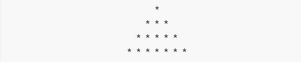

# *<u>**模拟试卷**</u>*

### 一、单项选择题（本大题共20小题，每小题2分，共40分。在每小题给出的四个备选项中，选出一个正确的答案，并将所选项前的字母填写在答题纸的相应位置上。）

##### 1. 以下选项中合法的用户标识符是（ ）

  `A. No-1、abc、sf_02`       `B. _int、 2xy、count`

  `C. pc、_4866pc、vf_2`       `D. ++c、hj6_d、name`

##### 2. 以下选项中正确的C语言常量是（ ）

  `A. 2.46E-1.5`   `B. 0382`    `C. '123'`      `D. '\0'`

##### 3. 设x为int类型，其值为11，则表达式（x++*1/3）的值是（ ）

  `A. 3`   `B. 4`   `C. 11`   `D. 12`

##### 4. 以下说法中正确的是（ ）

  `A．C语言程序总是从第一个定义的函数开始执行` 

  `B．C语言程序中，要调用的函数必须在main( )函数中定义` 

  `C．C语言程序总是从main( )函数开始执行` 

  `D．C语言程序中的main( )函数必须放在程序的开始部分`

##### 5. 正确表示条件100≤x≤300的C表达式是（ ）

  `A. 100<=x<=300`         `B. x>=100,x<=300`

  `C. x>=100&x<=300`     `D. x>=100&&x<=300`

##### 6. 下列程序段的运行结果是（ ）

```c
int x=10,y=20,z=30;

  if(x>y)  z=x; x=y; y=z;

  printf("%d,%d,%d\n",x,y,z);
```

  `A. 10,20,30`    `B. 20,30,10`  `C. 20,30,30`    `D. 20,30,20`

##### 7. C语言中while和do-while循环的主要区别是（ ） 

  `A. do-while的循环体至少无条件执行一次`

  `B. while的循环控制条件比do-while的循环控制条件严格`

  `C. do-while允许从外部转到循环体内`

  `D. do-while的循环体不能是复合语句`

##### 8. 设有以下程序段：

```c
int k=0;
while(k=1) k--;
```

  则以下叙述中正确的是（ ）

  `A. while循环执行一次`      `B. 该循环是无限循环`

  `C. 循环体语句一次也不执行`    `D. 该循环有语法错误`

##### 9. 以下选项中不能正确赋值的是（ ）

  `A. char *s; s="student";`    `B. char *s="student";`

  `C. char s[]="student";`     `D．char s[10]; s="student";`

##### 10. 下列各定义数组的语句中不正确的是（ ）

  `A. int a[1][3];`         `B. int x[2][2]={1,2,3,4};`

  `C. int x[2][ ]={1,2,4,6};`    `D. int m[ ][3]={1,2,3,4,5};` 

##### 11. 若有int a[10], *p=a;，且a数组已赋值，则与a[4]不等价的表达式为（ ）

  `A. p+4`      `B. *(p+4)`    `C. *(a+4)`     `D. p[4]`

##### 12. 下列关于函数之间数据传递的叙述正确的是（ ）

  `A. 当函数实参是指针类型时，被称为传值调用`

  `B. 利用函数的返回值传递数据时只能传递一个数据`

  `C. 参数的传址调用是一种双向数据传递方式`

  `D. 参数的传值调用方式中，形参与实参具有相同的存储空间`

##### 13. 已定义以下函数的功能是（ ）

```c
void fun(char *p2, char *p1)

{ while((*p2=*p1)!= '\0'){ p1++;p2++; } }
```

  `A. 将p1所指字符串复制到p2所指内存空间`

  `B. 将p1所指字符串的地址赋给指针p2`

  `C. 对p1和p2两个指针所指字符串进行比较`

  `D. 检查p1和p2两个指针所指字符串中是否有'\0'`

##### 14. 以下程序段中，变量c的二进制值是（ ）

```
char a=2,b=4,c;

c=a+b<<2;
```

  `A. 00000011`    `B. 00010100`  `C. 00011100`    `D. 00011000`

##### 15. 表达式strlen("\x69\082\n")的值是（ ）

​    `A. 1`       `B. 2`     `C. 3`       `D. 4`

##### `16．C`语言中局部变量的缺省存储类别是（ ）

  `A. static`　　   `B. auto`     `C. register`　　  `D. extern`

##### 17．以下程序的运行结果是（ ）

```c
#include<stdio.h>

#define M(x,y) x-y

void main()
	{  int a=4,b=3,c=5;
		printf("%d",a*M(b,c));
    }
```

  `A．8`       `B. 7`      `C. 编译错误`　　  `D. -8`

##### 18.以下程序段运行后的结果是（ ）

```c
int x=1,y=2,z=3;

y+=x+=z;

printf("%d",x<y?x++:y++);
```

  `A. 6`       `B. 5`     `C. 4`       `D. 3`

##### 19. 若有以下说明和语句，对c数组元素的正确引用是（ ）

```c
int c[4][5], *cp[4];

for(int j=0;j<4;j++)  cp[j]=c[j];
```

  `A. cp+1`    `B. *(cp+3)`    `C. *(cp+1)+3`    `D. cp[2][3]`

##### 20．有以下说明语句：

```c
struct
{
	int a;
	double b;
}stu;
```

  则下面叙述中不正确的是（ ）

  `A．struct是定义结构体类型的关键字`

  `B．struct stu是用户定义的结构体类型`

  `C．stu是用户定义的结构体变量`

  `D．a和b都是结构体成员名`

### 二、程序阅读题（本大题共5小题，每小题6分，共30分。请将程序的运行结构填写在答题纸的相应位置上。）

##### 1. 

```c
#include<stdio.h>

	double f(double x,double y)

	{  if(x>=y)
		return (x+y)/2.0;
	else
		return f(f(x+2,y-1),f(x+1,y-2));
	}

void main()
{  
	printf("%.1f",f(5.0, 7.0));
}
```

##### 2. 

```c
#include<stdio.h>

void main()
{  int i,j,x=0;
	for(i=0;i<2;i++)
	{	x++;
		for(j=0;j<=3;j++)
		{  if(j%2) continue;
			x++;
		}
		x++;
	}
	printf("x=%d",x);
}
```

##### 3. 

```c
#include <stdio.h>

int sum(int *p, int n)
{  int s=0,j;
	for(j=0;j<n;j++)
		s+=p[j];

	return s;  
}

void main()
{  
	int a[10]={1,2,3,4,5,6,7,8,9,10},t;
	t=sum(a+2, 5);
	printf("%d",t);
}
```

##### 4. 

```c
#include<stdio.h>

void swap(int *,int);

void main( )
{   int a=3,b=5;
	swap(&a,b);
	printf("a=%d,b=%d",a,b);
}

void swap(int *x,int y)
{   int temp ;
	temp=*x ; *x=y ; y=temp ;
}
```

##### 5. 

```c
#include<stdio.h>

int adds(int x,int y);

void main()
{   int a=5,b=-1,c;
	c=adds(a,b);
	printf("%d,",c);
	c=adds(a,b); printf("%d\n",c);
}
int adds(int x,int y)
{   static int m=0,n=3;
	n*=++m;
	m=n%x+y++;
	return(m);
}
```

### 三、程序填空题（本大题共3小题，每空5分，共35分。请将答案填写在答题纸的相应位置上。）

##### 1. 程序功能：输出100以内的个位数为6、且能被3整除的所有正数。

```c
#include <stdio.h>

void main()
{   int i,j;
	for(i=0;;i++);
	if() continue;
	printf("%d\t",j);
	}
}
```

##### 2. 程序功能：实现数组元素的逆序存放并输出结果。

```c
#include<stdio.h>

void inverse(int * , int );
void main()
{   int a[10],i;
	for(i=0;i<10;i++)
		scanf("%d",&a[i]);
	inverse();
	for(i=0;i<10;i++)
		printf("%d\t",a[i]);
	printf("\n");
 }
 void inverse(int *p , int n)
 {   int *q ,t;
	for( )
	{ t=*p ; *p=*q ; *q=t; }
}
```

##### 3．程序功能：找出学生成绩的最高者，并输出其各项信息。

```c
#include<stdio.h>

void main()
{   struct student
	{  int id;
		char name[20];
		float score;
	};
struct student stu[4],*p;
int i,temp=0;
for (p=stu;p<stu+4;p++)
	scanf("%d %s %f",);
for (i=1;i<4;i++)
	if( )
		temp=i;
p=;
printf("\nThe max-num score :\n");
printf("Id:%d\nName:%s\nScore:%4.1f\n",p->id,p->name,p->score);
}
```


### 四、编程题（本大题共3小题，每小题15分，共45分。请在答题纸的相应位置上作答。） 

##### 1.编写程序，使用循环结构语句打印输出如下图形。



##### 2. 编写程序，将从键盘输入的10个整数按升序排列输出。

##### 3. 编写函数`void del(char *s,char c)`，其功能是在s所指字符串中删除与变量c相同的字符，并设计主函数实现：

（1）从键盘输入字符串和指定被删除的字符；

（2）调用`del()`函数实现删除操作；

（3）输出删除后的字符串。

**说明：不允许使用除gets()和puts()之外的任何字符串处理库函数。**

 

 
