# 第一章:微型计算机基础

## 计算机的发展

**根据电子器件划分**：

- 1946年第一代：**电子管**计算机：**ENIAC**。

- 1958年第二代：**晶体管**计算机。

- 1964年第三代：**中小规模集成电路**计算机。

- 1971年第四代：**大规模和超大规模集成电路**计算机，出现了**微型计算机**。

**微型计算机的发展**：

1971年，Intel公司设计了世界上**第一个微处理器芯片**`Intel 4004`

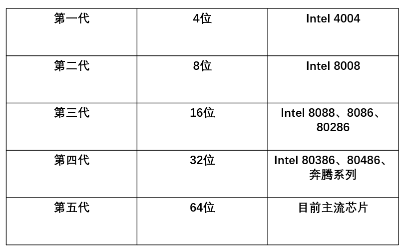

## 微机主要性能指标

- **机器字长**：计算机内部**ALU**能够一次同时处理的二进制数的位数(二进制)。是标明微信计算机的负重和CPU的性能的参数。**字长越长，运算精度越高**。通常字长都是字节（**8位二进制数**）的整数倍。

- **主存容量**：能够容纳二进制位数。**最小单位**为：位(bit)，**基本单位**为：字节(Byte)  `1B = 8 bit`。   

  容量越大储存的程序和数据越多，处理能力也就越强。

- **主频**：计算机的**时钟频率**，在一定程度上反映机器的运算速度。计算机的脉冲个数，**主频越高，运算速度越快**。

  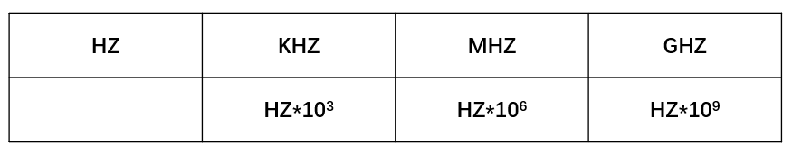

- **时钟周期**：频率用`f`表示，主频的倒数：
  $$
  T=\frac 1f
  $$
  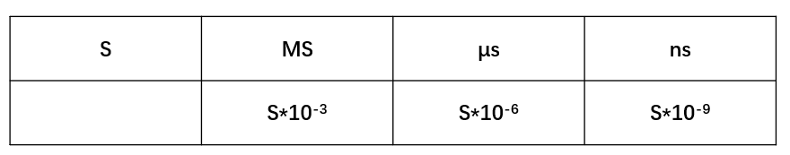

- **运算速度**：运算速度的一种表示方式是MIPS（millions of instructions per second ）,即每秒百万条指令，它主要是对整数运算而言。对于浮点运算，一般使用MFLOPS（million floatingpoint operations per second）表示,即每秒百万次浮点运算。

## 常用名词术语

- 
- **总线周期**：

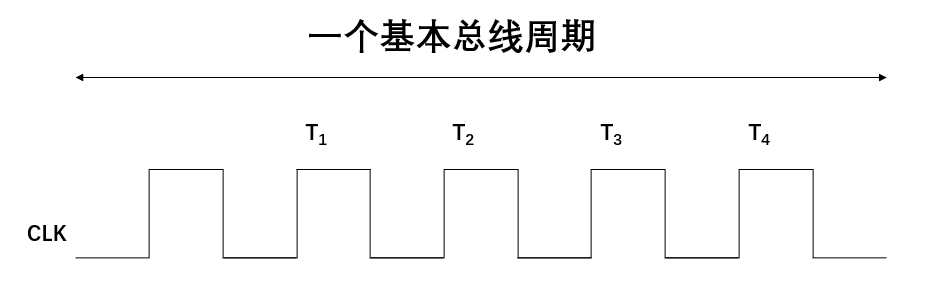

## 微型计算机的系统组成

### 微处理器(Micro processor)

**定义**：

​	一片/n片大规模集成电路组成**中央处理器(CPU)**叫**微处理器**。，也称为**微处理器芯片**。

**特点**：

​	集成度越来越高。

**构成**：

> CPU = ALU(运算器) + CU(控制器) + R(寄存器组)

**注意**：

​	电子部件(逻辑器件)发展到第四代才有了微处理器。**它是微型计算机的运算和控制核心**。**它能够自动按照程序的功能完成指令的运行**，所以能够**自动运行**。

### 微型计算机(Micro computer)

​	以**CPU**/(微处理器)为核心构成计算机(裸机)，只包括**硬件**。

主板主要指的是微型计算机，它是硬件集成在一块板子的集合。

**构成**：

> CPU + 内存(主存) + I/O接口(Input/Output)

### 微型计算机系统(Micro computer system)

**构成**：

> 微型计算机+软件+外围设备

**发展顺序**：

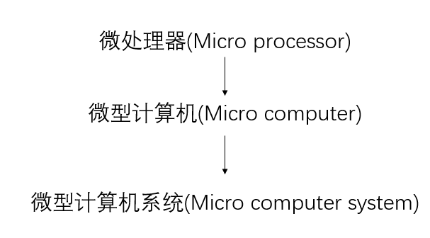

**微型计算机系统结构图**：

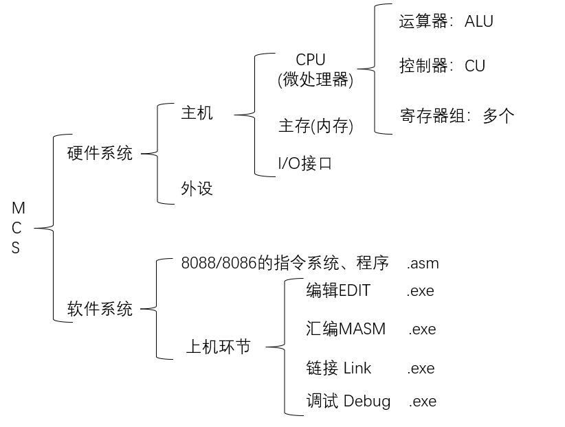

## 计算机部件

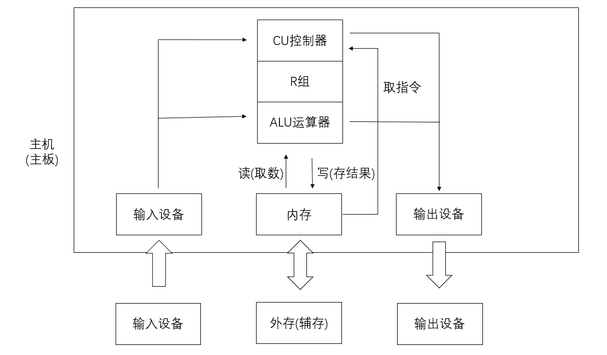


计算机的五大部件是**控制器**、**运算器**、**存储器**、**输入设备和输出设备**。

### 控制器

### 运算器

### 寄存器

**触发器**：记忆装置的基本单元，触发器可以组成寄存器，寄存器可以组成存储器，寄存器和存储器称为计算机的记忆装置。触发器一般用晶体管原件。


多个触发器组成一个寄存器。例如AX就是16个触发器组成的。

### 存储器

### 输入输出设备

## 总线(BUS)

​	计算机系统各部件之间**传输信息**的公共通道(BUS)。

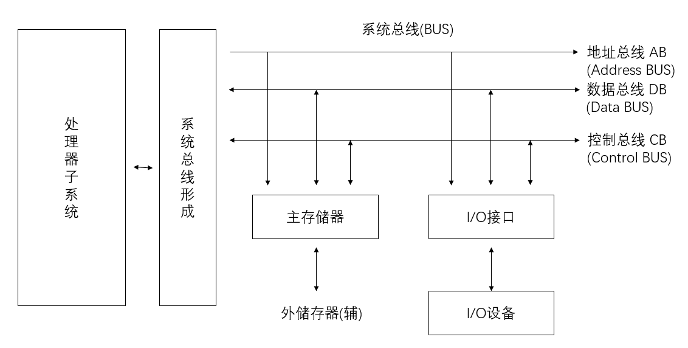

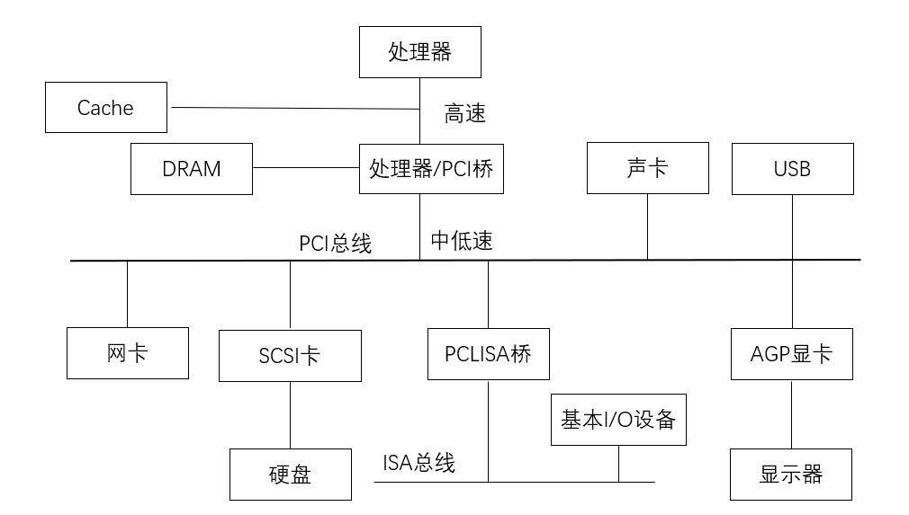

### 按照连接的部件

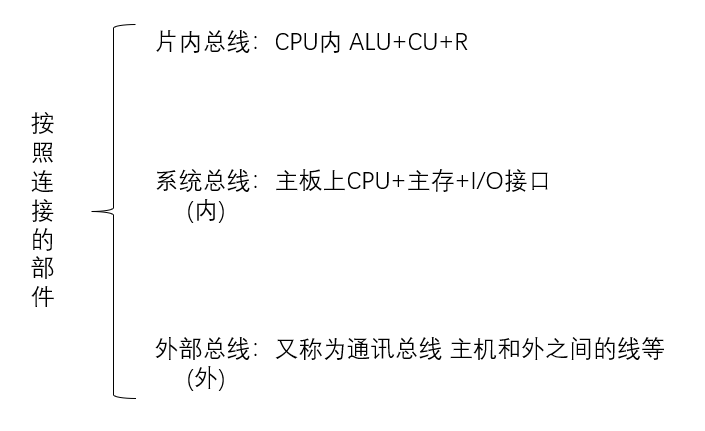

### 按照传送信息种类

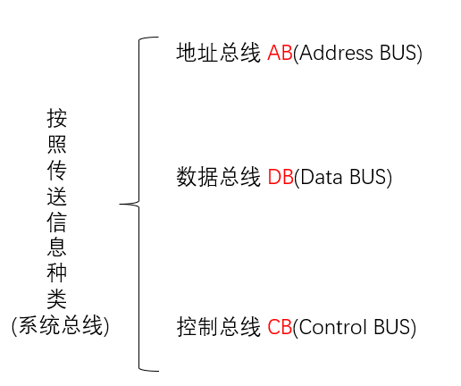

### 按照数据传输方式

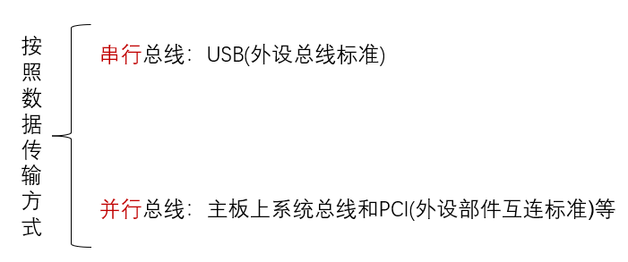

### 按照总线标准

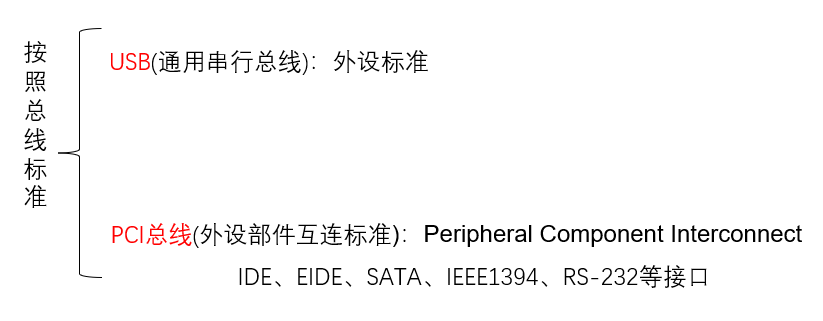

按功能可分为两部分:总线接口单元BIU(Bus Interface Unit)和执行单元*EU*(Execution Unit)。

### 总线的性能指标

1. **总线带宽**：bps(bit/s) ：数据传输率。 

> USB 2.0： 480mbps
>
> USB 3.0： 4.8Gbps

2. **总线位宽**：数据通路宽度。同时传输二进制位数。

3. **总线工作频率**：MHZ 脉冲。

## 微机的软件系统

- **操作系统**	`MS-DOS`

- **编辑程序**	`EDIT.COM`

- **汇编程序**	`MASM.EXE`

- **链接程序**	`LINK.EXE`

- **调试程序**	`DEBUG.EXE`

## 冯·诺依曼计算机设计思想

1. 计算机硬件包括五大功能部件
2. 采用二进制
3. 存储程序＋程序自动控制

## 门电路


### 与门


​                        														`A与Ｂ为输入端可有多个输入　Y为输出端`

**与运算**：

​	**计算机指令的＂AND＂**

​	**特点**是只有A与B都是＂`1`＂（**高电平**）

​	**输出端**才会输出＂1＂　**其他情况**输出端均输出＂0＂

|  A   |  B   |  Y   |
| :--: | :--: | :--: |
|  0   |  0   |  0   |
|  1   |  1   |  1   |
|  1   |  0   |  0   |
|  0   |  1   |  0   |

**总结**：

​	**有零出零**

​	**全一出一**：只有唯一情况 保证译码唯一。

​	**输入端可以多接 最好接双数：**与门基本形式是双数。

​	**当有多个输入端为1 用与门 保证唯一性**。

------


### 或门


​													                     	`A与Ｂ为输入端可有多个输入　Y为输出端`

或运算：

​	**计算机指令的＂OR＂**

​	**特点**是只有A与B都是＂0＂（**高电平**）

​	**输出端**才会输出＂0＂　**其他情况**输出端均输出＂1＂

|  A   |  B   |  Y   |
| :--: | :--: | :--: |
|  0   |  0   |  0   |
|  1   |  1   |  1   |
|  1   |  0   |  1   |
|  0   |  1   |  1   |

**总结**：

​	**有一出一** 

​	**全零出零**：唯一情况

​	**碰到输入端为0 用或门**

​	**输入端可以多接 最好接双数**

------


### 非门


​											                                         	`一般输入端、输出端都只有一个`

非运算：

​	**计算机指令的＂NOT＂**

​	**特点**是将输入的内容取反后输出，即若A为＂1＂则Y输出为＂0＂；若A为＂０＂则Y输出为＂１＂

　**注意**：输出端的小圆圈　这个圆圈代表的就是取反　

|  A   |  Y   |
| :--: | :--: |
|  0   |  1   |
|  1   |  0   |

**补充**：


------


### 组合型

------

#### 与非门


​										                      				`A与Ｂ为输入端可有多个输入　Y为输出端`

与非运算：

​	**特点**是只有A与B都是＂0＂（高电平）

​	**输出端**才会输出＂1＂　**其他情况**输出端均输出＂1＂

|  A   |  B   |  Y   |
| :--: | :--: | :--: |
|  0   |  0   |  1   |
|  1   |  1   |  0   |
|  1   |  0   |  1   |
|  0   |  1   |  1   |

总结：

​	**有零出一**

​	**全一出零**：只有唯一情况 保证译码唯一

​	**输入端可以多接 最好接双数：**与非门基本形式是双数 

​	**当有多个输入端为1 用与非门 保证唯一性**

------


#### 或非门


​											              			`A与Ｂ为输入端可有多个输入　Y为输出端`

或非运算：

​	**特点**是只有A与B都是＂0＂（高电平）

​	**输出端**才会输出＂1＂　**其他情况**输出端均输出＂1＂

|  A   |  B   |  Y   |
| :--: | :--: | :--: |
|  0   |  0   |  1   |
|  1   |  1   |  0   |
|  1   |  0   |  0   |
|  0   |  1   |  0   |

总结：

​	**有一出零** 

​	**全零出一**：只有唯一情况 保证译码唯一

​	**输入端可以多接 最好接双数**

------

#### 异或门


​														`A与Ｂ为输入端可有多个输入　Y为输出端`

​																	         **Y = A + B**

#### 异或运算

​	**计算机指令的＂XOR＂**

　异或电路的运算是A与B的**输入相同**时Y输出是＂0＂**不相同**的Y输出为＂１＂

|  A   |  B   |  Y   |
| :--: | :--: | :--: |
|  0   |  0   |  0   |
|  0   |  1   |  1   |
|  1   |  0   |  1   |
|  1   |  1   |  0   |

总结：

​	**输入相同出0**

​	**输入不同出1**


------

## 进制

**采用不同的进制的原因**是不同的领域用到的技术形式不相同　

- 在计算机底层都以**二进制**形式存在。

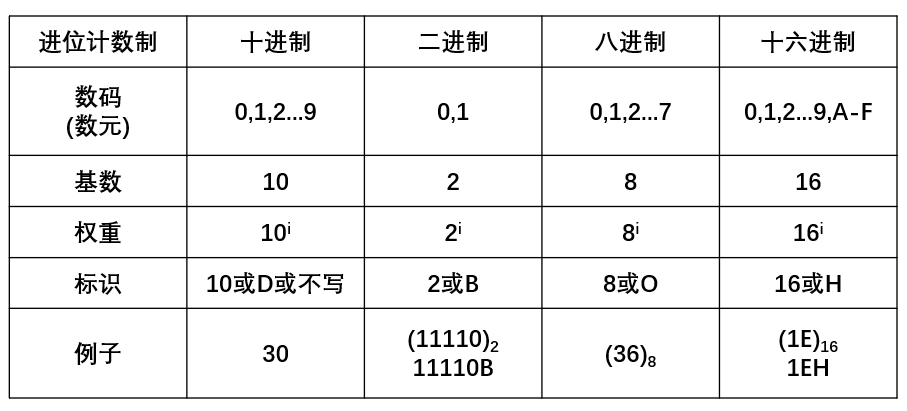

### 进位计数制

​	**按照进位的方法进行计数，称为进位计数制。**

​	**常见的进位计数制**：二进制、八进制、十进制、十二进制、十六进制等等。

  **R进制数的特点：**

- 具有R个不同的数符。0，1，2．．．，R－１

- 逢R进一。


**进位计数制**：一般表达式(按权展开式)：

R进制的表示方法，任一R进制数S可表示为

> S=a<sub>n-1</sub> a<sub>n-2</sub> ... a<sub>1</sub> a<sub>0</sub> . a<sub>-1</sub>...+a<sub>-m</sub>           位置表示法
>
> =a<sub>n-1</sub>R<sup>n-1</sup> + ... + a<sub>1</sub>R<sup>1</sup> + a<sub>0</sub>R<sup>0</sup> + a<sub>-1</sub>R<sup>-1</sup> ... +a<sub>-m</sub>R<sup>-m</sup> (按权展开式)
>
> 其中:a<sub>i</sub> : R 进制中的数字符号
>
> ​		 R：基数
>
> ​         R<sup>i</sup> : 位权，简称权

###  十进制N<sub>D</sub>

​	**特点：**


  - ​	有十个数码：0~9

  - ​	逢十进一

加权展开式以10为基数，各位系数为0~9

> N<sub>D</sub> = d<sub>n-1</sub> * 10<sup>n-1</sup> + d<sub>n-2</sub> * 10<sup>n-2</sup>+...+d<sub>0</sub> * 10<sup>0</sup>+d<sub>-1</sub> * 10<sup>-1</sup>+...

例:(1234.5)<sub>10</sub> = 1 * 10<sup>3</sup> + 2 * 10<sup>2</sup> +3 * 10<sup>1</sup> +  4 * 10<sup>0</sup> +5 * 10<sup>-1</sup> 


### 二进制N<sub>B</sub>

**特点：**

- ​	有两个数码：0、1

- ​	逢二进一

加权展开式以2为基数，各位系数为0、1

> N<sub>B</sub> = b<sub>n-1</sub> * 2<sup>n-1</sup> + b<sub>n-2</sub> * 2<sup>n-2</sup>+...+b<sub>0</sub> * 2<sup>0</sup>+b<sub>-1</sub> * 2<sup>-1</sup>+...

例: `1101.101B` = 1 * 2<sup>3</sup> + 1 * 2<sup>2</sup> +0 * 2<sup>1</sup> +  1 * 2<sup>0</sup> +1 * 2<sup>-1</sup> +0 * 10<sup>-2</sup> +1 * 2<sup>-3</sup> 

**注意:**不够八位最好前面加上0 凑成八位

### 八进制N<sub>O/Q</sub>

​	**暂无**

### 十六进制N<sub>H</sub>

​	因为二进制太长 所以采用十六进制 

​	一位十六进制可以表示四位二进制

​	**特点：**


  - ​	有十六个数码：0~9、A~F

  - ​	逢十六进一

加权展开式以16为基数，各位系数为0~9，A~F

> N<sub>H</sub> = h<sub>n-1</sub> * 16<sup>n-1</sup> + h<sub>n-2</sub> * 16<sup>n-2</sup>+...+h<sub>0</sub> * 16<sup>0</sup>+h<sub>-1</sub> * 16<sup>-1</sup>+...

例:`DFC.8H` = 13 * 16<sup>2</sup> +15 * 16<sup>1</sup> +  12 * 16<sup>0</sup> +8 * 16<sup>-1</sup> 

### 注意

不同进位制数以后缀区别,十进制数可不 带后缀。或加括弧，再在括弧之后注明。

- `101`、`101D`、`101B`、`101H`、`101H`
- (20)<sub>10</sub>、(1101)<sub>2</sub>、(345)<sub>16</sub>


### 不同进制计数制的转换

#### 			二进制、十六进制转换成十进制

**方法**：

​	先将二、十六进制数按权展开，然后按照十进制运算法则求和

**举例**： 

​	`1011.1010B`=1 * 2<sup>3</sup>+1 * 2<sup>1</sup>+1 * 2<sup>0</sup>+1 * 2<sup>-1</sup>+1*2<sup>-3</sup>

​						   =(11.625)<sub>10</sub>

​	`DFC.8H`=13 * 16<sup>2</sup> + 15 * 16<sup>1</sup> + 12 * 16<sup>0</sup> + 8 * 16<sup>-1</sup> 

​				  =(3580.5)<sub>10</sub>

#### 			十进制转换成二进制、十六进制

**方法**：

**整数部分,除基取余**

​	不断**除以**所要转换的进制基数，直至**商为0**。每除一次取一个余数，从低位排向高位。

**小数部分,乘基取整**
	用转换进制的基数乘以小数部分，直至小数为0或达到转换精度要求的位数。每**乘一次取一次整数**，从最高位排到最低位。

**举例**：

​	**二进制最好前面加上0 凑成八位**

​	39转换成二进制数        
​	(39)<sub>10</sub>=`00100111B`

​	208转换成十六进制数   
​	`208D` = `D0H`

​	`0.625D`转换成十六进制数
​	0.625 × 16 = 10.0	 `0.625D` = `0.AH`

​	 `208.625D` 转换成十六进制数 
​	 `208.625D`= `D0.AH`

​	0.25十进制 转换成 二进制数
​	`0.25D`=`0.01B`

​	(15.8125)<sub>10</sub>转换成二进制数 	
​	(15.8125)<sub>10</sub>=`00001111.1101`

   

#### 二进制转换成十六进制

​	由2<sup>4</sup>=16可知 四位二进制数对应一位十六进制数。
​	例:   `3AF.2H` 
​      		= <u>0011</u> <u>1010</u> <u>1111</u>.<u>0010</u> =`1110101111.001B` 	
​				      3      A       F        2

​           `1111101.11B` 
​			   = <u>0111</u> <u>1101</u>.<u>1100</u>  = `7D.CH`         
​					  7       D       C
​    二进制转换为16进制时，整数部分从**最低位**进行划分，**每4位二进制数为一组**，不足4位的，最高位补零；**小数部分**从**最高位**进行划分，每4位二进制数为一组，不足4位的最低为补零

#### 技巧：

​	按照`8421`方法，即对应二进制四位

##### 			十六进制转为二进制：

​	`8421`排列组合成十六进制数

​	`37FH`

​	  =  	  3 	    7 	    F
​          `8421` `8421` `8421`

​           **0011  0111  1111**

##### 			 二进制转换为十六进制：

​	每四位为一个 `8421`

​	`0110111100B`

​	=     <u>0001</u>  <u>1011</u>  <u>1100</u>
​	       `8421` `8421` `8421`

​	           **1        B         C**		

##### 			八进制二进制互相转换：

​	同理，只不过将 `8421` 变为 `421`

​	`11010110`

​	=  	  11   010   110
​	       `421`  `421`  `421`

​	          **3       2       6**
​				
​	`765`

​	=  	  7        6       5
​	     `421`  `421`  `421`

​	      **111    110     101**

##### 		十进制转换二进制：

​	可将十进制先转换成十六进制再转成二进制

​	`39D`

​	=  	 <u>39</u> / 16		余7 

​	            2	           余2
​					
​	=    `2    7  H`

​	    `8421` `8421`

​	= **0010   0111**  B

​	`0.25D`

​	=  	 <u>0.25</u> * 16		=4
​	=    `0.4H`
​	= `8421` 

​	 **0.01**  B

## 机器数的表示

### 定点表示法

所有数据的小数点位置固定不变。

## BCD码

​	BCD码(Binary Coded Decimal)本质就是十进制数 

**二进制编码的十进制数**

**特点**:

1. BCD码有十个不同字符，逢十进一，是十进制数。

2. 每一位十进制数用4 位二进制编码表示，是二进制编码的十进制数。即 0000-1001。

   对于1010-1111 (A~F) 属于无效编码

3. 直观。

### 表示方式

- #### 组合BCD 也叫压缩BCD 四位表示一位十进制数

​		**举例**

​			56 ---》 (0101 0110)<sub>BCD</sub>

- #### 非组合BCD 也叫非压缩BCD 八位表示一位十进制数

  **举例**		

  ​	56 ---》 (0000 0101 0000 0110)<sub>BCD</sub>

  十进制数876的BCD码
    	876.7 = （1000 0111 0110.0111）<sub>BCD</sub>
   	 876 = `36CH` = `1101101100B`

**注意**：BCD码  ——>   十进制码  ——>    二进制   

​	除BCD编码外，还有其他二进制编码的十进制数。如余3码、余3循环码等。


## 字符编码

**(ASCII码 American Standard Code For Information Interchange，美国标准信息交换码)** 

一般用来**显示** 或**传输**  用

可表示**128种字符的7位基本ASCⅡ码**和**可表示256种字符的8位扩充ASCⅡ码**（可重新定义）。
  字符可分为：**显示字符**和**控制字符**。
    0—9：ASCII码	`30H`—`39H`
    A—Z：                 `41H`—`5AH`
    a—z：                  `61H`—`7AH`


## 带符号数的表示方法

### 机器数与真值

机器数：计算机中数的表示形式，以二进制的形式表示，位数通常为8的倍数 。一般数的最高位作符号位，“0”表示“+”， “1”表示“-”。
真值： 机器数所代表的实际数值。可用二进制
    表示，也可用其他进制表示。
举例：一个8位机器数与它的真值对应关系如下：
    真值： X1= 84 = `+1010100B`       X2 = -84= `-1010100B` 
 机器数： [X1]<sub>机</sub>= `01010100B`        [X2]<sub>机</sub>= `11010100B`

## 	原码、反码、补码

对于有符号的而言：

 1. 二进制的最高位是符号位：0表示正数，1表示负数。

 2. 正数的原码、反码、补码都一样(三码合一)。

 3. 负数的反码=他的原码符号位不变，其他位取反(0-->1 1-->0)。

 4. 负数的补码=它的反码+1

 5. 0的反码、补码都是0

 6. 计算机运算的时候，都是以**补码的方式**来运算。	

    ```c
    //2的原码、反码、补码
    //0000 0000 0000 0000 0000 0000 0000 0010
    //-3的原码
    //1000 0000 0000 0000 0000 0000 0000 0011
    //-3的反码
    //1111 1111 1111 1111 1111 1111 1111 1100
    //-3的补码
    //1111 1111 1111 1111 1111 1111 1111 1101
    ```


