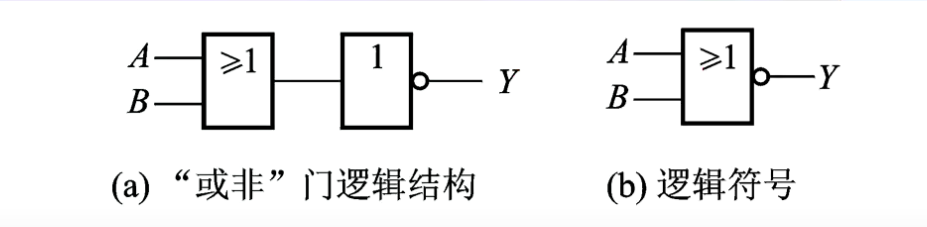
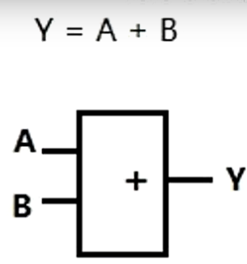
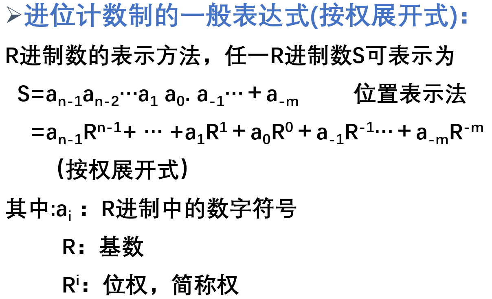

# *<u>**微机原理**</u>*

- ## 门电路

会在存储器译码特别学习

------

### 与门：

​														`A与Ｂ为输入端可有多个输入　Y为输出端`

#### 与运算：

​	**计算机指令的＂AND＂**

​	**特点**是只有A与B都是＂1＂（高电平）

​	**输出端**才会输出＂1＂　**其他情况**输出端均输出＂0＂

|  A   |  B   |  Y   |
| :--: | :--: | :--: |
|  0   |  0   |  0   |
|  1   |  1   |  1   |
|  1   |  0   |  0   |
|  0   |  1   |  0   |

#### 总结：

​	**有零出零**

​	**全一出一**：只有唯一情况 保证译码唯一 

​	**输入端可以多接 最好接双数：**与门基本形式是双数 

​	**当有多个输入端为1 用与门 保证唯一性**

------

### 或门：

​														`A与Ｂ为输入端可有多个输入　Y为输出端`

#### 或运算：

​	**计算机指令的＂OR＂**

​	**特点**是只有A与B都是＂0＂（高电平）

​	**输出端**才会输出＂0＂　**其他情况**输出端均输出＂1＂

|  A   |  B   |  Y   |
| :--: | :--: | :--: |
|  0   |  0   |  0   |
|  1   |  1   |  1   |
|  1   |  0   |  1   |
|  0   |  1   |  1   |

#### 总结：

​	**有一出一** 

​	**全零出零**：唯一情况

​	**碰到输入端为0 用或门**

​	**输入端可以多接 最好接双数**

------

### 非门：

​												`一般输入端、输出端都只有一个`

#### 非运算：

​	**计算机指令的＂NOT＂**

​	**特点**是将输入的内容取反后输出，即若A为＂1＂则Y输出为＂0＂；若A为＂０＂则Y输出为＂１＂

　**注意**：输出端的小圆圈　这个圆圈代表的就是取反　

|  A   |  Y   |
| :--: | :--: |
|  0   |  1   |
|  1   |  0   |

#### 补充：

​	同相器：

​	反相器：　

------

### 组合型

------

#### 与非门

​														`A与Ｂ为输入端可有多个输入　Y为输出端`

#### 与非运算：

​	**特点**是只有A与B都是＂0＂（高电平）

​	**输出端**才会输出＂1＂　**其他情况**输出端均输出＂1＂

|  A   |  B   |  Y   |
| :--: | :--: | :--: |
|  0   |  0   |  1   |
|  1   |  1   |  0   |
|  1   |  0   |  1   |
|  0   |  1   |  1   |

#### 总结：

​	**有零出一**

​	**全一出零**：只有唯一情况 保证译码唯一

​	**输入端可以多接 最好接双数：**与非门基本形式是双数 

​	**当有多个输入端为1 用与非门 保证唯一性**

------

#### 或非门

​														`A与Ｂ为输入端可有多个输入　Y为输出端`

#### 或非运算：

​	**特点**是只有A与B都是＂0＂（高电平）

​	**输出端**才会输出＂1＂　**其他情况**输出端均输出＂1＂

|  A   |  B   |  Y   |
| :--: | :--: | :--: |
|  0   |  0   |  1   |
|  1   |  1   |  0   |
|  1   |  0   |  0   |
|  0   |  1   |  0   |

#### 总结：

​	**有一出零** 

​	**全零出一**：只有唯一情况 保证译码唯一

​	**输入端可以多接 最好接双数**

------

#### 异或门

​														`A与Ｂ为输入端可有多个输入　Y为输出端`

#### 异或运算：

​	**计算机指令的＂XOR＂**

　异或电路的运算是A与B的**输入相同**时Y输出是＂0＂**不相同**的Y输出为＂１＂

|  A   |  B   |  Y   |
| :--: | :--: | :--: |
|  0   |  0   |  0   |
|  0   |  1   |  1   |
|  1   |  0   |  1   |
|  1   |  1   |  0   |

#### 总结：

​	**输入相同出0**

​	**输入不同出1**

------

- ## 运算基础

  **采用不同的进制的原因**是不同的领域用到的技术形式不相同　

  - 在计算机底层都以**二进制**形式存在。

  ### 进位计数制

  ​	**按照进位的方法进行计数，称为进位计数制。**

  ​	**常见的进位计数制**：二进制、八进制、十进制、十二进制、十六进制等等。

  **R进制数的特点：**

  - 具有R个不同的数符。0，1，2．．．，R－１

  - 逢R进一。

  

### 十进制

### 二进制

### 十六进制

### 不同进制计数制的转换

- ## 存储器译码

  

