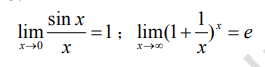
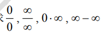

# *<u>**数学**</u>*

## 考试大纲

### 内容概述与总要求

参加数学（一）考试的考生应**理解或了解**《高等数学》中**函数、极限、连续、一元函数 微分学、一元函数积分学、向量代数与空间解析几何、多元函数微积分学、无穷级数、常微 分方程以及《线性代数》中行列式、矩阵、线性方程组的基本概念与基本理论**；**掌握或学会** **上述各部分的基本方法**；注意各部分知识的结构及知识的内在联系；应具有一定的运算能力、 逻辑推理能力、空间想象能力和抽象思维能力；能运用基本概念、基本理论和基本方法准确、 简捷地进行计算，正确地推理证明；注重数学应用能力的培养，能综合运用所学知识分析并 解决较简单的实际问题。数学考试从两个层次上对考生进行测试**，较高层次的要求为“理解” 和“掌握”，较低层次的要求为“了解”和“会”。**这里“理解”和“了解”是对概念与理论 提出的要求。“掌握”和“会”是对方法、运算能力及应用能力提出的要求。

### 考试形式与试卷结构 

考试采用闭卷、笔试形式，全卷满分为 100 分，考试时间为 60 分钟。 试卷包括选择题、填空题、计算题和应用题。选择题是四选一型的单项选择题；填空题 只要求直接填写结果，不必写出计算过程；计算题、应用题均应写出文字说明及演算步骤。 选择题和填空题分值合计为 50 分。其余类型题目分值合计为 50 分。 数学##### （一）中《高等数学》与《线性代数》试题的分值比例约为 `84：16`

### 知识要点与考核要求 

#### 一、 函数、极限与连续 

##### （一）函数 

###### 1．知识范围 

​	函数的概念及表示法 分段函数 函数的奇偶性、单调性、有界性和周期性 复合函数、 反函数、分段函数和隐函数 基本初等函数的性质及其图形 初等函数 简单应用问题函数 2 关系的建立。 

###### 2．考核要求

​	（1）理解函数的概念，会求函数的定义域、表达式及函数值。

​	（2）了解函数的简单性质，会判断函数的有界性、奇偶性、单调性、周期性。

​	（3）掌握基本初等函数的性质及其图形。

​	（4）理解复合函数及分段函数的概念，了解反函数及隐函数的概念。掌握将一个复合函 数分解为基本初等函数或者简单函数的复合的方法。 

​	（5）会建立实际问题中的函数关系式并利用函数关系分析和解决较简单的实际问题。 

#####  （二）极限 

###### 1．知识范围 

​	数列极限与函数极限的定义及其性质 函数的左、右极限 极限的四则运算 无穷小 无穷大 无穷小的比较。 

两个重要极限：

###### 2．考核要求 

​	（1）理解极限的概念（对极限定义中“  N ”、“  ”、“  M ”等形式的描述不作 要求），理解函数左、右极限的概念以及极限存在与左、右极限之间的关系，了解自变量趋向 于无穷大时函数极限存在的充分必要条件。 

​	（2）了解极限的性质，掌握极限的四则运算法则。 

​	（3）理解无穷小、无穷大以及无穷小的比较（高阶、低阶、同阶和等价）的概念，会应 用无穷小与无穷大的关系、有界变量与无穷小的乘积、等价无穷小代换求极限。 

​	（4）掌握应用两个重要极限求极限的方法。 

##### （三）函数的连续性 

###### 1．知识范围 

​	函数连续的概念 函数的间断点 初等函数的连续性 闭区间上连续函数的性质（最大 值与最小值定理、零点存在定理）及其简单应用。

###### 2．考核要求 

​	（1）理解函数连续性概念，会判断分段函数在分段点的连续性。 

​	（2）会求函数的间断点。 

​	（3）了解闭区间上连续函数的性质（最大值与最小值定理、零点存在定理）。 

​	（4）了解连续函数的性质和初等函数的连续性，理解函数在一点连续和极限存在的关系， 会应用函数的连续性求极限。 

​	（5）会利用连续函数的最大、最小值定理及零点存在定理分析和解决较简单的实际问题。

####  二、 一元函数微分学 

##### （一）导数与微分 

###### 1．知识范围 

​	导数与微分的概念 导数的几何意义与物理意义 函数的可导性与连续性的关系 平面 曲线的切线和法线 基本初等函数的导数 导数与微分的四则运算 复合函数、隐函数以及 参数方程确定的函数的微分法 高阶导数的概念 某些简单函数的 n 阶导数 微分运算法则 一阶微分形式的不变性。 

###### 2．考核要求 

​	（1）理解导数与微分的概念，理解导数的几何意义，了解函数的可导性与连续性之间的 关系，会求分段函数在分段点处的导数。 

​	（2）会求平面曲线的切线方程与法线方程。 

​	（3）掌握基本初等函数的导数公式，掌握导数的四则运算法则及复合函数的求导法则。 

​	（4）会求隐函数和由参数方程所确定的函数的一阶、二阶导数，会使用对数求导法。 

​	（5）了解高阶导数的概念，会求某些简单函数的 n 阶导数。 

​	（6）掌握微分运算法则及一阶微分形式不变性，了解可微与可导的关系，会求函数的微 分。

#####  （二）微分中值定理和导数的应用 

###### 1．知识范围 

​	罗尔（`Rolle`）中值定理 拉格朗日（`Lagrange`）中值定理 洛必达（`L’Hospital`）法 则 函数单调性的判定 函数极值及其求法 函数最大值、最小值的求法及简单应用 函数 图形的凹凸性与拐点及其求法 函数图形的水平渐近线和垂直渐近线。 

###### 2．考核要求 

​	（1）了解罗尔中值定理、拉格朗日中值定理及其几何意义。 

​	（2）掌握用洛必达法则求  型未定式极限的方法。 

​	（3）掌握利用导数判定函数单调性及求函数的单调区间的方法。 

​	（4）理解函数极值的概念，掌握求函数极值的方法，掌握函数最大值、最小值的求法及 简单应用。 

​	（5）会判断函数图形的凹凸性，会求函数图形的拐点。 

​	（6）会求函数图形的水平渐近线和垂直渐近线。 

​	（7）会描绘简单函数的图形。

####  三、 一元函数积分学 

##### （一）不定积分 

###### 1．知识范围 

​	原函数与不定积分的概念 不定积分的基本性质 基本积分公式 第一换元法（即凑微 分法） 第二换元法 分部积分法 简单有理函数、简单无理函数及三角函数有理式的积分。 

###### 2．考核要求 

   （1）理解原函数与不定积分的概念。 

   （2）理解不定积分的基本性质。 

   （3）掌握不定积分的基本公式。 

   （4）掌握不定积分的第一换元法、第二换元法（限于三角代换与简单的根式代换）和分 部积分

#####  （二）定积分 

###### 1．知识范围 

  ​	定积分的概念和性质 变上限定积分及其导数 牛顿—莱布尼茨（Newton-Leibniz）公 式 定积分的换元法和分部积分法 定积分的应用（平面图形的面积，旋转体的体积，物理 学中的简单应用） 无穷区间的广义积分的概念与计算。 

######  2．考核要求 

​    （1）理解定积分的概念，理解定积分的基本性质。 

​	（2）理解变上限定积分是其上限的函数及其求导定理，掌握牛顿—莱布尼茨公式。 

​	（3）掌握定积分的换元法和分部积分法。 

​	（4）掌握用定积分求平面图形的面积、简单的封闭平面图形绕坐标轴旋转所成旋转体体 积及定积分在物理学中的简单应用。

​	（5）了解无穷区间的广义积分的概念，会计算无穷区间的广义积分。 

####   四、 向量代数与空间解析几何 

##### （一）向量代数 

###### 1．知识范围 

​	向量的概念 向量的坐标表示 方向余弦 单位向量 向量的线性运算 向量的数量积 与向量积及其运算 两向量的夹角 两向量垂直、平行的充分必要条件。 

###### 2．考核要求 

​	（1）理解空间直角坐标系，理解向量的概念及其表示；了解单位向量、向量的模与方向 余弦，向量在坐标轴上的投影。

​	（2）掌握向量的线性运算、数量积、向量积，以及用坐标表达式进行向量运算的方法。 （3）掌握两向量平行、垂直的条件，会求向量的夹角。 

#####  （二）平面与直线

###### 1．知识范围 

​	平面点法式方程和一般式方程 点到平面的距离 空间直线的标准式（又称对称式或点 5 向式）方程、一般式（又称交面式）方程和参数式方程 直线与直线、直线与平面、平面与 平面平行、垂直的条件和夹角。 

###### 2．考核要求 

​	（1）掌握平面的方程，会判定两平面平行、垂直或重合。 

​	（2）会求点到平面的距离。 

​	（3）掌握空间直线的标准式方程、一般式方程、参数式方程。会判定两直线平行、垂直 或重合。 

​	（4）会判定直线与平面间的位置关系（垂直、平行、斜交或直线在平面上）。 

##### （三）曲面的方程 

###### 1．知识范围 

​	曲面方程的概念 球面 母线平行于坐标轴的柱面 旋转轴为坐标轴的旋转曲面 常用 二次曲面。 

###### 2．考核要求 

​	（1）了解曲面方程的概念。了解母线平行于坐标轴的柱面、旋转轴为坐标轴的旋转曲面 的方程及其图形。 

​	（2）了解球面、椭球面、圆柱面、圆锥面和旋转抛物面等常用二次曲面的方程及其图形。 

#### 五、多元函数微分学 

###### 1．知识范围 

​	多元函数的概念 二元函数的的极限与连续的概念 偏导数、全微分的概念 全微分存 在的必要条件与充分条件 二阶偏导数 复合函数、隐函数的求导法 偏导数的几何应用 多元函数的极值、条件极值的概念 多元函数极值的必要条件 二元函数极值的充分条件 极值的求法 拉格朗日乘数法。

###### 2．考核要求 

​	（1）理解多元函数的概念，了解二元函数的几何意义和定义域。了解二元函数极限与连 续概念（对计算不作要求）。 

​	（2）理解偏导数的概念，了解全微分的概念和全微分存在的必要条件和充分条件。 

​	（3）掌握二元初等函数的一、二阶偏导数的计算方法，会求全微分。 

​	（4）掌握复合函数一、二阶偏导数的计算方法（含抽象函数）。 

​	（5）掌握由方程 F(x, y,z) = 0 所确定的隐函数 z = z(x, y)的一阶、二阶偏导数的求法。 

​	（6）会求空间曲面的切平面方程和法线方程。 

​	（7）会求二元函数的极值，会用拉格朗日乘数法求条件极值，会求二元函数的最大值、 最小值并会解一些简单的应用问题。

####  六、 多元函数积分学 

##### （一）二重积分 

###### 1．知识范围 

​	二重积分的概念及性质 二重积分的计算 二重积分的几何应用。 

###### 2.考核要求

​	（1）理解二重积分的概念，了解其性质。 

​	（2）掌握二重积分（直角坐标系，极坐标系）的计算方法。 

​	（3）会在直角坐标系内交换两次定积分的次序。 

​	（4）会用二重积分求空间曲面所围成立体的体积。

#####  （二) 曲线积分 

###### 1．知识范围 

对坐标的平面曲线积分的概念和性质 对坐标的平面曲线积分的计算 格林（Green）公 式 平面曲线积分与路径无关的条件。 

###### 2．考核要求 

​	 (1) 理解对坐标的平面曲线积分的概念及性质。

 	(2) 掌握对坐标的曲线积分计算的方法。

​	 (3) 掌握格林公式，会应用平面曲线积分与路径无关的条件。 

#### 七、 无穷级数 

##### （一）常数项级数 

###### 1．知识范围 

 	常数项级数收敛、发散的概念 收敛级数的和 级数收敛的基本性质和必要条件 正项 级数收敛性的比较判别法、比值判别法 交错级数的莱布尼茨（Leibniz）判别法 绝对收敛 与条件收敛。 

###### 2．考核要求 

​	（1）理解常数项级数收敛、发散以及收敛级数的和的概念。理解级数收敛的必要条件和 基本性质。 

​	（2）掌握几何级数  n0 n aq 的敛散性。 

​	（3）掌握调和级数  1 1 n n 与 p-级数   1 1 n p n 的敛散性。 

​	（4）掌握正项级数的比值判别法，会用正项级数的比较判别法。

​	（5）会用莱布尼茨判别法判定交错级数收敛。 

​	（6）了解级数绝对收敛与条件收敛的概念，会判定任意项级数的绝对收敛与条件收敛。 

#####  （二）幂级数 

###### 1．知识范围 

###### 幂级数的收敛半径、收敛区间和收敛域 幂级数在收敛区间内的基本性质 函数 x e x x   1 1 , ln(1 ) , 的马克劳林（Maclaurin）展开式。 

2. ###### 2．考核要求 

   （1）了解幂级数的概念。 （2）了解幂级数在其收敛区间内的基本性质（逐项求和，逐项求导与逐项积分）。 （3）掌握求幂级数的收敛半径、收敛域的方法（包括端点处的收敛性）。 （4）会运用 x e x x   1 1 , ln(1 ) , 的马克劳林展开式，将一些简单的初等函数展开为 x 或  x  x0  的幂级数。 八、 常微分方程 ##### （一）微分方程基本概念 1．###### 1．知识范围 常微分方程的概念 微分方程的阶、解、通解、初始条件和特解。 2．###### 2．考核要求 （1）了解微分方程的阶、解、通解、初始条件和特解的概念。 （2）会验证常微分方程的解、通解和特解。 （3）会建立一些微分方程，解决简单的应用问题。 #####  （二）一阶微分方程 1．###### 1．知识范围 一阶可分离变量微分方程 一阶线性微分方程。 2．###### 2．考核要求 （1）掌握一阶可分离变量微分方程的解法。 （2）会用公式法解一阶线性微分方程。 （三）二阶线性微分方程 1．###### 1．知识范围 二阶线性微分方程解的性质和解的结构 二阶常系数齐次线性微分方程 二阶常系数非 齐次线性微分方程。 2．###### 2．考核要求 （1）了解二阶线性微分方程解的性质与解的结构。 （2）掌握二阶常系数齐次线性微分方程的解法。 （ 3 ） 掌 握 二 阶 常 系 数 非 齐 次 线 性 微 分 方 程 特 解 的 形 式 ， 其 中 自 由 项 限 定 为 f (x) e P (x) n ax  （ a 是常数， P (x) n 是 n 次多项式）或 f (x) e (Acosbx Bsin bx) ax   （ a , b , A , B 是常数），并会求二阶常系数非齐次线性微分方程的通解。 8 九、 线性代数 ##### （一）行列式 1．###### 1．知识范围 行列式的概念 余子式和代数余子式 行列式的性质 行列式按一行（列）展开定理 克莱姆（Cramer）法则及推论。 2．###### 2．考核要求 （1）了解行列式的定义，理解行列式的性质。 （2）理解行列式按一行（列）展开定理。 （3）掌握计算行列式的基本方法。 （4）会用克莱姆法则及推论解线性方程组。 #####  （二）矩阵 1．###### 1．知识范围 矩阵的概念 矩阵的线性运算 矩阵的乘法 矩阵的转置 单位矩阵 对角矩阵 三角 形矩阵 方阵的行列式 方阵乘积的行列式 逆矩阵的概念 矩阵可逆的充分必要条件 伴 随矩阵 矩阵的初等变换 矩阵的秩 初等变换求矩阵的秩和逆矩阵。 2．###### 2．考核要求 （1）了解矩阵的概念，了解单位矩阵、对角矩阵和三角形矩阵。 （2）掌握矩阵的线性运算、乘法和矩阵的转置。 （3）会用伴随矩阵法求二、三阶方阵的逆矩阵。 （4）理解矩阵秩的概念，会用初等变换法求矩阵的秩和逆矩阵，会解简单的矩阵方程。 （三）线性方程组 1．###### 1．知识范围 向量的概念 向量组的线性相关与线性无关 向量组的极大无关组 向量组的秩与矩阵 的秩的关系 齐次线性方程组有非零解的充分必要条件 非齐次线性方程组有解的充分必 要条件 齐次线性方程组的基础解系和通解 非齐次线性方程组的通解 用行初等变换求解 线性方程组的方法。 2．###### 2．考核要求 （1）理解 n 维向量的概念，理解向量组线性相关与线性无关的定义，了解向量组的极大 无关组和向量组的秩的概念。 （2）了解判别向量组的线性相关性的方法。 （3）会求齐次线性方程组的基础解系，会求齐次线性方程组和非齐次线性方程组的一般 解和通解。 （4）会建立线性方程组，解决简单的应用问题。

